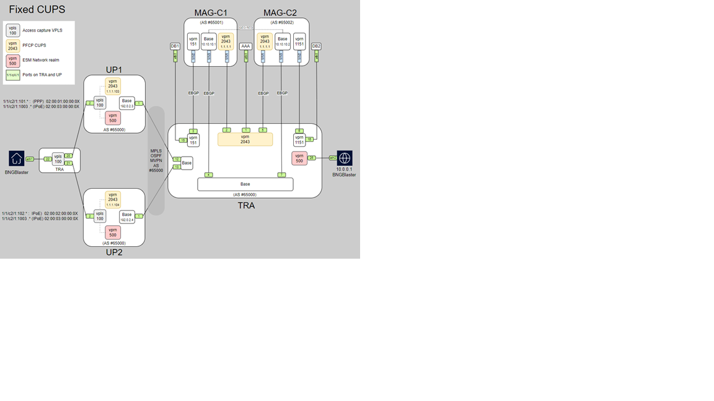
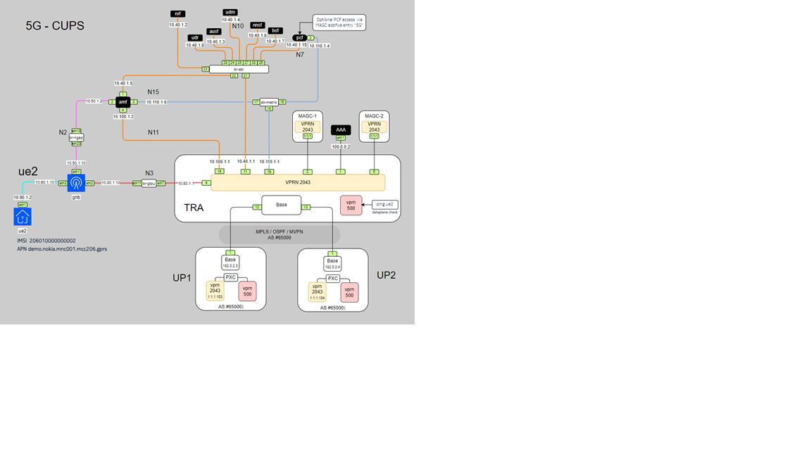

# MAG-CUPS: 5G CUPS Simulation using Open5GS, UERANSIM, BNGBlaster, and ContainerLab

**MAG-CUPS** is an open-source project designed to simulate a **5G CUPS (Centralized User Plane Separation)** network architecture. This project leverages **ContainerLab** for container-based network simulation, **Open5GS** for the 5G core network, **UERANSIM** for 5G RAN simulation, and **BNGBlaster** for simulating broadband access using **PPPoE** and **IPoE**.

## Overview

This project is built to simulate a 5G mobile network with a **CUPS architecture**, where the **Control Plane** and **User Plane** are separated. The solution uses **Open5GS** for the 5G core network, **UERANSIM** for simulating the **gNB** (5G base station) and **UE** (User Equipment), and **BNGBlaster** for simulating broadband access using **PPPoE** and **IPoE** protocols.

The entire network is simulated in a containerized environment using **ContainerLab**, providing a flexible and scalable platform for deployment, testing, and experimentation with 5G CUPS networks.

## Features

- **5G CUPS Simulation**: Simulates 5G with separated Control Plane and User Plane architecture.
- **Containerized Setup**: Utilizes **ContainerLab** for orchestrating and managing the container-based network simulation.
- **Open5GS**: Implements the 5G core network including AMF,NRF,UDM,AUSF, and other components.
- **UERANSIM**: Simulates the **gNB** and **UE** for 5G RAN (Radio Access Network).
- **PPPoE/IPoE Simulation**: Simulates broadband access with **BNGBlaster** for managing PPPoE and IPoE sessions.
- **Flexible Setup**: Customizable network topologies and components to suit various testing scenarios.
- **Open Source**: Fully open-source solution suitable for research, education, and testing purposes.

## Components


### 1. ** Nokia MAG-C** 
   - **Nokia MAG-C** Multi-Access Gateway – Control Plane) is a core network component that manages session control, mobility and policy enforcement for both mobile 4G/5G and fixed broadband (PPPoE/IPoE) sessions.
   - It works alongside MAG-U (User Plane) to enable CUPS (Control and User Plane Separation), providing scalability, flexibility, and optimized performance in converged networks
### 2. **ContainerLab**
   - **ContainerLab** is used to deploy network components in isolated containers.
   - It simplifies the process of deploying complex networks and simulating real-world network conditions.
   - The key network components (**Open5GS**, **UERANSIM**, and **BNGBlaster**) are containerized.

### 3. **Open5GS**
   - **Open5GS** provides the **5G core network** including essential components like **AMF** (Access and Mobility Management Function), **NRF** (NF Repository Function), **UDM** (Unified Data Management), and **AUSF** (Authentication Server Function).
   - Open5GS is configured for a **CUPS** architecture, where the **Control Plane** (AMF, SMF, etc.) is separated from the **User Plane** (UPF).
   
### 4. **UERANSIM**
   - **UERANSIM** is used to simulate the **gNB** (5G base station) and **UE** (User Equipment), providing the RAN (Radio Access Network) simulation.
   - It supports key 5G RAN features, including 5G NR (New Radio) and the connection setup between the gNB and UE.

### 5. **BNGBlaster**
   - **BNGBlaster** provides **PPPoE** and **IPoE** session management capabilities, simulating broadband access using BNGBlaster to create fixed sessions for end users.

## Installation

### Prerequisites

Before you begin, ensure that the following are installed on your machine:

- **Docker**: Required for running the containerized components.
- **ContainerLab**: To create and manage container-based network simulations.
- **Git**: For cloning the repository.


### Steps

1. **Clone the Repository**:

   First, clone this repository to your local machine:
   ```bash
   git clone https://github.com/htakkey/mag-cups.git
   cd mag-cups
	
2. **create the needed bridges**:
   create the brideges 
   ```bash
   [root@compute-1 scripts]# ./create_bridges-centos.sh
   Warning: ALREADY_ENABLED: br-s1ap
   success
   Warning: ALREADY_ENABLED: br-gtpc
   success
   Warning: ALREADY_ENABLED: br-gtpu
   success
   Warning: ALREADY_ENABLED: br-diam
   success
   Warning: ALREADY_ENABLED: br-enb
   success
   success
  
3. **Deploy the ContainerLab Environment**:

   Deploy the containerized network environment using the ContainerLab configuration:
   ```bash     
			[root@compute-1 MAG-cups]# clab dep -t cups.clab.yml
			19:05:18 INFO Containerlab started version=0.66.0
			19:05:18 INFO Parsing & checking topology file=cups.clab.yml
			19:05:18 INFO Creating docker network name=cups IPv4 subnet=192.168.40.0/24 IPv6 subnet="" MTU=0
			19:05:18 INFO Creating lab directory path=/root/MAG-cups/clab-cups
			19:05:18 INFO Creating container name=pcf
			19:05:18 INFO Creating container name=udr
			19:05:18 INFO Creating container name=amf
			19:05:18 INFO Using existing config file (/root/MAG-cups/clab-cups/up-1/tftpboot/config.txt) instead of applying a new one
			19:05:18 INFO Using existing config file (/root/MAG-cups/clab-cups/mag-c2/tftpboot/config.txt) instead of applying a new one
			19:05:18 INFO Creating container name=nssf
			19:05:18 INFO Creating container name=dbctl
			19:05:18 INFO Creating container name=ausf
			19:05:18 INFO Creating container name=radius
			19:05:18 INFO Creating container name=udm
			19:05:18 INFO Creating container name=bngblaster
			19:05:18 INFO Creating container name=mag-c1
			19:05:18 INFO Creating container name=mag-c2
			19:05:18 INFO Creating container name=up-1
			19:05:21 INFO Creating container name=mongo
			19:05:21 INFO Using existing config file (/root/MAG-cups/clab-cups/TRA/tftpboot/config.txt) instead of applying a new one
			19:05:21 INFO Creating container name=TRA
			19:05:22 INFO Creating container name=bsf
			19:05:22 INFO Creating container name=db-1
			19:05:23 INFO Creating container name=ue1
			19:05:23 INFO Creating container name=db-2
			19:05:24 INFO Creating container name=nrf
			19:05:25 INFO Creating container name=gnb
			19:05:26 INFO Using existing config file (/root/MAG-cups/clab-cups/up-2/tftpboot/config.txt) instead of applying a new one
			19:05:26 INFO Creating container name=up-2
			19:05:28 INFO Creating container name=webui
			19:05:34 INFO Created link: mag-c1:eth2 ▪┄┄▪ TRA:eth5
			19:05:37 INFO Created link: mag-c2:eth2 ▪┄┄▪ TRA:eth6
			19:05:38 INFO Created link: up-1:eth1 ▪┄┄▪ TRA:eth7
			19:05:39 INFO Created link: TRA:eth9 ▪┄┄▪ up-1:eth2
			19:05:39 INFO Created link: TRA:eth11 ▪┄┄▪ bngblaster:eth1
			19:05:39 INFO Created link: TRA:eth12 ▪┄┄▪ bngblaster:eth2
			19:05:39 INFO Created link: mag-c1:eth4 ▪┄┄▪ TRA:eth13
			19:05:39 INFO Created link: mag-c2:eth4 ▪┄┄▪ TRA:eth14
			19:05:39 INFO Created link: mag-c1:eth3 ▪┄┄▪ TRA:eth15
			19:05:40 INFO Created link: mag-c2:eth3 ▪┄┄▪ TRA:eth16
			19:05:40 INFO Created link: db-1:eth1 ▪┄┄▪ TRA:eth17
			19:05:43 INFO Created link: up-2:eth1 ▪┄┄▪ TRA:eth8
			19:05:47 INFO Created link: TRA:eth10 ▪┄┄▪ up-2:eth2
			19:05:47 INFO Created link: db-2:eth1 ▪┄┄▪ TRA:eth18
			19:05:48 INFO Created link: br-sbi:eth23 ▪┄┄▪ TRA:eth4
			19:05:48 INFO Created link: mag-c2:eth1 ▪┄┄▪ br-dsf2:magc2eth1
			19:05:48 INFO Created link: br-metric:eth17 ▪┄┄▪ pcf:eth2
			19:05:48 INFO Created link: br-gtpu:eth3 ▪┄┄▪ TRA:eth1
			19:05:48 INFO Created link: mag-c2:eth5 ▪┄┄▪ br-dsf2:magc2eth2
			19:05:48 INFO Created link: br-ngap:eth20 ▪┄┄▪ amf:eth2
			19:05:48 INFO Created link: mag-c1:eth1 ▪┄┄▪ br-dsf1:magc1eth1
			19:05:49 INFO Created link: radius:eth1 ▪┄┄▪ TRA:eth19
			19:05:49 INFO Created link: br-gtpu:eth4 ▪┄┄▪ gnb:eth2
			19:05:49 INFO Created link: br-metric:eth18 ▪┄┄▪ amf:eth3
			19:05:49 INFO Created link: gnb:eth3 ▪┄┄▪ ue1:eth1
			19:05:49 INFO Created link: mag-c1:eth5 ▪┄┄▪ br-dsf1:magc1eth2
			19:05:49 INFO Created link: br-metric:eth19 ▪┄┄▪ TRA:eth2
			19:05:49 INFO Created link: mag-c2:eth6 ▪┄┄▪ br-dsf2:magc2eth3
			19:05:49 INFO Created link: br-ngap:eth21 ▪┄┄▪ gnb:eth1
			19:05:49 INFO Created link: amf:eth4 ▪┄┄▪ TRA:eth20
			19:05:49 INFO Created link: br-sbi:eth24 ▪┄┄▪ amf:eth1
			19:05:49 INFO Created link: mag-c1:eth6 ▪┄┄▪ br-dsf1:magc1eth3
			19:05:49 INFO Created link: br-sbi:eth25 ▪┄┄▪ nrf:eth1
			19:05:49 INFO Created link: br-ngap:eth22 ▪┄┄▪ TRA:eth3
			19:05:49 INFO Created link: br-sbi:eth26 ▪┄┄▪ ausf:eth1
			19:05:50 INFO Created link: br-sbi:eth27 ▪┄┄▪ udm:eth1
			19:05:50 INFO Created link: br-sbi:eth28 ▪┄┄▪ pcf:eth1
			19:05:52 INFO Created link: br-sbi:eth29 ▪┄┄▪ nssf:eth1
			19:05:52 INFO Created link: br-sbi:eth30 ▪┄┄▪ bsf:eth1
			19:05:52 INFO Created link: br-sbi:eth31 ▪┄┄▪ udr:eth1
			19:05:52 INFO Executed command node=udr command="ip addr add 10.40.1.8/24 dev eth1" stdout=""
			19:05:52 INFO Executed command node=amf command="ip addr add 10.40.1.5/24 dev eth1" stdout=""
			19:05:52 INFO Executed command node=amf command="ip addr add 10.50.1.2/24 dev eth2" stdout=""
			19:05:52 INFO Executed command node=amf command="ip addr add 10.110.1.6/24 dev eth3" stdout=""
			19:05:52 INFO Executed command node=amf command="ip addr add 10.100.1.2/24 dev eth4" stdout=""
			19:05:52 INFO Executed command node=amf command="ip route add 1.1.1.1/32 via 10.100.1.1" stdout=""
			19:05:52 INFO Executed command node=nssf command="ip addr add 10.40.1.6/24 dev eth1" stdout=""
			19:05:52 INFO Executed command node=ue1 command="ip addr add 10.90.1.2/24 dev eth1" stdout=""
			19:05:52 INFO Executed command node=ue1 command="sed -i /imei:/d /etc/ueransim/ue.yaml" stdout=""
			19:05:52 INFO Executed command node=ue1 command="sed -i /imeiSv:/d /etc/ueransim/ue.yaml" stdout=""
			19:05:52 INFO Executed command node=ue1 command="bash -c envsubst < /etc/ueransim/ue.yaml > ue.yaml" stdout=""
			19:05:52 INFO Executed command node=db-2 command="ip addr add 192.168.1.100/24 dev eth1" stdout=""
			19:05:52 INFO Executed command node=db-2 command="ip route add 1.1.1.1/32 via 192.168.1.1" stdout=""
			19:05:52 INFO Executed command node=gnb command="ip addr add 10.50.1.10/24 dev eth1" stdout=""
			19:05:52 INFO Executed command node=gnb command="ip addr add 10.80.1.10/24 dev eth2" stdout=""
			19:05:52 INFO Executed command node=gnb command="ip addr add 10.90.1.10/24 dev eth3" stdout=""
			19:05:52 INFO Executed command node=gnb command="ip route add 1.1.1.0/24 via 10.80.1.1" stdout=""
			19:05:52 INFO Executed command node=gnb command="bash -c envsubst < /etc/ueransim/gnb.yaml > gnb.yaml" stdout=""
			19:05:52 INFO Executed command node=pcf command="ip addr add 10.40.1.15/24 dev eth1" stdout=""
			19:05:52 INFO Executed command node=pcf command="ip add add 10.110.1.4/24 dev eth2" stdout=""
			19:05:52 INFO Executed command node=pcf command="ip route add 1.1.1.1/32 via 10.110.1.1" stdout=""
			19:05:52 INFO Executed command node=udm command="ip addr add 10.40.1.4/24 dev eth1" stdout=""
			19:05:52 INFO Executed command node=udm command="ip route add 1.1.1.1/32 via 10.40.1.1" stdout=""
			19:05:52 INFO Executed command node=db-1 command="ip addr add 192.168.1.100/24 dev eth1" stdout=""
			19:05:52 INFO Executed command node=db-1 command="ip route add 1.1.1.1/32 via 192.168.1.1" stdout=""
			19:05:52 INFO Executed command node=bsf command="ip addr add 10.40.1.7/24 dev eth1" stdout=""
			19:05:52 INFO Executed command node=nrf command="ip addr add 10.40.1.2/24 dev eth1" stdout=""
			19:05:52 INFO Executed command node=nrf command="ip route add 1.1.1.1/32 via 10.40.1.1" stdout=""
			19:05:52 INFO Executed command node=ausf command="ip addr add 10.40.1.3/24 dev eth1" stdout=""
			19:05:52 INFO Adding host entries path=/etc/hosts
			19:05:52 INFO Adding SSH config for nodes path=/etc/ssh/ssh_config.d/clab-cups.conf
			╭─────────────────┬────────────────────────────────────────────┬─────────┬────────────────╮
			│       Name      │                 Kind/Image                 │  State  │ IPv4/6 Address │
			├─────────────────┼────────────────────────────────────────────┼─────────┼────────────────┤
			│ cups-TRA        │ vr-sros                                    │ running │ 192.168.40.20  │
			│                 │ registry.srlinux.dev/pub/vr-sros:24.10.R3  │         │ N/A            │
			├─────────────────┼────────────────────────────────────────────┼─────────┼────────────────┤
			│ cups-amf        │ linux                                      │ running │ 192.168.40.54  │
			│                 │ gradiant/open5gs:2.7.1                     │         │ N/A            │
			├─────────────────┼────────────────────────────────────────────┼─────────┼────────────────┤
			│ cups-ausf       │ linux                                      │ running │ 192.168.40.58  │
			│                 │ gradiant/open5gs:2.7.1                     │         │ N/A            │
			├─────────────────┼────────────────────────────────────────────┼─────────┼────────────────┤
			│ cups-bngblaster │ linux                                      │ running │ 192.168.40.21  │
			│                 │ ghcr.io/asadarafat/bngblaster:main         │         │ N/A            │
			├─────────────────┼────────────────────────────────────────────┼─────────┼────────────────┤
			│ cups-bsf        │ linux                                      │ running │ 192.168.40.62  │
			│                 │ gradiant/open5gs:2.7.1                     │         │ N/A            │
			├─────────────────┼────────────────────────────────────────────┼─────────┼────────────────┤
			│ cups-db-1       │ linux                                      │ running │ 192.168.40.14  │
			│                 │ registry.srlinux.dev/pub/mag-c-db:24.10.R3 │         │ N/A            │
			├─────────────────┼────────────────────────────────────────────┼─────────┼────────────────┤
			│ cups-db-2       │ linux                                      │ running │ 192.168.40.15  │
			│                 │ registry.srlinux.dev/pub/mag-c-db:24.10.R3 │         │ N/A            │
			├─────────────────┼────────────────────────────────────────────┼─────────┼────────────────┤
			│ cups-dbctl      │ linux                                      │ running │ 192.168.40.52  │
			│                 │ gradiant/open5gs-dbctl:0.10.3              │         │ N/A            │
			├─────────────────┼────────────────────────────────────────────┼─────────┼────────────────┤
			│ cups-gnb        │ linux                                      │ running │ 192.168.40.66  │
			│                 │ openverso/ueransim:3.2.6                   │         │ N/A            │
			├─────────────────┼────────────────────────────────────────────┼─────────┼────────────────┤
			│ cups-mag-c1     │ vr-sros                                    │ running │ 192.168.40.2   │
			│                 │ registry.srlinux.dev/pub/mag-c:24.10.R3    │         │ N/A            │
			├─────────────────┼────────────────────────────────────────────┼─────────┼────────────────┤
			│ cups-mag-c2     │ vr-sros                                    │ running │ 192.168.40.3   │
			│                 │ registry.srlinux.dev/pub/mag-c:24.10.R3    │         │ N/A            │
			├─────────────────┼────────────────────────────────────────────┼─────────┼────────────────┤
			│ cups-mongo      │ linux                                      │ running │ 192.168.40.50  │
			│                 │ mongo:5.0.28                               │         │ N/A            │
			├─────────────────┼────────────────────────────────────────────┼─────────┼────────────────┤
			│ cups-nrf        │ linux                                      │ running │ 192.168.40.57  │
			│                 │ gradiant/open5gs:2.7.1                     │         │ N/A            │
			├─────────────────┼────────────────────────────────────────────┼─────────┼────────────────┤
			│ cups-nssf       │ linux                                      │ running │ 192.168.40.61  │
			│                 │ gradiant/open5gs:2.7.1                     │         │ N/A            │
			├─────────────────┼────────────────────────────────────────────┼─────────┼────────────────┤
			│ cups-pcf        │ linux                                      │ running │ 192.168.40.60  │
			│                 │ gradiant/open5gs:2.7.1                     │         │ N/A            │
			├─────────────────┼────────────────────────────────────────────┼─────────┼────────────────┤
			│ cups-radius     │ linux                                      │ running │ 192.168.40.4   │
			│                 │ freeradius/freeradius-server:3.2.3-alpine  │         │ N/A            │
			├─────────────────┼────────────────────────────────────────────┼─────────┼────────────────┤
			│ cups-udm        │ linux                                      │ running │ 192.168.40.59  │
			│                 │ gradiant/open5gs:2.7.1                     │         │ N/A            │
			├─────────────────┼────────────────────────────────────────────┼─────────┼────────────────┤
			│ cups-udr        │ linux                                      │ running │ 192.168.40.63  │
			│                 │ gradiant/open5gs:2.7.1                     │         │ N/A            │
			├─────────────────┼────────────────────────────────────────────┼─────────┼────────────────┤
			│ cups-ue1        │ linux                                      │ running │ 192.168.40.67  │
			│                 │ openverso/ueransim:3.2.6                   │         │ N/A            │
			├─────────────────┼────────────────────────────────────────────┼─────────┼────────────────┤
			│ cups-up-1       │ vr-sros                                    │ running │ 192.168.40.11  │
			│                 │ registry.srlinux.dev/pub/vr-sros:24.10.R3  │         │ N/A            │
			├─────────────────┼────────────────────────────────────────────┼─────────┼────────────────┤
			│ cups-up-2       │ vr-sros                                    │ running │ 192.168.40.12  │
			│                 │ registry.srlinux.dev/pub/vr-sros:24.10.R3  │         │ N/A            │
			├─────────────────┼────────────────────────────────────────────┼─────────┼────────────────┤
			│ cups-webui      │ linux                                      │ running │ 192.168.40.51  │
			│                 │ gradiant/open5gs-webui:2.7.1               │         │ N/A            │
			╰─────────────────┴────────────────────────────────────────────┴─────────┴────────────────╯
	 
3.   **Register the 5G Subscriber**:
     Navigate to the scripts directory and register the 5G subscriber:
     ```bash
     ./register_subscriber.sh
4.   **Start the Open5GS Core Network (AMF,NRF...)**:
     ```bash
     cd scripts
     ./start_open5gs.sh

5.   **Start PPPoE/IPoE Session using BNGBlaster**:
     Start the broadband session using BNGBlaster to simulate PPPoE or IPoE session management:

     ```bash
     ./start_dhcp_red.sh
     ./start_pppoe.sh   # To start session with traffic
6.   **Start the 5G Session**:
     Finally, start the 5G session (just 1 IMSI or 10 IMSIs)

     ```bash
     cd scripts
     ./start_5g_cups_10IMSI.sh
     ./start_5g_cups.sh
