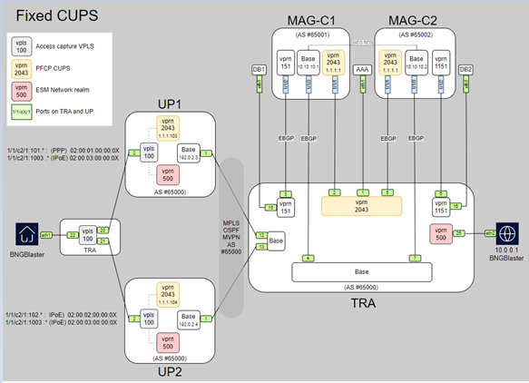
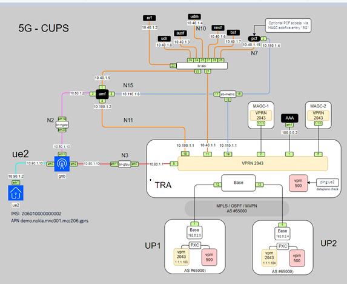

# **MAG-CUPS: 5G CUPS Simulation using Open5GS, UERANSIM, FreeRadius, BNGBlaster, and ContainerLab**

**MAG-CUPS** is an open-source project designed to simulate a **5G CUPS (Centralized User Plane Separation)** network architecture. This project leverages **ContainerLab** for container-based network simulation, **Open5GS** for the 5G core network, **UERANSIM** for 5G RAN simulation, and **BNGBlaster** for simulating broadband access using **PPPoE** and **IPoE**.

## **Overview**

This project simulates a 5G mobile network with a **CUPS architecture**, where the **Control Plane** and **User Plane** are separated. The solution uses **Open5GS** for the 5G core network, **UERANSIM** for simulating the **gNB** (5G base station) and **UE** (User Equipment), and **BNGBlaster** for simulating broadband access using **PPPoE** and **IPoE** protocols.

The entire network is simulated in a containerized environment using **ContainerLab**, providing a flexible and scalable platform for deployment, testing, and experimentation with 5G CUPS networks.

---

## **Features**

- **5G CUPS Simulation**: Implements 5G with a separated Control Plane and User Plane.
- **Containerized Setup**: Uses **ContainerLab** to orchestrate and manage the container-based network.
- **Open5GS Core**: Supports AMF, NRF, UDM, AUSF, SMF, and UPF components.
- **UERANSIM**: Simulates **gNB** and **UE** for 5G RAN (Radio Access Network).
- **PPPoE/IPoE Simulation**: Uses **BNGBlaster** for broadband session simulation.
- **FreeRADIUS Integration**: Implements AAA (Authentication, Authorization, and Accounting).
- **Flexible Setup**: Customizable network topologies for testing different scenarios.
- **Open Source**: Ideal for research, education, and testing.

---

## **Components**

### **1. Nokia MAG-C**
   - **Nokia MAG-C** (Multi-Access Gateway – Control Plane) manages session control, mobility, and policy enforcement for both mobile (4G/5G) and fixed broadband (PPPoE/IPoE) sessions.
   - Works alongside MAG-U (User Plane) to enable **CUPS (Control and User Plane Separation)** for scalability and flexibility.

### **2. ContainerLab**
   - **ContainerLab** deploys network components in isolated containers.
   - Simplifies network deployment and real-world simulation.
   - Used to manage containerized instances of **Open5GS**, **UERANSIM**, and **BNGBlaster**.

### **3. Open5GS**
   - Provides the **5G core network**, including **AMF, NRF, UDM, AUSF, SMF, and UPF**.
   - Configured for **CUPS** architecture with a separate **Control Plane** and **User Plane**.

### **4. UERANSIM**
   - Simulates **gNB** (5G base station) and **UE** (User Equipment).
   - Supports 5G NR (New Radio) and communication with Open5GS.

### **5. BNGBlaster**
   - Simulates **PPPoE** and **IPoE** sessions for broadband access testing.

### **6. FreeRADIUS**
   - Open-source RADIUS server for **Authentication, Authorization, and Accounting (AAA)**.
   - Supports EAP, PAP, CHAP, and integrates with **MySQL, PostgreSQL, LDAP**.
   - Used in ISPs and telecom networks for network access control.

---

## **Installation**

### **Prerequisites**
Ensure the following are installed:

- **Docker**: Runs containerized components.
- **ContainerLab**: Manages container-based network simulations.
- **Git**: Required for cloning the repository.

---

### **Getting Started**

Follow the **[documentation](docs/installation_verification.md)** for detailed setup instructions.

---

### **Installation Steps**

#### **1. Clone the Repository**
Clone this repository and navigate to the project directory:

```bash
git clone https://github.com/htakkey/mag-cups.git
cd mag-cups
```

#### **2. Create Required Network Bridges**
For **CentOS** (example):

```bash
[root@compute-1 scripts]# ./create_bridges-centos.sh
```

#### **3. Deploy the ContainerLab Environment**
Run the following command to deploy the simulated network:

```bash
[root@compute-1 MAG-cups]# clab dep -t cups.clab.yml
```

#### **4. Register a 5G Subscriber**
Use this script to register a new **IMSI**, APN, and Slice information:

```bash
[root@compute-1 scripts]# ./register_subscriber.sh    
```

##### **4.1 GUI Access to the Database**
You can verify subscriber records via **Web GUI**:

📌 **URL**: `http://x.x.x.x:10000/`  
📌 **Username/Password**: `admin/1423`  


#### **5. Start the Open5GS Core Network**
Run the following script to start the 5G Core:

```bash
[root@compute-1 scripts]# ./start_open5gs.sh
```

#### **6. Start PPPoE/IPoE Session using BNGBlaster**
Start the broadband session using **BNGBlaster**:



```bash
./start_dhcp_red.sh
./start_pppoe.sh   # To start session with traffic
```

#### **7. Start the 5G Session**
Start the 5G session (single IMSI or multiple IMSIs):



```bash
cd scripts
./start_5g_cups_10IMSI.sh
./start_5g_cups.sh
```

---

## **License**
- **ContainerLab images for MAG-C and VSR** are provided by **Nokia** and require a commercial license.
- **Other ContainerLab images** (Open5GS, FreeRADIUS, UERANSIM) are publicly available.

---

## **Contributing**
Contributions are welcome! Please submit a **pull request** or open an **issue** if you find bugs or want to improve the project.

---

## **Contact**
For questions, reach out via GitHub issues or contact the **Nokia team** for commercial licensing.
