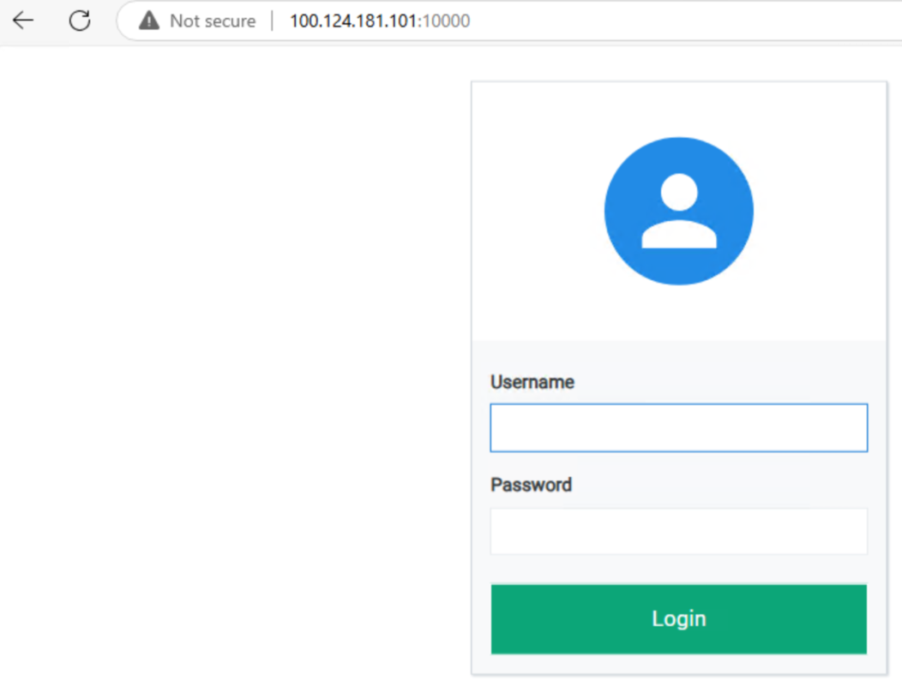

# MAG-CUPS: 5G CUPS Simulation using Open5GS, UERANSIM, BNGBlaster, and ContainerLab

**MAG-CUPS** is an open-source project designed to simulate a **5G CUPS (Centralized User Plane Separation)** network architecture. This project leverages **ContainerLab** for container-based network simulation, **Open5GS** for the 5G core network, **UERANSIM** for 5G RAN simulation, and **BNGBlaster** for simulating broadband access using **PPPoE** and **IPoE**.

## Overview

This project is built to simulate a 5G mobile network with a **CUPS architecture**, where the **Control Plane** and **User Plane** are separated. The solution uses **Open5GS** for the 5G core network, **UERANSIM** for simulating the **gNB** (5G base station) and **UE** (User Equipment), and **BNGBlaster** for simulating broadband access using **PPPoE** and **IPoE** protocols.

The entire network is simulated in a containerized environment using **ContainerLab**, providing a flexible and scalable platform for deployment, testing, and experimentation with 5G CUPS networks.

## Features

- **5G CUPS Simulation**: Simulates 5G with separated Control Plane and User Plane architecture.
- **Containerized Setup**: Utilizes **ContainerLab** for orchestrating and managing the container-based network simulation.
- **Open5GS**: Implements the 5G core network including AMF,NRF,UDM,AUSF, and other components.
- **UERANSIM**: Simulates the **gNB** and **UE** for 5G RAN (Radio Access Network).
- **PPPoE/IPoE Simulation**: Simulates broadband access with **BNGBlaster** for managing PPPoE and IPoE sessions.
- **Flexible Setup**: Customizable network topologies and components to suit various testing scenarios.
- **Open Source**: Fully open-source solution suitable for research, education, and testing purposes.

## Components


### 1. ** Nokia MAG-C** 
   - **Nokia MAG-C** Multi-Access Gateway – Control Plane) is a core network component that manages session control, mobility and policy enforcement for both mobile 4G/5G and fixed broadband (PPPoE/IPoE) sessions.
   - It works alongside MAG-U (User Plane) to enable CUPS (Control and User Plane Separation), providing scalability, flexibility, and optimized performance in converged networks
### 2. **ContainerLab**
   - **ContainerLab** is used to deploy network components in isolated containers.
   - It simplifies the process of deploying complex networks and simulating real-world network conditions.
   - The key network components (**Open5GS**, **UERANSIM**, and **BNGBlaster**) are containerized.

### 3. **Open5GS**
   - **Open5GS** provides the **5G core network** including essential components like **AMF** (Access and Mobility Management Function), **NRF** (NF Repository Function), **UDM** (Unified Data Management), and **AUSF** (Authentication Server Function).
   - Open5GS is configured for a **CUPS** architecture, where the **Control Plane** (AMF, SMF, etc.) is separated from the **User Plane** (UPF).
   
### 4. **UERANSIM**
   - **UERANSIM** is used to simulate the **gNB** (5G base station) and **UE** (User Equipment), providing the RAN (Radio Access Network) simulation.
   - It supports key 5G RAN features, including 5G NR (New Radio) and the connection setup between the gNB and UE.

### 5. **BNGBlaster**
   - **BNGBlaster** provides **PPPoE** and **IPoE** session management capabilities, simulating broadband access using BNGBlaster to create fixed sessions for end users.

### 6.  ** FreeRadius**
    - **FreeRadius** is a widely used open-source RADIUS server for authentication, authorization, and accounting (AAA). 
				- It supports various authentication methods, including EAP, PAP, CHAP, and integrates with databases like MySQL, PostgreSQL, and LDAP.
				- FreeRADIUS is commonly used in ISPs, enterprises, and telecom networks for managing network access control			

## Installation

### Prerequisites

Before you begin, ensure that the following are installed on your machine:

- **Docker**: Required for running the containerized components.
- **ContainerLab**: To create and manage container-based network simulations.
- **Git**: For cloning the repository.

### Getting Started

   Please follow the [documentation](docs/installation_verification.md) for setup instructions.

### Steps

1. **Clone the Repository**:

   First, clone this repository to your local machine:
   ```bash
   git clone https://github.com/htakkey/mag-cups.git
   cd mag-cups
 
2. **create the needed bridges**:
   create the brideges for Centos or Ubuntu ,example below for cenos OS 
   ```bash
   [root@compute-1 scripts]# ./create_bridges-centos.sh
    ```   
  
3. **Deploy the ContainerLab Environment**:

   Deploy the containerized network environment using the ContainerLab configuration:
   ```bash     
   [root@compute-1 MAG-cups]# clab dep -t cups.clab.yml
    ```

4.  **Register the 5G Subscriber**:
    you can subscriber the needed imsi using the below script,it contains the IMSI,APN ,Slice info....etc
     ```bash
     [root@compute-1 scripts]# ./register_subscriber.sh    
      ```
4.1  **GUI access to the database **:
	      You can check the users are created in the database via http://x.x.x.x:10000/   username/password: admin/1423
 
 
5. **Start the Open5GS Core Network (AMF,NRF...)**:
     ```bash
     [root@compute-1 scripts]#./start_open5gs.sh
					  ```

6.   **Start PPPoE/IPoE Session using BNGBlaster**:
     Start the broadband session using BNGBlaster to simulate PPPoE or IPoE session management

     ```bash
     ./start_dhcp_red.sh
     ./start_pppoe.sh   # To start session with traffic
7.   **Start the 5G Session**:
     start the 5G session (just 1 IMSI or 10 IMSIs)

     ```bash
     cd scripts
     ./start_5g_cups_10IMSI.sh
     ./start_5g_cups.sh			

8. License
clab image for MAG-C ,VSR are provided by nokia team,Commercial licenses are also available from Nokia team
other clab images (open5GS,radius and UERANSIM) are available via public sites
	
