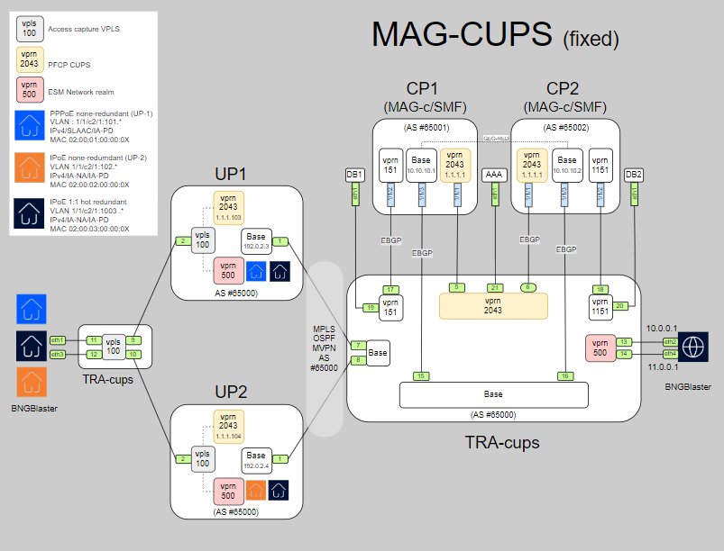
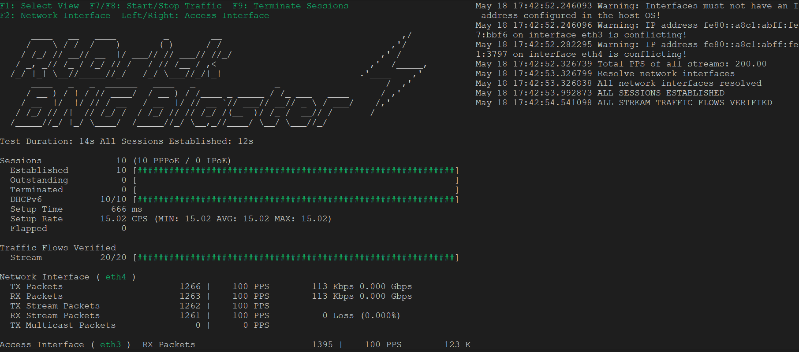

# **MAG-CUPS: Multi-Access Gateway for Control User Plane Separation Using Open-Source Tools**

## **Objective**
- The goal of this MAG-CUPS project , build with **[ContainerLab](https://containerlab.dev/)**, is to provide an efficient, flexible environment for simulating **fixed** and **Fixed Wireless Access (FWA) CUPS** sessions using open-source test tools. It is primarily designed for functional testing and educational purposes.

## **Overview**
- MAG-CUPS is an open-source project designed to simulate a 5G mobile network with a CUPS architecture. The architecture separates the Control Plane and User Plane for scalability and flexibility. The solution uses **[Open5GS](https://open5gs.org/)**  for the 5G core network, **[FreeRADIUS](https://www.freeradius.org/)**, an open-source RADIUS server for **Authentication, Authorization, and Accounting (AAA)**, **[UERANSIM](https://github.com/aligungr/UERANSIM)** to simulate the gNB (5G base station) and UE (User Equipment),  **[BNG Blaster](https://rtbrick.github.io/bngblaster/index.html)**  for simulating broadband access with PPPoE and IPoE protocols.
- The entire network is containerized and simulated using **[ContainerLab](https://containerlab.dev/)** for providing a flexible and scalable platform for testing, experimentation, and deployment of 5G CUPS networks. 

## **Topology setup**
To simplify the different functions for fixed and fixed wireless sessions, the deployed MAG-CUPS topology is illustrated in two parts.

The FWA part from the MAG-CUPS topology is illustrated in the diagram below:


The fixed part from the MAG-CUPS topology is illustrated in the diagram below:
 
 

## **Components**
### **1. MAG-C (Control Plane)**
- MAG-C (Multi-Access Gateway – Control Plane) is responsible for session control, mobility management, and policy enforcement for both mobile (4G/5G) and fixed broadband (PPPoE/IPoE) sessions.
  - This lab initiates 10 dual-stack PPPoE or 10 redundant/non redundant IPoE sessions using predefined scripts that trigger the BNG Blaster application, including `./start_dhcp.sh` , `./start_pppoe.sh` and `./start_dhcp_red.sh`.
  - This lab initiates 10 or a single 5G FWA session (single-stack ipv4) using predefined scripts that trigger the ueransim application, including `./start_5g_cups_10IMSI.sh` , `./start_5g_cups.sh` and `./stop_5g_cups.sh`.
  - This lab also includes a set of predefined CLI scripts (show commands) designed to streamline session monitoring and management during lab upskilling, eliminating the need for manually searching for specific commands.
- It works alongside MAG-U (User Plane) to implement CUPS for improved scalability, network efficiency, latency and flexibility

### **2. FreeRADIUS**
- **FreeRADIUS** is an open-source RADIUS server that provides Authentication, Authorization, and Accounting (AAA), supporting EAP, PAP, and CHAP while integrating with MySQL, PostgreSQL, and LDAP.
  - This LAB uses FreeRADIUS to authenticate PPPoE (chap), IPoE and FWA sessions and is used as an offline accounting-server.  

### **3. BNGBlaster**
- **BNG Blaster** simulates fixed sessions, such as PPPoE and IPoE, for broadband access testing while also supporting data traffic generation
  - This lab offers predefined scripts to initiate fixed sessions with or without data traffic (see above).

### **4. Open5GS**
- Open5GS provides the 5G core network, including key components such as AMF, NRF, UDM, UDR, AUSF, NSSF, BSF, and PCF .
  - This lab initiates the above elements using the pre-defined script `./start_open5gs.sh` and `./stop_open5gs.sh`.

### **5. UERANSIM**
- UERANSIM simulates the gNB (5G base station) and UE (User Equipment), enabling the simulation of the 5G Radio Access Network (RAN).
  - This LAB initiates a single or 10 dual-stack 5G FWA session(s) using pre-defined scripts `./start_5g_cups_10IMSI.sh` or `./start_5g_cups.sh` and `./stop_5g_cups.sh`.

**All scripts for initializing, starting, and stopping sessions are located in ../mag-cups/scripts and should be executed from within that directory**

### **LAB Prerequisites**

Ensure the following requirements are installed or fulfilled:
- **Docker**: Required for running containerized components.
- **ContainerLab**: For managing container-based network simulations.
- **Git**: For cloning this repository.
- Convert the QCOW2 images for SR OS and MAG-C (SR AG) into Docker images using **[vrnetlab](https://containerlab.dev/manual/vrnetlab/#vrnetlab)**
- Request a Nokia license for SR OS and MAG-C (SR AG), and save it as license.lic

## **Installation Steps**

Follow the **[documentation](docs/installation_verification.md)** for detailed setup instructions

### **1. Clone the Repository**

- Clone this repository and navigate to the project directory:
```bash
git clone https://github.com/hatakkey/mag-cups.git
cd mag-cups
```
### **2. Create Network Bridges**

We have two examples for creating the bridges one for CentOS and another one for Ubuntu,

For **CentOS** (example):
```bash
[root@compute-1 mag-cups]#cd scripts
[root@compute-1 scripts]#./create_bridges-centos.sh
```

### **3. Deploy the ContainerLab**

Run the following command to deploy the simulated network:
```bash    
[root@compute-1 mag-cups]# clab deploy -t cups.clab.yml
```
### 4. **Download cliscripts**

The delivered exec CLI scripts are a set of standard show commands designed to simplify session monitoring and management during lab upskilling. Rather than manually searching for specific CLI commands, these scripts provide a convenient way to execute them. All scripts are in the below directory.
```bash 
[root@compute-1 cliscripts]# pwd
/root/MAG-cups/cliscripts/
```
To use the CLI scripts, wait **a few minutes** for the clab nodes to fully initialize. Then, run the script below to transfer all CLI scripts from the `../cliscripts/` directory to `cf1:\magc` on CP1, CP2 and `cf1:\scripts-md` on UP1, UP2, and the TRA-cups node. Once the SFTP transfer is successfully completed, you can run all CLI scripts directly on each node. 

```bash 
[root@compute-1 scripts]#./upload-cliscripts.sh
```


## **Start Sessions**

### **1. Register IMSI in database**
Register a 5G subscriber with specific IMSI, APN, OPC, Key, SST, and SD values using the script:

```bash
[root@compute-1 scripts]#./register_subscriber.sh 
```
You can verify the registered subscriber records using the Web GUI:
📌 URL: http://x.x.x.x:10000/' 📌 **Username/Password**: admin/1423

 


### **2. Start the Open5GS Core Network**

Start the 5G Core (AMF, NRF, UDM, UDR, AUSF, NSSF, BSF, and PCF) using the pre-defined script.
```bash
[root@compute-1 scripts]#./start_open5gs.sh
```
Follow the **[documentation](docs/open5gs_verification.md)** for detailed information/checking .

### **3. Start the 5G FWA session**
- The scripts `./start_5g_cups.sh` and `./start_5g_cups_10IMSI.sh` initiate the respective session setups. We recommend connecting to the individual nodes — MAG1 and MAG2 — beforehand to start a call trace, allowing you to monitor session activity in real time. All details are described in the documentation link below.

```bash
[root@compute-1 scripts]#./start_5g_cups.sh         ## to start 1x5G session
[root@compute-1 scripts]#./start_5g_cups_10IMSI.sh  ## to start 10x5G sessions
```
Note that the sessions created using any of the two scripts (`start_5g_cups.sh` and `start_5g_cups_10IMSI.sh`) can be terminated from the home-user using the predefined script `./stop_5g_cups.sh`
or from the CP using the predefined script `exec clear-5g`.

Follow the **[documentation](docs/5G_session_verification.md)** for detailed information/checking .

### **4. Start the PPPoE or IPoE fixed sessions**
- The scripts `./start_dhcp_red.sh`, `./start_dhcp.sh`, and `./start_pppoe.sh` initiate the corresponding session setups. We recommend connecting to the individual nodes — cp1 and cp2 — beforehand to start a call trace, so you can monitor session activity in real time. All details are described in the documentation link below. 

```bash
[root@compute-1 scripts]#./start_dhcp_red.sh 
[root@compute-1 scripts]#./start_dhcp.sh 
[root@compute-1 scripts]#./start_pppoe.sh 
```
Bngblaster properly terminates the sessions by using Ctrl-C.



Follow the **[documentation](docs/fixed-sessions_verification.md)** for detailed information/checking.

### **5. Troubleshooting**
The logs available for analysis are gnb.log, amf.log, nrf.log, radiusd.log, and ue1.log. You can clear these logs using the ./clear_logs.sh script.
For further troubleshooting, you can use tcpdump to capture traffic on any bridge or port.
Additionally, EdgeShark can be integrated with Containerlab for more advanced packet analysis. For more information, refer to the Containerlab manual for [Wireshark integration](https://containerlab.dev/manual/wireshark/).


## **License**
- Nokia provides virtual simulator (vSIM) images in QCOW2 format for each SR OS and MAG-c (SR AG) release, available for download with a valid Nokia account.
  To use these with Containerlab, you must first build Docker images from the vSIM files using the vrnetlab framework. Refer to the vrnetlab documentation for detailed build instructions.
  Please note that deploying SR OS or MAG-c (SR AG) nodes in Containerlab also requires valid licenses. To obtain these, contact your Nokia account representative. The license should be created with the name license.lic and placed in the mag-cups project directory.
- All other ContainerLab snaps like Open5GS, FreeRADIUS or UERANSIM are publicly available and don’t require a license.
------
## **Contributing**
Contributions are welcome! Please submit a pull request or open an issue if you find bugs or want to improve the project.

## **Contact**
For questions, reach out via GitHub issues or contact the Nokia team for commercial licensing.

