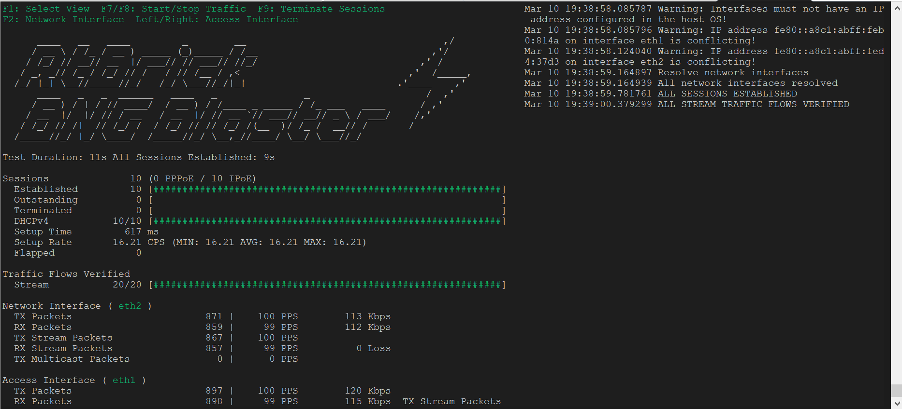
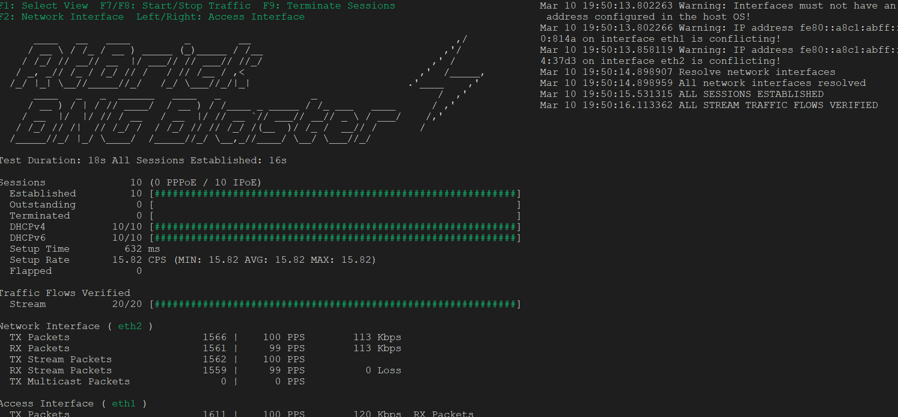
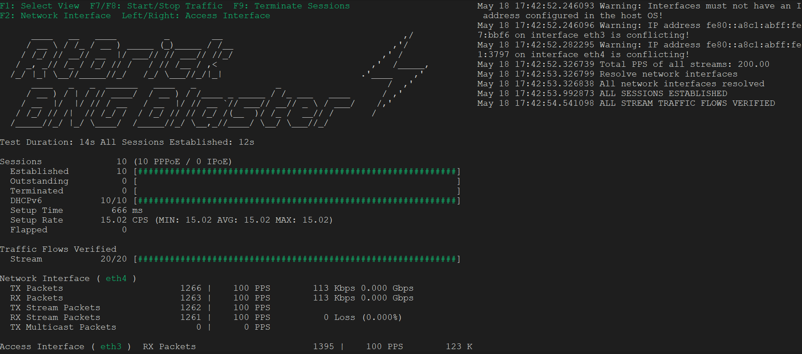

## 1.   **Start PPPoE/IPoE Session using BNGBlaste**
----
Start PPPoE/IPoE Session using BNGBlaster to simulate PPPoE or IPoE sessions

### 1.1. **Start dhcp redundant sessions (IPoE session)**
10 dhcp sessions are established using the BNGBlaster application
```bash
./start_dhcp_red.sh
```



The 10 IPoEs sessions are established on UP2 and UP1 using a 1:1 hot-standby redundancy model.
These can be verified with the following predfined script
   
```bash 
*A:CP1# exec s-ipoe_red
Pre-processing configuration file (V0v0)...
Completed processing 4 lines in 0.0 seconds
===============================================================================
BNG Sessions
===============================================================================
[IPoE] MAC                     : 02:00:03:00:00:01
-------------------------------------------------------------------------------
L2 Access Id                   : 1/1/c2/1
S-Vlan                         : 1003
C-Vlan                         : 1
MAC                            : 02:00:03:00:00:01

Up Time                        : 0d 00:00:22
Circuit Id                     : 0.0.0.0/0.0.0.0 eth 1:1
Remote Id                      : 7750bng-sub.1
Provisioned Addresses          : IPv4, IPv6_PD, IPv6_NA
Signaled Addresses             : IPv4, IPv6_PD, IPv6_NA

UP Peer                        : 1.1.1.101
Selected APN/DNN               : bngvrf
Network Realm                  : bngvrf
IPv4 Pool                      : ipoe-pool1

IPv4 Address                   : 111.250.0.1
IPv4 Address Origin            : Local pool
IPv4 Prefix Len                : 19
IPv4 Gateway                   : 111.250.31.254
IPv4 Primary DNS               : 208.67.5.1
IPv4 Secondary DNS             : 0.0.0.0
IPv4 Primary NBNS              : 0.0.0.0
IPv4 Secondary NBNS            : 0.0.0.0
DHCPv4 Server IP               : 111.250.31.254
DHCPv4 Lease Time              : 7d 00:00:00
DHCPv4 Renew Time              : 3d 12:00:00
DHCPv4 Rebind Time             : 6d 03:00:00
DHCPv4 Lease End               : 04/18/2025 13:30:06
DHCPv4 Remaining Lease Time    : 6d 23:59:38

IPv6 Delegated Prefix          : c01d:2::/56
IPv6 Delegated Prefix Origin   : Local pool
IPv6 PD Subnet Length          : 42
IPv6 PD as Framed Route        : No
IPv6 Delegated Prefix Pool     : ipoe-pool1
IPv6 NA                        : c01d:1::
IPv6 NA Origin                 : Local pool
IPv6 NA Subnet Length          : 114
IPv6 NA Pool                   : ipoe-pool1
IPv6 Link-local                : fe80::5eff:fe00:1
IPv6 Preferred Lifetime        : 7d 00:00:00
IPv6 Valid Lifetime            : 30d 00:00:00
IPv6 Primary DNS               : 4001::208:67:5:1
IPv6 Secondary DNS             : ::
DHCPv6 Server DUID             : (hex) 00 02 00 00 19 7f 43 50 31
DHCPv6 Client DUID             : (hex) 00 03 00 01 02 00 03 00 00 01
DHCPv6 IA_PD id                : 33554432
DHCPv6 IA_NA id                : 16777216
DHCPv6 T1                      : 3d 12:00:00
DHCPv6 T2                      : 5d 14:24:00
DHCPv6 Lease End               : 05/11/2025 13:30:06
DHCPv6 Remaining Lease Time    : 29d 23:59:38
DHCPv6 LDRA                    : No

Subscriber                     : auto_sub_61 (61)
Acct-Session-Id                : X00030110A06B683A0000003D
Acct-Multi-Session-Id          : Y0000003DA06B683A0000003C
State Id                       : 0x67f8fd3e00000016
Sub Profile                    : sub-base
Sla Profile                    : sla-base
UP Alternate Sub Profile       : N/A
UP Alternate Sla Profile       : N/A
App Profile                    : N/A
Content Filtering Policy Id    : 0
SAP-Template                   : defaultsap
Group-itf-template             : defaultgrp
Number of Framed IPv4 Routes   : 0
Number of Framed IPv6 Routes   : 0
NAT Profile                    : N/A
HTTP Redirect URL              : N/A
Intermediate Destination Id    : N/A
Ingress IPv4 filter override   : N/A
Egress IPv4 filter override    : N/A
Ingress IPv6 filter override   : N/A
Egress IPv6 filter override    : N/A
Number of QoS Overrides        : 0

PFCP Node ID                   : up1.nokia.com
PFCP Local SEID                : 0x0000000000030110
PFCP Remote SEID               : 0x000000000000007a

UE Id                          : 0x00030110
PDN Session Id                 : 0x00030110
Group/VM                       : 1/2
Call-Insight                   : disabled

Fate Sharing Group Id          : 1
UP Group                       : HOT1-UP1-UP2-VPLS-A/A
UPF Resiliency Type            : Hot Standby
Active UPF Session State       : Created
Standby UPF Session State      : Created
Standby UPF PFCP Remote IP     : 1.1.1.102
Standby UPF PFCP Node ID       : up2.nokia.com
Standby UPF PFCP Local SEID    : 0x0000000000040110
Standby UPF PFCP Remote SEID   : 0x0000000000000078
Standby UPF IBCP Remote IP     : 1.1.1.102
Standby UPF IBCP Remote TEID   : 0x80460000
Standby UPF L2 Access Id       : 1/1/c2/1
Standby UPF S-Vlan             : 1003
Standby UPF C-Vlan             : 1

Charging Profile 1             : mybngcharging
  Radius enabled               : Yes
  CHF enabled                  : No
  CHF rating group             : N/A

-------------------------------------------------------------------------------
Number of sessions shown : 1
===============================================================================
===============================================================================
BNG session aggregate statistics
===============================================================================
[IPoE] MAC                     : 02:00:03:00:00:01
-------------------------------------------------------------------------------
Time                           : (Not Specified)
Packets down                   : 0
Packets up                     : 0
Octets down                    : 0
Octets up                      : 0
Packets down dropped           : 0
Packets up dropped             : 0
Octets down dropped            : 0
Octets up dropped              : 0
-------------------------------------------------------------------------------
No. of sessions: 1
===============================================================================
Executed 4 lines in 0.0 seconds from file cf1:\magc\s-ipoe_red
```

The 10 sessions are created on the two UPs using UPF Resiliency Type hot-standby

```bash
*A:CP1# exec fsg
Pre-processing configuration file (V0v0)...
Completed processing 12 lines in 0.0 seconds

===============================================================================
Up Table
===============================================================================
Gw UpId
        L2-Access-Id           S-Vlan    C-Vlan    UPGroup       Fsg     Role
-------------------------------------------------------------------------------
1 up1.nokia.com (1.1.1.101)
        1/1/c2/1               1003      1-1000    HOT1-UP1-UP2-  1       Act
                                                   VPLS-A/A
-------------------------------------------------------------------------------
1 up2.nokia.com (1.1.1.102)
        1/1/c2/1               1003      1-1000    HOT1-UP1-UP2-  1       Std
                                                   VPLS-A/A
-------------------------------------------------------------------------------
No. of UPs : 2
===============================================================================
===============================================================================
UPGroup 'HOT1-UP1-UP2-VPLS-A/A'
===============================================================================
PDN gateway                            : 1
Description                            : (Not Specified)
Admin State                            : up

FSG Profile                            : fsg1
    Default Standby Type               : hot

-------------------------------------------------------------------------------
     FSG Active UP                Standby UP                 Sessions  Hold-Off
-------------------------------------------------------------------------------
       1 up1.nokia.com            up2.nokia.com (ready)            10         0
-------------------------------------------------------------------------------
No. of FSGs: 1
-------------------------------------------------------------------------------

-------------------------------------------------------------------------------
UP                                           Pref Drain Health    Fsg     Role
-------------------------------------------------------------------------------
up1.nokia.com (1.1.1.101)                    yes  no       100    1       Act
up2.nokia.com (1.1.1.102)                    no   no       100    1       Std
-------------------------------------------------------------------------------
No. of UPs: 2
-------------------------------------------------------------------------------
===============================================================================

===============================================================================
Fate Sharing Group Table
===============================================================================
FSG     Gw UPGroup          Active UP                               Sessions
           Site              Standby UP
-------------------------------------------------------------------------------
1       1  HOT1-UP1-UP2-     up1.nokia.com                                 10
           VPLS-A/A          up2.nokia.com
-------------------------------------------------------------------------------
No. of Sessions  : 10
-------------------------------------------------------------------------------
No. of FSGs      : 1
===============================================================================
```


### 1.1.1 **Check IPoE session on UP1**

Check the session are also created on UP1 via the below predefined script

```bash
A:admin@UP1# show s-ipoe_red
===============================================================================
Subscriber Host table
===============================================================================
Sap
  IP Address
    MAC Address                PPPoE-SID       Origin          Fwding State
      Subscriber
-------------------------------------------------------------------------------
[1/1/c2/1:1003.1]
  111.250.0.1
    02:00:03:00:00:01          N/A             PFCP            Fwding
      _cups_61
[1/1/c2/1:1003.1]
  c01d:1::/128
    02:00:03:00:00:01          N/A             PFCP            Fwding
      _cups_61
[1/1/c2/1:1003.1]
  c01d:2::/56
    02:00:03:00:00:01          N/A             PFCP            Fwding
      _cups_61
-------------------------------------------------------------------------------
Number of subscriber hosts : 3
===============================================================================

===============================================================================
PFCP Sessions
===============================================================================
Local Session Id                     : 0x000000000000007a
Local Peer Address                   : 1.1.1.101
Local Router                         : sx
Local TE-ID                          : 0x804a0000
Remote Session Id                    : 0x0000000000030110
Remote Peer Address                  : 1.1.1.1
Remote TE-ID                         : 0x40030111
PFCP Association                     : sx
Data Upstream PDR-ID                 : 0x0a01
Data Downstream PDR-ID               : 0x8a01
IBCP Upstream PDR-ID                 : 0x0a00
IBCP Downstream PDR-ID               : 0x8a00
Session Type                         : IPoE
Sap                                  : 1/1/c2/1:1003.1
Mac                                  : 02:00:03:00:00:01
StateId                              : 0x67f8fd3e00000016
Subscriber Id                        : _cups_61
Sub Profile                          : sub-base
SLA Profile                          : sla-base
Fate Sharing Group Id                : 1 (active)
Call-trace profile                   : (Not Specified)
-------------------------------------------------------------------------------
    Host                             :
        IP Address                   : 111.250.0.1
        Forwarding                   : Yes
        L2-Aware                     : No
    Host                             :
        IP Address                   : c01d:1::/128
        Forwarding                   : Yes
        L2-Aware                     : No
    Host                             :
        IP Address                   : c01d:2::/56
        Forwarding                   : Yes
        L2-Aware                     : No
===============================================================================
No. of PFCP Sessions: 1
===============================================================================
Executed 5 lines in 0.0 seconds from file "cf1:\scripts-md\s-ipoe_red"
```
### 1.1.2 **Check statistics on UP1/UP2**

The statistics on UP1 also show the 10 users  via the below predefined script
```bash
A:admin@UP1# show sessions
===============================================================================
Subscriber Management Statistics for System
===============================================================================
-------------------------------------------------------------------------------
-------------------------------------------------------------------------------
Host & Protocol Statistics
-------------------------------------------------------------------------------
IPv4   IPOE Hosts       - PFCP                  10       10 04/11/2025 13:40:33
-------------------------------------------------------------------------------
IPv6   IPOE Hosts       - PFCP (NA)             10       10 04/11/2025 13:40:33
       IPOE Hosts       - PFCP (PD)             10       10 04/11/2025 13:40:33
-------------------------------------------------------------------------------
Total  IPOE Hosts                               30       30 04/11/2025 13:40:33
       IPv4 Hosts                               10       10 04/11/2025 13:40:33
       IPv6 Hosts                               20       20 04/11/2025 13:40:33
       PFCP Hosts                               30       30 04/11/2025 13:40:33
       System Hosts Scale                       30       30 04/11/2025 13:40:33
-------------------------------------------------------------------------------
===============================================================================
===============================================================================
Subscriber Management Statistics for System
===============================================================================
-------------------------------------------------------------------------------
-------------------------------------------------------------------------------
PFCP Session Statistics
-------------------------------------------------------------------------------
Total  PFCP Sessions    - IPOE                  10       10 04/11/2025 13:40:33
       PFCP Sessions    - default tunnels        1        1 04/11/2025 13:40:33
       Total PFCP Sessions                      11       11 04/11/2025 13:40:33
-------------------------------------------------------------------------------
===============================================================================

===============================================================================
SLA Profile Statistics
===============================================================================
SLA-Profile Name                           Current     Peak      Peak Timestamp
-------------------------------------------------------------------------------
sla-base                                        10       10 04/11/2025 13:40:33
sla-default                                      0        0
sla-fwa                                          0        0
sla-hqos                                         0        0
-------------------------------------------------------------------------------
Total                                           10
===============================================================================

===============================================================================
Subscriber Profile Statistics
===============================================================================
Subscriber-Profile Name                    Current     Peak      Peak Timestamp
-------------------------------------------------------------------------------
sub-base                                        10       10 04/11/2025 13:40:33
sub-default                                      0        0
sub-fwa                                          0        0
sub-hqos                                         0        0
-------------------------------------------------------------------------------
Total                                           10
===============================================================================
===============================================================================
Subscriber Management Statistics for System
===============================================================================
       Type                                Current     Peak      Peak Timestamp
-------------------------------------------------------------------------------
-------------------------------------------------------------------------------
-------------------------------------------------------------------------------
Total  Subscribers                              10       10 04/11/2025 13:40:33
-------------------------------------------------------------------------------
===============================================================================
Peak values last reset at : 04/11/2025 13:40:33
Executed 20 lines in 0.0 seconds from file "cf1:\scripts-md\sessions"
```
The statistics on UP2 show the 10 users via the below predefined script

```bash
*A:UP2#
*A:UP2# exec sessions
Pre-processing configuration file (V0v0)...
Completed processing 20 lines in 0.0 seconds
===============================================================================
Subscriber Management Statistics for System
===============================================================================
-------------------------------------------------------------------------------

-------------------------------------------------------------------------------
Host & Protocol Statistics
-------------------------------------------------------------------------------
IPv4   IPOE Hosts       - PFCP                  10       10 03/12/2025 11:03:12
-------------------------------------------------------------------------------
Total  IPOE Hosts                               10       10 03/12/2025 11:03:12
       IPv4 Hosts                               10       10 03/12/2025 11:03:12
       PFCP Hosts                               10       10 03/12/2025 11:03:12
       System Hosts Scale                       10       10 03/12/2025 11:03:12
-------------------------------------------------------------------------------
===============================================================================
<snip>
```
### 1.1.3 **Call-trace for the session**

A call trace can be used to check the session via the below predefined script:
 
```bash
*A:CP1# exec ct-ipoe_red
Pre-processing configuration file (V0v0)...
Completed processing 14 lines in 0.0 seconds

From Debug to Sesion
---------------------

debug mobile-gateway call-insight bng profile debug-output mac-address 02:00:03:00:00:01
show mobile-gateway call-insight bng

===============================================================================
Call-insight BNG
===============================================================================
Match           Value                                            Status    Msgs
-------------------------------------------------------------------------------
mac-address     02:00:03:00:00:01                                running   0
-------------------------------------------------------------------------------
Number of call-insight debug jobs: 1
===============================================================================

Command:
debug mobile-gateway call-insight  no bng all

Executed 14 lines in 1.0 seconds from file cf1:\magc\ct-ipoe_red
```
```bash
*A:CP1# configure log log-id 77
----------------------------------------------
            from debug-trace
            to session
            no shutdown

```

 
```bash
*A:CP1#
1 2025/04/11 13:54:36.667 CEST MINOR: CALLTRACE #2003 N/A CALL-TRACE
"CALL-TRACE: msgType 2 slot 2 mda 1
   Profile:       debug-output
   MAC-address:   02:00:03:00:00:01
   UPnode-id:    1.1.1.102
   L2-circuit-id: 1/1/c2/1:1003.1

   Info:     ingressing frame on interface Sx
             to application Connectivity-management

   IP/UDP:   from 1.1.1.102 (port 2151) to 1.1.1.1 (port 2152)

   GTP-U:    T-PDU (TEID 0x0002fff0)

   Ethernet: from 02:00:03:00:00:01 to 33:33:00:01:00:02 (ethertype 0x86dd)

   IPv6/UDP: from fe80::ffff:ffff:ff00:1 (port 546) to ff02::1:2 (port 547)

   DHCPv6:
     Msg Type : SOLICIT (1)
     Trans Id : 0x7a9009
     Option : ELAPSED_TIME (8), Length : 2
       Time : 0 ms
     Option : CLIENTID (1), Length : 10
       LL  : HwTyp=0001,LL=020003000001
       00030001020003000001
     Option : RAPID_COMMIT (14), Length : 0
     Option : IA_NA (3), Length : 12
       IAID : 16777216
       Time1: 0 seconds
       Time2: 0 seconds
     Option : IA_PD (25), Length : 41
       IAID : 33554432
       Time1: 0 seconds
       Time2: 0 seconds
       Option : IAPREFIX (26), Length : 25
         Prefix : ::/0
         Preferred Lifetime : 0 seconds
         Valid Lifetime     : 0 seconds
     Option : ORO (6), Length : 2
       Requested Option : DNS_NAME_SRVR (23)
"

2 2025/04/11 13:54:36.667 CEST MINOR: CALLTRACE #2003 N/A CALL-TRACE
"CALL-TRACE: msgType 2 slot 2 mda 1
   Profile:       debug-output
   MAC-address:   02:00:03:00:00:01
   UPnode-id:    1.1.1.102
   L2-circuit-id: 1/1/c2/1:1003.1

   Info:     ingressing frame on interface Sx
             to application Connectivity-management

   IP/UDP:   from 1.1.1.101 (port 2151) to 1.1.1.1 (port 2152)

   GTP-U:    T-PDU (TEID 0x0001fff0)

   Ethernet: from 02:00:03:00:00:01 to 33:33:00:01:00:02 (ethertype 0x86dd)

   IPv6/UDP: from fe80::ffff:ffff:ff00:1 (port 546) to ff02::1:2 (port 547)

   DHCPv6:
     Msg Type : SOLICIT (1)
     Trans Id : 0x7a9009
     Option : ELAPSED_TIME (8), Length : 2
       Time : 0 ms
     Option : CLIENTID (1), Length : 10
       LL  : HwTyp=0001,LL=020003000001
       00030001020003000001
     Option : RAPID_COMMIT (14), Length : 0
     Option : IA_NA (3), Length : 12
       IAID : 16777216
       Time1: 0 seconds
       Time2: 0 seconds
     Option : IA_PD (25), Length : 41
       IAID : 33554432
       Time1: 0 seconds
       Time2: 0 seconds
       Option : IAPREFIX (26), Length : 25
         Prefix : ::/0
         Preferred Lifetime : 0 seconds
         Valid Lifetime     : 0 seconds
     Option : ORO (6), Length : 2
       Requested Option : DNS_NAME_SRVR (23)
"

3 2025/04/11 13:54:36.668 CEST MINOR: CALLTRACE #2003 N/A CALL-TRACE
"CALL-TRACE: msgType 2 slot 2 mda 1
   Profile:       debug-output
   MAC-address:   02:00:03:00:00:01
   Info:          Public event from application Other
   Info:          and module sessmgr

   apnmgr ADB message
      authentication-db: adb1-group
      matched entry: up1-up2-1003
      search circuit-id:
      search remote-id:
      search l2-access-id: 1/1/c2/1
      search username:
      search username-domain:
      search vendor-class:
      search UPip: 1.1.1.101
      search sVlan: 1003
      search cVlan: 1
      search apn:
      search imsi-mcc:
      search imsi-mnc:
      search imei-tac:
      search derivedId:
      search UPgroup: HOT1-UP1-UP2-VPLS-A/A
      search UPnode-id: up1.nokia.com
      search MAC: 02:00:03:00:00:01
      search client-id:
      search source-ip-prefix: ::/128
      search s-snssai-sst: 0
      search s-snssai-sd: 0
      search pdn-type: 0
      search charging-characteristics: 0
      search tai-mcc:
      search tai-mnc:
      search tai-tac:
      search tai-list-id: 0
      search cell-id-list-id: 0
"

4 2025/04/11 13:54:36.668 CEST MINOR: CALLTRACE #2003 N/A CALL-TRACE
"CALL-TRACE: msgType 2 slot 2 mda 1
   Profile:       debug-output
   MAC-address:   02:00:03:00:00:01

   Info:     egressing frame on interface Rad
             from application Radius-auth

   IP/UDP:   from 1.1.1.1 (port 65447) to 100.0.0.2 (port 1812)

   RADIUS:   Access Request (1) id=225 len=358
   - User-Name: "02:00:03:00:00:01"
   - User-Password: <encrypted>
   - NAS-IP-Address: 1.1.1.1
   - Calling-Station-Id: "1/1/c2/1:1003.1"
   - NAS-Port-Id: "bert 1.1.1.101/1/1/c2/1:1003.1 "
   - NAS-Identifier: "CP1"
   - Acct-Session-Id: "X00080110A06B683A0000006F"
   - Acct-Multi-Session-Id: "Y0000006FA06B683A0000006E"
   - NAS-Port-Type: Ethernet (15)
   - Alc-Client-Hardware-Addr: "02:00:03:00:00:01"
   - Alc-ToServer-Dhcp6-Options: 0x0008000200000001000a00030001020003000001000e0
0000003000c01000000000000000000000000190029020000000000000000000000001a001900000
000000000000000000000000000000000000000000000000600020017
   - Alc-UPId: "up1.nokia.com"
   - Alc-UPIp-Address: 1.1.1.101
   - Alc-UPGroup: "HOT1-UP1-UP2-VPLS-A/A"
"

5 2025/04/11 13:54:36.687 CEST MINOR: CALLTRACE #2003 N/A CALL-TRACE
"CALL-TRACE: msgType 2 slot 2 mda 1
   Profile:       debug-output
   MAC-address:   02:00:03:00:00:01

   Info:     ingressing frame on interface Rad
             to application Radius-auth

   IP/UDP:   from 100.0.0.2 (port 1812) to 1.1.1.1 (port 65447)

   RADIUS:   Access Accept (2) id=225 len=20
"

6 2025/04/11 13:54:36.687 CEST MINOR: CALLTRACE #2003 N/A CALL-TRACE
"CALL-TRACE: msgType 2 slot 2 mda 1
   Profile:       debug-output
   MAC-address:   02:00:03:00:00:01
   Info:          Public event from application Other
   Info:          and module sessmgr

   apnmgr ADB message
      authentication-db: adb2-group
      matched entry: charging
      search circuit-id:
      search remote-id:
      search l2-access-id: 1/1/c2/1
      search username:
      search username-domain:
      search vendor-class:
      search UPip: 1.1.1.101
      search sVlan: 1003
      search cVlan: 1
      search apn:
      search imsi-mcc:
      search imsi-mnc:
      search imei-tac:
      search derivedId:
      search UPgroup: HOT1-UP1-UP2-VPLS-A/A
      search UPnode-id: up1.nokia.com
      search MAC: 02:00:03:00:00:01
      search client-id:
      search source-ip-prefix: ::/128
      search s-snssai-sst: 0
      search s-snssai-sd: 0
      search pdn-type: 0
      search charging-characteristics: 0
      search tai-mcc:
      search tai-mnc:
      search tai-tac:
      search tai-list-id: 0
      search cell-id-list-id: 0
"

7 2025/04/11 13:54:36.687 CEST MINOR: CALLTRACE #2003 N/A CALL-TRACE
"CALL-TRACE: msgType 2 slot 2 mda 1
   Profile:       debug-output
   MAC-address:   02:00:03:00:00:01
   Info:          Public event from application Connectivity-management
   Info:          and module pfcp

   Sessmgr to PFCP
      msgType: PFCP_SESSION_CREATE_REQ (= 1)
      PFCP Sessmgr header
         ueId 0x80110
         ueBndlIdx 0x0
         tunnelInfo
            endPtIpAddr 1.1.1.101
            secEndPtIpAddr 0.0.0.0
            endPtSeId 0x0
            lclSeId 0xa0110
            refPtId 1
         pfcpOpaque 0
         smgrTransId 0x4001
         transErrCode: Success (= 0)
"

8 2025/04/11 13:54:36.687 CEST MINOR: CALLTRACE #2003 N/A CALL-TRACE
"CALL-TRACE: msgType 2 slot 2 mda 1
   Profile:       debug-output
   MAC-address:   02:00:03:00:00:01
   UPnode-id:    1.1.1.101

   Info:     egressing frame on interface Sx
             from application Connectivity-management

   IP/UDP:   from 1.1.1.1 (port 8805) to 1.1.1.101 (port 8805)

   PFCP:
   Header:
   - Version: 1
   - MP: 1    FO: 0    S: 1
   - Msg type: 50 [SESS_EST_REQ]
   - Msg len: 1176
   - SEID: 0x00000000
   - Seq nbr: 589852
   - Msg prio: 15

   IEs:
   - T: 60 [Node Id]     L: 18
     Type: FQDN
     Id: 206.01.PGW.1.1.1
   - T: 57 [FSEID]     L: 13
     SEID: 0x000a0110
     IPv4 Addr: 1.1.1.1
   - T: 1 [Create PDR]     L: 41
     Payload:
     - T: 56 [PDR Id]     L: 2
       V: 35328
     - T: 29 [Precedence]     L: 4
       V: 4096
     - T: 2 [PDI]     L: 10
       Payload:
       - T: 20 [Src Intf]     L: 1
         Intf: CP-function
       - T: 131 [Traffic End Pt Id]     L: 1
         V: 21
     - T: 95 [Out Hdr Rem]     L: 1
       Desc: GTP-U/UDP/IPv4
     - T: 108 [FAR Id]     L: 4
       Alloc Type: Dynamic by CP      Id: 537198592
   - T: 1 [Create PDR]     L: 158
     Payload:
     - T: 56 [PDR Id]     L: 2
       V: 2560
     - T: 29 [Precedence]     L: 4
       V: 4096
     - T: 2 [PDI]     L: 132
       Payload:
       - T: 20 [Src Intf]     L: 1
         Intf: Access
       - T: 131 [Traffic End Pt Id]     L: 1
         V: 5
       - T: 23 [SDF Filter]     L: 36
         Flow Desc: permit out 17 from any 67 to any
       - T: 23 [SDF Filter]     L: 37
         Flow Desc: permit out 17 from any 547 to any
       - T: 23 [SDF Filter]     L: 37
         Flow Desc: permit out 58 from FF02::2 to any
     - T: 108 [FAR Id]     L: 4
       Alloc Type: Dynamic by CP      Id: 327680
   - T: 1 [Create PDR]     L: 89
     Payload:
     - T: 56 [PDR Id]     L: 2
       V: 35329
     - T: 29 [Precedence]     L: 4
       V: 65535
     - T: 2 [PDI]     L: 10
       Payload:
       - T: 20 [Src Intf]     L: 1
         Intf: Core
       - T: 131 [Traffic End Pt Id]     L: 1
         V: 53
     - T: 108 [FAR Id]     L: 4
       Alloc Type: Dynamic by CP      Id: 537722880
     - T: 81 [URR Id]     L: 4
       Alloc Type: Dynamic by CP      Id: 1073741825
     - T: 109 [QER Id]     L: 4
       Alloc Type: Dynamic by CP      Id: 4112
     - T: 106 [Act Pre Rules]     L: 33
       Name: subprof:sub-base;slaprof:sla-base
   - T: 1 [Create PDR]     L: 96
     Payload:
     - T: 56 [PDR Id]     L: 2
       V: 2561
     - T: 29 [Precedence]     L: 4
       V: 65535
     - T: 2 [PDI]     L: 10
       Payload:
       - T: 20 [Src Intf]     L: 1
         Intf: Access
       - T: 131 [Traffic End Pt Id]     L: 1
         V: 37
     - T: 32771 [Outer Hdr Removal]     L: 3
       Ent ID: 3561 (BBF)
       Desc: Ethernet
     - T: 108 [FAR Id]     L: 4
       Alloc Type: Dynamic by CP      Id: 851968
     - T: 81 [URR Id]     L: 4
       Alloc Type: Dynamic by CP      Id: 1073741825
     - T: 109 [QER Id]     L: 4
       Alloc Type: Dynamic by CP      Id: 4112
     - T: 106 [Act Pre Rules]     L: 33
       Name: subprof:sub-base;slaprof:sla-base
   - T: 3 [Create FAR]     L: 27
     Payload:
     - T: 108 [FAR Id]     L: 4
       Alloc Type: Dynamic by CP      Id: 537198592
     - T: 44 [Apply Act]     L: 1
       Action(s): FORW
     - T: 4 [Forw Param]     L: 10
       Payload:
       - T: 42 [Dest Intf]     L: 1
         Intf: Access
       - T: 131 [Traffic End Pt Id]     L: 1
         V: 5
   - T: 3 [Create FAR]     L: 36
     Payload:
     - T: 108 [FAR Id]     L: 4
       Alloc Type: Dynamic by CP      Id: 327680
     - T: 44 [Apply Act]     L: 1
       Action(s): FORW
     - T: 4 [Forw Param]     L: 19
       Payload:
       - T: 42 [Dest Intf]     L: 1
         Intf: CP-func
       - T: 84 [Out Hdr Creat]     L: 10
         TEID: 0x400a0111
         IPv4 Addr: 1.1.1.1
         N19/N6 Ind: NO/NO
   - T: 3 [Create FAR]     L: 35
     Payload:
     - T: 108 [FAR Id]     L: 4
*"

9 2025/04/11 13:54:36.687 CEST MINOR: CALLTRACE #2003 N/A CALL-TRACE
"CALL-TRACE: msgType 2 slot 2 mda 1 (Cont'd)
*
       Alloc Type: Dynamic by CP      Id: 537722880
     - T: 44 [Apply Act]     L: 1
       Action(s): FORW
     - T: 4 [Forw Param]     L: 18
       Payload:
       - T: 42 [Dest Intf]     L: 1
         Intf: Access
       - T: 32770 [Outer Hdr Creation]     L: 4
         Ent ID: 3561 (BBF)
         Desc:  Traffic-Endpoint
       - T: 131 [Traffic End Pt Id]     L: 1
         V: 37
   - T: 3 [Create FAR]     L: 33
     Payload:
     - T: 108 [FAR Id]     L: 4
       Alloc Type: Dynamic by CP      Id: 851968
     - T: 44 [Apply Act]     L: 1
       Action(s): FORW
     - T: 4 [Forw Param]     L: 16
       Payload:
       - T: 42 [Dest Intf]     L: 1
         Intf: Core
       - T: 22 [NW Inst]     L: 7
         Netw Inst: bngvrf
   - T: 7 [Create QER]     L: 21
     Payload:
     - T: 109 [QER Id]     L: 4
       Alloc Type: Dynamic by CP      Id: 4112
     - T: 28 [QER Corr Id]     L: 4
       V: 111
     - T: 25 [Gate Status]     L: 1
       UL Gate: Open
       DL Gate: Open
   - T: 6 [Create URR]     L: 32
     Payload:
     - T: 81 [URR Id]     L: 4
       Alloc Type: Dynamic by CP      Id: 1073741825
     - T: 62 [Mea Method]     L: 1
       Method(s): VOLUM
     - T: 37 [Rep Triggers]     L: 2
       Trigger(s): PERIO
     - T: 64 [Mea Period]     L: 4
       V: 30
     - T: 100 [Mea Info]     L: 1
       Info bit(s): MNOP
   - T: 127 [Create Traffic EndPt]     L: 10
     Payload:
     - T: 131 [Traffic End Pt Id]     L: 1
       V: 21
     - T: 21 [FTEID]     L: 1
       FLAGS: CH,V6,V4
   - T: 127 [Create Traffic EndPt]     L: 44
     Payload:
     - T: 131 [Traffic End Pt Id]     L: 1
       V: 5
     - T: 32769 [Logical Port]     L: 10
       Ent ID: 3561 (BBF)
       V: 1/1/c2/1
     - T: 134 [C Tag]     L: 3
       Flag(s): VID
       C-VID: 1
     - T: 135 [S Tag]     L: 3
       Flag(s): VID
       S-VID: 1003
     - T: 133 [MAC Address]     L: 7
       SMAC: 02:00:03:00:00:01
   - T: 127 [Create Traffic EndPt]     L: 97
     Payload:
     - T: 131 [Traffic End Pt Id]     L: 1
       V: 37
     - T: 32769 [Logical Port]     L: 10
       Ent ID: 3561 (BBF)
       V: 1/1/c2/1
     - T: 134 [C Tag]     L: 3
       Flag(s): VID
       C-VID: 1
     - T: 135 [S Tag]     L: 3
       Flag(s): VID
       S-VID: 1003
     - T: 133 [MAC Address]     L: 7
       SMAC: 02:00:03:00:00:01
     - T: 93 [UE IP]     L: 5
       IPv4 Addr: 111.250.128.1
     - T: 93 [UE IP]     L: 18
       IPv6 Addr: c01d:1::1:0
       IPv6 Pref Len: 128
     - T: 93 [UE IP]     L: 18
       IPv6 Addr: c01d:2:100::
       IPv6 Pref Del: 08
   - T: 127 [Create Traffic EndPt]     L: 69
     Payload:
     - T: 131 [Traffic End Pt Id]     L: 1
       V: 53
     - T: 22 [NW Inst]     L: 7
       Netw Inst: bngvrf
     - T: 93 [UE IP]     L: 5
       IPv4 Addr: 111.250.128.1
     - T: 93 [UE IP]     L: 18
       IPv6 Addr: c01d:1::1:0
       IPv6 Pref Len: 128
     - T: 93 [UE IP]     L: 18
       IPv6 Addr: c01d:2:100::
       IPv6 Pref Del: 08
   - T: 113 [PDN Type]     L: 1
     V: IPv4
   - T: 50001 [Random Vector]     L: 18
     Ent ID: 3729 (Nokia)
     V: (encrypted) ef 17 33 3f d8 10 9a 30 dd 2b 52 70 2c 2a 15 2b
   - T: 50002 [LI Container]     L: 74
     Ent ID: 3729 (Nokia)
     V: (encrypted) 31 18 a7 95 87 2c 6b dc 21 db d2 d7 ee b1 09 1d 7c 21 01
   12 51 51 3e 0b 15 aa 82 df 03 ce 57 21 05 e1 93 f2 77 8a d2 6a 90 ad be 95
   0f fd b2 61 04 38 d0 bb 11 b6 61 cf 3e d0 e8 05 ed a4 19 34 3c 48 25 e6 2c
   c4 68 0c
   - T: 32774 [UP Aggregate Route]     L: 98
     Ent ID: 3729 (Nokia)
     Payload:
     - T: 22 [NW Inst]     L: 7
       Netw Inst: bngvrf
     - T: 153 [Framed Route]     L: 18
       V: 111.250.159.254/19
     - T: 155 [Framed IPv6 Route]     L: 15
       V: c01d:1::1:0/114
     - T: 155 [Framed IPv6 Route]     L: 15
       V: c01d:2:100::/42
     - T: 155 [Framed IPv6 Route]     L: 21
       V: fe80::5eff:fe00:1/128
   - T: 32775 [SAP Template]     L: 12
     Ent ID: 3729 (Nokia)
     V: defaultsap
*"

10 2025/04/11 13:54:36.687 CEST MINOR: CALLTRACE #2003 N/A CALL-TRACE
"CALL-TRACE: msgType 2 slot 2 mda 1 (Cont'd)
*
   - T: 32776 [MTU]     L: 12
     Ent ID: 3729 (Nokia)
     V: 25701
   - T: 32806 [L2TP Auth Challenge]     L: 6
     Ent ID: 3561 (BBF)
     Auth Challenge: 00000001
   - T: 32837 [Calltrace Profile]     L: 14
     Ent ID: 3729 (Nokia)
     Profile Name: debug-output
   - T: 32777 [State ID]     L: 10
     Ent ID: 3729 (Nokia)
     V: 7492022736462544936
"

11 2025/04/11 13:54:36.706 CEST MINOR: CALLTRACE #2003 N/A CALL-TRACE
"CALL-TRACE: msgType 2 slot 2 mda 1
   Profile:       debug-output
   MAC-address:   02:00:03:00:00:01
   UPnode-id:    1.1.1.102
   L2-circuit-id: 1/1/c2/1:1003.1

   Info:     ingressing frame on interface Sx
             to application Connectivity-management

   IP/UDP:   from 1.1.1.102 (port 2151) to 1.1.1.1 (port 2152)

   GTP-U:    T-PDU (TEID 0x0002fff0)

   Ethernet: from 02:00:03:00:00:01 to ff:ff:ff:ff:ff:ff (ethertype 0x0800)

   IP/UDP:   from 0.0.0.0 (port 68) to 255.255.255.255 (port 67)

   DHCP:
   ciaddr: 0.0.0.0           yiaddr: 0.0.0.0
   siaddr: 0.0.0.0           giaddr: 0.0.0.0
   chaddr: 02:00:03:00:00:01    xid: 0x3b51fd48

   DHCP options:
   [82] Relay agent information: len = 40
      [1] Circuit-id: 0.0.0.0/0.0.0.0 eth 1:1
      [2] Remote-id: 7750bng-sub.1
   [53] Message type: Discover
   [55] Param request list: len = 4
             1  Subnet mask
             3  Router
             6  Domain name server
            15  Domain name
   [255] End
"

12 2025/04/11 13:54:36.706 CEST MINOR: CALLTRACE #2003 N/A CALL-TRACE
"CALL-TRACE: msgType 2 slot 2 mda 1
   Profile:       debug-output
   MAC-address:   02:00:03:00:00:01
   UPnode-id:    1.1.1.102
   L2-circuit-id: 1/1/c2/1:1003.1

   Info:     ingressing frame on interface Sx
             to application Connectivity-management

   IP/UDP:   from 1.1.1.101 (port 2151) to 1.1.1.1 (port 2152)

   GTP-U:    T-PDU (TEID 0x0001fff0)

   Ethernet: from 02:00:03:00:00:01 to ff:ff:ff:ff:ff:ff (ethertype 0x0800)

   IP/UDP:   from 0.0.0.0 (port 68) to 255.255.255.255 (port 67)

   DHCP:
   ciaddr: 0.0.0.0           yiaddr: 0.0.0.0
   siaddr: 0.0.0.0           giaddr: 0.0.0.0
   chaddr: 02:00:03:00:00:01    xid: 0x3b51fd48

   DHCP options:
   [82] Relay agent information: len = 40
      [1] Circuit-id: 0.0.0.0/0.0.0.0 eth 1:1
      [2] Remote-id: 7750bng-sub.1
   [53] Message type: Discover
   [55] Param request list: len = 4
             1  Subnet mask
             3  Router
             6  Domain name server
            15  Domain name
   [255] End
"

13 2025/04/11 13:54:36.747 CEST MINOR: CALLTRACE #2003 N/A CALL-TRACE
"CALL-TRACE: msgType 2 slot 2 mda 1
   Profile:       debug-output
   MAC-address:   02:00:03:00:00:01
   UPnode-id:    1.1.1.101

   Info:     ingressing frame on interface Sx
             to application Connectivity-management

   IP/UDP:   from 1.1.1.101 (port 8805) to 1.1.1.1 (port 8805)

   PFCP:
   Header:
   - Version: 1
   - MP: 1    FO: 0    S: 1
   - Msg type: 51 [SESS_EST_RSP]
   - Msg len: 113
   - SEID: 0x000a0110
   - Seq nbr: 589852
   - Msg prio: 15

   IEs:
   - T: 60 [Node Id]     L: 15
     Type: FQDN
     Id: up1.nokia.com
   - T: 19 [Cause]     L: 1
     Cause: 1 [Accepted]
   - T: 50002 [LI Container]     L: 34
     Ent ID: 3729 (Nokia)
     V: (encrypted) 31 34 a0 ba 87 08 57 da ae c6 f2 b5 bf 52 62 b6 c5 64 46
   cb 95 58 03 27 89 ad 21 bd a8 87 b4 c5
   - T: 57 [FSEID]     L: 13
     SEID: 0x0000009a
     IPv4 Addr: 1.1.1.101
   - T: 128 [Created Traffic EndPt]     L: 18
     Payload:
     - T: 131 [Traffic End Pt Id]     L: 1
       V: 21
     - T: 21 [FTEID]     L: 9
       FLAGS: V4
       TEID: 0x80500002
       IPv4 Addr: 1.1.1.101
"

14 2025/04/11 13:54:36.747 CEST MINOR: CALLTRACE #2003 N/A CALL-TRACE
"CALL-TRACE: msgType 2 slot 2 mda 1
   Profile:       debug-output
   MAC-address:   02:00:03:00:00:01
   Info:          Public event from application Connectivity-management
   Info:          and module pfcp

   PFCP to sessmgr
      msgType: E_SMGR_PFCP_SESSION_CREATE_RSP (= 383)
      PFCP Sessmgr header
         ueId 0x80110
         ueBndlIdx 0x0
         tunnelInfo
            endPtIpAddr 1.1.1.101
            secEndPtIpAddr ::
            endPtSeId 0x9a
            lclSeId 0xa0110
            refPtId 1
         pfcpOpaque 1
         smgrTransId 0x4001
         transErrCode: Success (= 0)
"

15 2025/04/11 13:54:36.747 CEST MINOR: CALLTRACE #2003 N/A CALL-TRACE
"CALL-TRACE: msgType 2 slot 2 mda 1
   Profile:       debug-output
   MAC-address:   02:00:03:00:00:01
   UPnode-id:    1.1.1.101
   L2-circuit-id: 1/1/c2/1:1003.1

   Info:     egressing frame on interface Sx
             from application Connectivity-management

   IP/UDP:   from 1.1.1.1 (port 2151) to 1.1.1.101 (port 2152)

   GTP-U:    T-PDU (TEID 0x80500002)

   Ethernet: from 02:00:5e:00:00:01 to 02:00:03:00:00:01 (ethertype 0x0800)

   IP/UDP:   from 111.250.159.254 (port 67) to 111.250.128.1 (port 68)

   DHCP:
   ciaddr: 0.0.0.0           yiaddr: 111.250.128.1
   siaddr: 111.250.159.254   giaddr: 0.0.0.0
   chaddr: 02:00:03:00:00:01    xid: 0x3b51fd48

   DHCP options:
   [53] Message type: Offer
   [54] DHCP server addr: 111.250.159.254
   [51] Lease time: 604800
   [58] Renew timeout: 302400
   [59] Rebind timeout: 529200
   [1] Subnet mask: 255.255.224.0
   [3] Router: 111.250.159.254
   [6] Domain name server: 208.67.5.1
   [255] End
"

16 2025/04/11 13:54:36.747 CEST MINOR: CALLTRACE #2003 N/A CALL-TRACE
"CALL-TRACE: msgType 2 slot 2 mda 1
   Profile:       debug-output
   MAC-address:   02:00:03:00:00:01
   UPnode-id:    1.1.1.101
   L2-circuit-id: 1/1/c2/1:1003.1

   Info:     egressing frame on interface Sx
             from application Connectivity-management

   IP/UDP:   from 1.1.1.1 (port 2151) to 1.1.1.101 (port 2152)

   GTP-U:    T-PDU (TEID 0x80500002)

   Ethernet: from 02:00:5e:00:00:01 to 02:00:03:00:00:01 (ethertype 0x86dd)

   IPv6/UDP: from fe80::5eff:fe00:1 (port 547) to fe80::ffff:ffff:ff00:1
   (port 546)

   DHCPv6:
     Msg Type : REPLY (7)
     Trans Id : 0x7a9009
     Option : CLIENTID (1), Length : 10
       LL  : HwTyp=0001,LL=020003000001
       00030001020003000001
     Option : SERVERID (2), Length : 9
       EN  : Enterpr.=0000197f,Id=435031
       00020000197f435031
     Option : RAPID_COMMIT (14), Length : 0
     Option : IA_NA (3), Length : 40
       IAID : 16777216
       Time1: 302400 seconds
       Time2: 483840 seconds
       Option : IAADDR (5), Length : 24
         Address : c01d:1::1:0
         Preferred Lifetime : 604800 seconds
         Valid Lifetime     : 2592000 seconds
     Option : IA_PD (25), Length : 41
       IAID : 33554432
       Time1: 302400 seconds
       Time2: 483840 seconds
       Option : IAPREFIX (26), Length : 25
         Prefix : c01d:2:100::/56
         Preferred Lifetime : 604800 seconds
         Valid Lifetime     : 2592000 seconds
     Option : DNS_NAME_SRVR (23), Length : 16
       Server : 4001::208:67:5:1
"

17 2025/04/11 13:54:36.747 CEST MINOR: CALLTRACE #2003 N/A CALL-TRACE
"CALL-TRACE: msgType 2 slot 2 mda 1
   Profile:       debug-output
   MAC-address:   02:00:03:00:00:01
   Info:          Public event from application Connectivity-management
   Info:          and module pfcp

   Sessmgr to PFCP
      msgType: PFCP_SESSION_CREATE_REQ (= 1)
      PFCP Sessmgr header
         ueId 0x80110
         ueBndlIdx 0x0
         tunnelInfo
            endPtIpAddr 1.1.1.102
            secEndPtIpAddr 0.0.0.0
            endPtSeId 0x0
            lclSeId 0xb0110
            refPtId 1
         pfcpOpaque 0
         smgrTransId 0x4002
         transErrCode: Success (= 0)
"

18 2025/04/11 13:54:36.747 CEST MINOR: CALLTRACE #2003 N/A CALL-TRACE
"CALL-TRACE: msgType 2 slot 2 mda 1
   Profile:       debug-output
   MAC-address:   02:00:03:00:00:01
   UPnode-id:    1.1.1.102

   Info:     egressing frame on interface Sx
             from application Connectivity-management

   IP/UDP:   from 1.1.1.1 (port 8805) to 1.1.1.102 (port 8805)

   PFCP:
   Header:
   - Version: 1
   - MP: 1    FO: 0    S: 1
   - Msg type: 50 [SESS_EST_REQ]
   - Msg len: 1176
   - SEID: 0x00000000
   - Seq nbr: 589855
   - Msg prio: 15

   IEs:
   - T: 60 [Node Id]     L: 18
     Type: FQDN
     Id: 206.01.PGW.1.1.1
   - T: 57 [FSEID]     L: 13
     SEID: 0x000b0110
     IPv4 Addr: 1.1.1.1
   - T: 1 [Create PDR]     L: 41
     Payload:
     - T: 56 [PDR Id]     L: 2
       V: 35328
     - T: 29 [Precedence]     L: 4
       V: 4096
     - T: 2 [PDI]     L: 10
       Payload:
       - T: 20 [Src Intf]     L: 1
         Intf: CP-function
       - T: 131 [Traffic End Pt Id]     L: 1
         V: 21
     - T: 95 [Out Hdr Rem]     L: 1
       Desc: GTP-U/UDP/IPv4
     - T: 108 [FAR Id]     L: 4
       Alloc Type: Dynamic by CP      Id: 537198592
   - T: 1 [Create PDR]     L: 158
     Payload:
     - T: 56 [PDR Id]     L: 2
       V: 2560
     - T: 29 [Precedence]     L: 4
       V: 4096
     - T: 2 [PDI]     L: 132
       Payload:
       - T: 20 [Src Intf]     L: 1
         Intf: Access
       - T: 131 [Traffic End Pt Id]     L: 1
         V: 5
       - T: 23 [SDF Filter]     L: 36
         Flow Desc: permit out 17 from any 67 to any
       - T: 23 [SDF Filter]     L: 37
         Flow Desc: permit out 17 from any 547 to any
       - T: 23 [SDF Filter]     L: 37
         Flow Desc: permit out 58 from FF02::2 to any
     - T: 108 [FAR Id]     L: 4
       Alloc Type: Dynamic by CP      Id: 327680
   - T: 1 [Create PDR]     L: 89
     Payload:
     - T: 56 [PDR Id]     L: 2
       V: 35329
     - T: 29 [Precedence]     L: 4
       V: 65535
     - T: 2 [PDI]     L: 10
       Payload:
       - T: 20 [Src Intf]     L: 1
         Intf: Core
       - T: 131 [Traffic End Pt Id]     L: 1
         V: 53
     - T: 108 [FAR Id]     L: 4
       Alloc Type: Dynamic by CP      Id: 537722880
     - T: 81 [URR Id]     L: 4
       Alloc Type: Dynamic by CP      Id: 1073741825
     - T: 109 [QER Id]     L: 4
       Alloc Type: Dynamic by CP      Id: 4112
     - T: 106 [Act Pre Rules]     L: 33
       Name: subprof:sub-base;slaprof:sla-base
   - T: 1 [Create PDR]     L: 96
     Payload:
     - T: 56 [PDR Id]     L: 2
       V: 2561
     - T: 29 [Precedence]     L: 4
       V: 65535
     - T: 2 [PDI]     L: 10
       Payload:
       - T: 20 [Src Intf]     L: 1
         Intf: Access
       - T: 131 [Traffic End Pt Id]     L: 1
         V: 37
     - T: 32771 [Outer Hdr Removal]     L: 3
       Ent ID: 3561 (BBF)
       Desc: Ethernet
     - T: 108 [FAR Id]     L: 4
       Alloc Type: Dynamic by CP      Id: 851968
     - T: 81 [URR Id]     L: 4
       Alloc Type: Dynamic by CP      Id: 1073741825
     - T: 109 [QER Id]     L: 4
       Alloc Type: Dynamic by CP      Id: 4112
     - T: 106 [Act Pre Rules]     L: 33
       Name: subprof:sub-base;slaprof:sla-base
   - T: 3 [Create FAR]     L: 27
     Payload:
     - T: 108 [FAR Id]     L: 4
       Alloc Type: Dynamic by CP      Id: 537198592
     - T: 44 [Apply Act]     L: 1
       Action(s): FORW
     - T: 4 [Forw Param]     L: 10
       Payload:
       - T: 42 [Dest Intf]     L: 1
         Intf: Access
       - T: 131 [Traffic End Pt Id]     L: 1
         V: 5
   - T: 3 [Create FAR]     L: 36
     Payload:
     - T: 108 [FAR Id]     L: 4
       Alloc Type: Dynamic by CP      Id: 327680
     - T: 44 [Apply Act]     L: 1
       Action(s): FORW
     - T: 4 [Forw Param]     L: 19
       Payload:
       - T: 42 [Dest Intf]     L: 1
         Intf: CP-func
       - T: 84 [Out Hdr Creat]     L: 10
         TEID: 0x400a0111
         IPv4 Addr: 1.1.1.1
         N19/N6 Ind: NO/NO
   - T: 3 [Create FAR]     L: 35
     Payload:
     - T: 108 [FAR Id]     L: 4
*"

19 2025/04/11 13:54:36.747 CEST MINOR: CALLTRACE #2003 N/A CALL-TRACE
"CALL-TRACE: msgType 2 slot 2 mda 1 (Cont'd)
*
       Alloc Type: Dynamic by CP      Id: 537722880
     - T: 44 [Apply Act]     L: 1
       Action(s): FORW
     - T: 4 [Forw Param]     L: 18
       Payload:
       - T: 42 [Dest Intf]     L: 1
         Intf: Access
       - T: 32770 [Outer Hdr Creation]     L: 4
         Ent ID: 3561 (BBF)
         Desc:  Traffic-Endpoint
       - T: 131 [Traffic End Pt Id]     L: 1
         V: 37
   - T: 3 [Create FAR]     L: 33
     Payload:
     - T: 108 [FAR Id]     L: 4
       Alloc Type: Dynamic by CP      Id: 851968
     - T: 44 [Apply Act]     L: 1
       Action(s): FORW
     - T: 4 [Forw Param]     L: 16
       Payload:
       - T: 42 [Dest Intf]     L: 1
         Intf: Core
       - T: 22 [NW Inst]     L: 7
         Netw Inst: bngvrf
   - T: 7 [Create QER]     L: 21
     Payload:
     - T: 109 [QER Id]     L: 4
       Alloc Type: Dynamic by CP      Id: 4112
     - T: 28 [QER Corr Id]     L: 4
       V: 111
     - T: 25 [Gate Status]     L: 1
       UL Gate: Open
       DL Gate: Open
   - T: 6 [Create URR]     L: 32
     Payload:
     - T: 81 [URR Id]     L: 4
       Alloc Type: Dynamic by CP      Id: 1073741825
     - T: 62 [Mea Method]     L: 1
       Method(s): VOLUM
     - T: 37 [Rep Triggers]     L: 2
       Trigger(s): PERIO
     - T: 64 [Mea Period]     L: 4
       V: 30
     - T: 100 [Mea Info]     L: 1
       Info bit(s): MNOP
   - T: 127 [Create Traffic EndPt]     L: 10
     Payload:
     - T: 131 [Traffic End Pt Id]     L: 1
       V: 21
     - T: 21 [FTEID]     L: 1
       FLAGS: CH,V6,V4
   - T: 127 [Create Traffic EndPt]     L: 44
     Payload:
     - T: 131 [Traffic End Pt Id]     L: 1
       V: 5
     - T: 32769 [Logical Port]     L: 10
       Ent ID: 3561 (BBF)
       V: 1/1/c2/1
     - T: 134 [C Tag]     L: 3
       Flag(s): VID
       C-VID: 1
     - T: 135 [S Tag]     L: 3
       Flag(s): VID
       S-VID: 1003
     - T: 133 [MAC Address]     L: 7
       SMAC: 02:00:03:00:00:01
   - T: 127 [Create Traffic EndPt]     L: 97
     Payload:
     - T: 131 [Traffic End Pt Id]     L: 1
       V: 37
     - T: 32769 [Logical Port]     L: 10
       Ent ID: 3561 (BBF)
       V: 1/1/c2/1
     - T: 134 [C Tag]     L: 3
       Flag(s): VID
       C-VID: 1
     - T: 135 [S Tag]     L: 3
       Flag(s): VID
       S-VID: 1003
     - T: 133 [MAC Address]     L: 7
       SMAC: 02:00:03:00:00:01
     - T: 93 [UE IP]     L: 5
       IPv4 Addr: 111.250.128.1
     - T: 93 [UE IP]     L: 18
       IPv6 Addr: c01d:1::1:0
       IPv6 Pref Len: 128
     - T: 93 [UE IP]     L: 18
       IPv6 Addr: c01d:2:100::
       IPv6 Pref Del: 08
   - T: 127 [Create Traffic EndPt]     L: 69
     Payload:
     - T: 131 [Traffic End Pt Id]     L: 1
       V: 53
     - T: 22 [NW Inst]     L: 7
       Netw Inst: bngvrf
     - T: 93 [UE IP]     L: 5
       IPv4 Addr: 111.250.128.1
     - T: 93 [UE IP]     L: 18
       IPv6 Addr: c01d:1::1:0
       IPv6 Pref Len: 128
     - T: 93 [UE IP]     L: 18
       IPv6 Addr: c01d:2:100::
       IPv6 Pref Del: 08
   - T: 113 [PDN Type]     L: 1
     V: IPv4
   - T: 50001 [Random Vector]     L: 18
     Ent ID: 3729 (Nokia)
     V: (encrypted) d4 12 61 3d 27 22 ab 3f d7 49 c3 7a 62 61 be 4c
   - T: 50002 [LI Container]     L: 74
     Ent ID: 3729 (Nokia)
     V: (encrypted) 18 e8 e0 65 6b a2 a2 52 9a 2f 6e 35 5a 3a 52 9a 29 42 69
   35 46 9c 2a 20 79 eb f7 49 79 38 f9 6b 42 cd 9e 39 7d 30 d5 72 9f 25 62 59
   1e e1 c9 73 8e f5 1e 70 66 d7 71 27 50 7e fc 61 49 2f 7e b1 c7 a3 2f 1a 94
   79 36 4f
   - T: 32774 [UP Aggregate Route]     L: 98
     Ent ID: 3729 (Nokia)
     Payload:
     - T: 22 [NW Inst]     L: 7
       Netw Inst: bngvrf
     - T: 153 [Framed Route]     L: 18
       V: 111.250.159.254/19
     - T: 155 [Framed IPv6 Route]     L: 15
       V: c01d:1::1:0/114
     - T: 155 [Framed IPv6 Route]     L: 15
       V: c01d:2:100::/42
     - T: 155 [Framed IPv6 Route]     L: 21
       V: fe80::5eff:fe00:1/128
   - T: 32775 [SAP Template]     L: 12
     Ent ID: 3729 (Nokia)
     V: defaultsap
*"

20 2025/04/11 13:54:36.747 CEST MINOR: CALLTRACE #2003 N/A CALL-TRACE
"CALL-TRACE: msgType 2 slot 2 mda 1 (Cont'd)
*
   - T: 32776 [MTU]     L: 12
     Ent ID: 3729 (Nokia)
     V: 25701
   - T: 32806 [L2TP Auth Challenge]     L: 6
     Ent ID: 3561 (BBF)
     Auth Challenge: 00000001
   - T: 32837 [Calltrace Profile]     L: 14
     Ent ID: 3729 (Nokia)
     Profile Name: debug-output
   - T: 32777 [State ID]     L: 10
     Ent ID: 3729 (Nokia)
     V: 7492022736462544936
"

21 2025/04/11 13:54:36.747 CEST MINOR: CALLTRACE #2003 N/A CALL-TRACE
"CALL-TRACE: msgType 2 slot 2 mda 1
   Profile:       debug-output
   MAC-address:   02:00:03:00:00:01
   Info:          Public event from application Other
   Info:          and module lrdm

   lrdm event
      apnRadGrpID 8
      radSesReqType 17
      code 0
"

22 2025/04/11 13:54:36.747 CEST MINOR: CALLTRACE #2003 N/A CALL-TRACE
"CALL-TRACE: msgType 2 slot 2 mda 1
   Profile:       debug-output
   MAC-address:   02:00:03:00:00:01

   Info:     egressing frame on interface Rad
             from application Radius-auth

   IP/UDP:   from 1.1.1.1 (port 65447) to 100.0.0.2 (port 1813)

   RADIUS:   Accounting Request (4) id=229 len=370
   - Acct-Status-Type: Start (1)
   - NAS-IP-Address: 1.1.1.1
   - Acct-Delay-Time: 0
   - User-Name: "02:00:03:00:00:01"
   - Framed-IP-Address: 111.250.128.1
   - Framed-IP-Netmask: 255.255.224.0
   - NAS-Identifier: "CP1"
   - Acct-Session-Id: "X00080110A06B683A0000006F"
   - Acct-Multi-Session-Id: "Y0000006FA06B683A0000006E"
   - Acct-Authentic: RADIUS (1)
   - Event-Timestamp: FRI APR 11 11:54:36 2025

   - Calling-Station-Id: "1/1/c2/1:1003.1"
   - NAS-Port-Type: Ethernet (15)
   - NAS-Port-Id: "bert 1.1.1.101/1/1/c2/1:1003.1 "
   - Delegated-IPv6-Prefix: c01d:2:100::/56
   - Framed-IPv6-Address: c01d:1::1:0
   - Alc-Subsc-ID-Str: "auto_sub_111"
   - Alc-Subsc-Prof-Str: "sub-base"
   - Alc-SLA-Prof-Str: "sla-base"
   - Alc-Client-Hardware-Addr: "02:00:03:00:00:01"
   - Alc-UPId: "up1.nokia.com"
   - Alc-UPIp-Address: 1.1.1.101
   - Alc-UPSubscriber-Id: 111
   - Alc-Active-Addresses: na_pd (12)
   - Alc-UPGroup: "HOT1-UP1-UP2-VPLS-A/A"
"

23 2025/04/11 13:54:36.786 CEST MINOR: CALLTRACE #2003 N/A CALL-TRACE
"CALL-TRACE: msgType 2 slot 2 mda 1
   Profile:       debug-output
   MAC-address:   02:00:03:00:00:01
   UPnode-id:    1.1.1.101
   L2-circuit-id: 1/1/c2/1:1003.1

   Info:     egressing frame on interface Sx
             from application Connectivity-management

   IP/UDP:   from 1.1.1.1 (port 2151) to 1.1.1.101 (port 2152)

   GTP-U:    T-PDU (TEID 0x80500002)

   Ethernet: from 02:00:5e:00:00:01 to 02:00:03:00:00:01 (ethertype 0x86dd)

   IPv6:     from fe80::5eff:fe00:1 to ff02::1

   ICMPv6:
      Type    : Router Advertisement (134)
      Code    : No Code (0)
      Checksum: 0x5502
      Hop Limit     : 255
      Flags         : Managed
      Retrans Time  : 0
      Def Life Time : 1800
      Reachable Time: 0
      Option  : Src Link Layer Addr 02:00:5e:00:00:01
      Option  : DNS Lifetime : 1800
                DNS Address  : 4001::208:67:5:1
"

24 2025/04/11 13:54:36.796 CEST MINOR: CALLTRACE #2003 N/A CALL-TRACE
"CALL-TRACE: msgType 2 slot 2 mda 1
   Profile:       debug-output
   MAC-address:   02:00:03:00:00:01
   UPnode-id:    1.1.1.102

   Info:     ingressing frame on interface Sx
             to application Connectivity-management

   IP/UDP:   from 1.1.1.102 (port 8805) to 1.1.1.1 (port 8805)

   PFCP:
   Header:
   - Version: 1
   - MP: 1    FO: 0    S: 1
   - Msg type: 51 [SESS_EST_RSP]
   - Msg len: 113
   - SEID: 0x000b0110
   - Seq nbr: 589855
   - Msg prio: 15

   IEs:
   - T: 60 [Node Id]     L: 15
     Type: FQDN
     Id: up2.nokia.com
   - T: 19 [Cause]     L: 1
     Cause: 1 [Accepted]
   - T: 50002 [LI Container]     L: 34
     Ent ID: 3729 (Nokia)
     V: (encrypted) 18 c4 e7 4a 6b 86 9e 54 15 32 4e 57 0b d9 39 31 86 02 64
   30 6a d6 97 4a c9 19 d0 62 37 3e 2f 01
   - T: 57 [FSEID]     L: 13
     SEID: 0x000000a3
     IPv4 Addr: 1.1.1.102
   - T: 128 [Created Traffic EndPt]     L: 18
     Payload:
     - T: 131 [Traffic End Pt Id]     L: 1
       V: 21
     - T: 21 [FTEID]     L: 9
       FLAGS: V4
       TEID: 0x804e0003
       IPv4 Addr: 1.1.1.102
"

25 2025/04/11 13:54:36.796 CEST MINOR: CALLTRACE #2003 N/A CALL-TRACE
"CALL-TRACE: msgType 2 slot 2 mda 1
   Profile:       debug-output
   MAC-address:   02:00:03:00:00:01
   Info:          Public event from application Connectivity-management
   Info:          and module pfcp

   PFCP to sessmgr
      msgType: E_SMGR_PFCP_SESSION_CREATE_RSP (= 383)
      PFCP Sessmgr header
         ueId 0x80110
         ueBndlIdx 0x0
         tunnelInfo
            endPtIpAddr 1.1.1.102
            secEndPtIpAddr ::
            endPtSeId 0xa3
            lclSeId 0xb0110
            refPtId 1
         pfcpOpaque 1
         smgrTransId 0x4002
         transErrCode: Success (= 0)
"

26 2025/04/11 13:54:36.808 CEST MINOR: CALLTRACE #2003 N/A CALL-TRACE
"CALL-TRACE: msgType 2 slot 2 mda 1
   Profile:       debug-output
   MAC-address:   02:00:03:00:00:01
   UPnode-id:    1.1.1.101
   L2-circuit-id: 1/1/c2/1:1003.1

   Info:     ingressing frame on interface Sx
             to application Connectivity-management

   IP/UDP:   from 1.1.1.102 (port 2151) to 1.1.1.1 (port 2152)

   GTP-U:    T-PDU (TEID 0x0002fff0)

   Ethernet: from 02:00:03:00:00:01 to ff:ff:ff:ff:ff:ff (ethertype 0x0800)

   IP/UDP:   from 0.0.0.0 (port 68) to 255.255.255.255 (port 67)

   DHCP:
   ciaddr: 0.0.0.0           yiaddr: 0.0.0.0
   siaddr: 0.0.0.0           giaddr: 0.0.0.0
   chaddr: 02:00:03:00:00:01    xid: 0x3b51fd48

   DHCP options:
   [82] Relay agent information: len = 40
      [1] Circuit-id: 0.0.0.0/0.0.0.0 eth 1:1
      [2] Remote-id: 7750bng-sub.1
   [53] Message type: Request
   [55] Param request list: len = 4
             1  Subnet mask
             3  Router
             6  Domain name server
            15  Domain name
   [54] DHCP server addr: 111.250.159.254
   [50] Requested IP addr: 111.250.128.1
   [255] End
"

27 2025/04/11 13:54:36.808 CEST MINOR: CALLTRACE #2003 N/A CALL-TRACE
"CALL-TRACE: msgType 2 slot 2 mda 1
   Profile:       debug-output
   MAC-address:   02:00:03:00:00:01
   UPnode-id:    1.1.1.101
   L2-circuit-id: 1/1/c2/1:1003.1

   Info:     ingressing frame on interface Sx
             to application Connectivity-management

   IP/UDP:   from 1.1.1.102 (port 2151) to 1.1.1.1 (port 2152)

   GTP-U:    T-PDU (TEID 0x400a0111)

   Ethernet: from 02:00:03:00:00:01 to 33:33:00:00:00:02 (ethertype 0x86dd)

   IPv6:     from fe80::ffff:ffff:ff00:1 to ff02::2

   ICMPv6:
      Type    : Router Solicitation (133)
      Code    : No Code (0)
      Checksum: 0x7e35
"

28 2025/04/11 13:54:36.808 CEST MINOR: CALLTRACE #2003 N/A CALL-TRACE
"CALL-TRACE: msgType 2 slot 2 mda 1
   Profile:       debug-output
   MAC-address:   02:00:03:00:00:01

   Info:     ingressing frame on interface Rad
             to application Radius-auth

   IP/UDP:   from 100.0.0.2 (port 1813) to 1.1.1.1 (port 65447)

   RADIUS:   Accounting Response (5) id=229 len=20
"

29 2025/04/11 13:54:36.808 CEST MINOR: CALLTRACE #2003 N/A CALL-TRACE
"CALL-TRACE: msgType 2 slot 2 mda 1
   Profile:       debug-output
   MAC-address:   02:00:03:00:00:01
   UPnode-id:    1.1.1.101
   L2-circuit-id: 1/1/c2/1:1003.1

   Info:     ingressing frame on interface Sx
             to application Connectivity-management

   IP/UDP:   from 1.1.1.101 (port 2151) to 1.1.1.1 (port 2152)

   GTP-U:    T-PDU (TEID 0x400a0111)

   Ethernet: from 02:00:03:00:00:01 to ff:ff:ff:ff:ff:ff (ethertype 0x0800)

   IP/UDP:   from 0.0.0.0 (port 68) to 255.255.255.255 (port 67)

   DHCP:
   ciaddr: 0.0.0.0           yiaddr: 0.0.0.0
   siaddr: 0.0.0.0           giaddr: 0.0.0.0
   chaddr: 02:00:03:00:00:01    xid: 0x3b51fd48

   DHCP options:
   [82] Relay agent information: len = 40
      [1] Circuit-id: 0.0.0.0/0.0.0.0 eth 1:1
      [2] Remote-id: 7750bng-sub.1
   [53] Message type: Request
   [55] Param request list: len = 4
             1  Subnet mask
             3  Router
             6  Domain name server
            15  Domain name
   [54] DHCP server addr: 111.250.159.254
   [50] Requested IP addr: 111.250.128.1
   [255] End
"

30 2025/04/11 13:54:36.808 CEST MINOR: CALLTRACE #2003 N/A CALL-TRACE
"CALL-TRACE: msgType 2 slot 2 mda 1
   Profile:       debug-output
   MAC-address:   02:00:03:00:00:01
   Circuit-id:    0.0.0.0/0.0.0.0 eth 1:1
   Remote-id:     7750bng-sub.1
   UPnode-id:    1.1.1.101
   L2-circuit-id: 1/1/c2/1:1003.1

   Info:     egressing frame on interface Sx
             from application Connectivity-management

   IP/UDP:   from 1.1.1.1 (port 2151) to 1.1.1.101 (port 2152)

   GTP-U:    T-PDU (TEID 0x80500002)

   Ethernet: from 02:00:5e:00:00:01 to 02:00:03:00:00:01 (ethertype 0x0800)

   IP/UDP:   from 111.250.159.254 (port 67) to 111.250.128.1 (port 68)

   DHCP:
   ciaddr: 0.0.0.0           yiaddr: 111.250.128.1
   siaddr: 111.250.159.254   giaddr: 0.0.0.0
   chaddr: 02:00:03:00:00:01    xid: 0x3b51fd48

   DHCP options:
   [53] Message type: Ack
   [54] DHCP server addr: 111.250.159.254
   [51] Lease time: 604800
   [58] Renew timeout: 302400
   [59] Rebind timeout: 529200
   [1] Subnet mask: 255.255.224.0
   [3] Router: 111.250.159.254
   [6] Domain name server: 208.67.5.1
   [255] End
"

31 2025/04/11 13:54:36.808 CEST MINOR: CALLTRACE #2003 N/A CALL-TRACE
"CALL-TRACE: msgType 2 slot 2 mda 1
   Profile:       debug-output
   MAC-address:   02:00:03:00:00:01
   Circuit-id:    0.0.0.0/0.0.0.0 eth 1:1
   Remote-id:     7750bng-sub.1
   UPnode-id:    1.1.1.101
   L2-circuit-id: 1/1/c2/1:1003.1

   Info:     ingressing frame on interface Sx
             to application Connectivity-management

   IP/UDP:   from 1.1.1.101 (port 2151) to 1.1.1.1 (port 2152)

   GTP-U:    T-PDU (TEID 0x400a0111)

   Ethernet: from 02:00:03:00:00:01 to 33:33:00:00:00:02 (ethertype 0x86dd)

   IPv6:     from fe80::ffff:ffff:ff00:1 to ff02::2

   ICMPv6:
      Type    : Router Solicitation (133)
      Code    : No Code (0)
      Checksum: 0x7e35
"

32 2025/04/11 13:54:36.808 CEST MINOR: CALLTRACE #2003 N/A CALL-TRACE
"CALL-TRACE: msgType 2 slot 2 mda 1
   Profile:       debug-output
   MAC-address:   02:00:03:00:00:01
   Info:          Public event from application Other
   Info:          and module lrdm

   lrdm event
      apnRadGrpID 8
      radSesReqType 17
      code 0
"

33 2025/04/11 13:54:36.808 CEST MINOR: CALLTRACE #2003 N/A CALL-TRACE
"CALL-TRACE: msgType 2 slot 2 mda 1
   Profile:       debug-output
   MAC-address:   02:00:03:00:00:01

   Info:     egressing frame on interface Rad
             from application Radius-auth

   IP/UDP:   from 1.1.1.1 (port 65453) to 100.0.0.2 (port 1813)

   RADIUS:   Accounting Request (4) id=216 len=465
   - Acct-Status-Type: Interim-Update (3)
   - NAS-IP-Address: 1.1.1.1
   - Acct-Delay-Time: 0
   - User-Name: "02:00:03:00:00:01"
   - Framed-IP-Address: 111.250.128.1
   - Framed-IP-Netmask: 255.255.224.0
   - NAS-Identifier: "CP1"
   - Acct-Session-Id: "X00080110A06B683A0000006F"
   - Acct-Multi-Session-Id: "Y0000006FA06B683A0000006E"
   - Acct-Authentic: RADIUS (1)
   - Acct-Session-Time: 0
   - Event-Timestamp: FRI APR 11 11:54:36 2025

   - Acct-Input-Packets: 0
   - Acct-Output-Packets: 0
   - Acct-Input-Octets: 0
   - Acct-Output-Octets: 0
   - Calling-Station-Id: "1/1/c2/1:1003.1"
   - NAS-Port-Type: Ethernet (15)
   - NAS-Port-Id: "bert 1.1.1.101/1/1/c2/1:1003.1 7750bng-sub.1"
   - Delegated-IPv6-Prefix: c01d:2:100::/56
   - Framed-IPv6-Address: c01d:1::1:0
   - ADSL-Agent-Circuit-Id: 0x302e302e302e302f302e302e302e302065746820313a31
   - ADSL-Agent-Remote-Id: 0x37373530626e672d7375622e31
   - Alc-Subsc-ID-Str: "auto_sub_111"
   - Alc-Subsc-Prof-Str: "sub-base"
   - Alc-SLA-Prof-Str: "sla-base"
   - Alc-Client-Hardware-Addr: "02:00:03:00:00:01"
   - Alc-Acct-Triggered-Reason: Framed-IP-Address-up (4)
   - Alc-UPId: "up1.nokia.com"
   - Alc-UPIp-Address: 1.1.1.101
   - Alc-UPSubscriber-Id: 111
   - Alc-Active-Addresses: na_pd_v4 (13)
   - Alc-UPGroup: "HOT1-UP1-UP2-VPLS-A/A"
"

34 2025/04/11 13:54:36.947 CEST MINOR: CALLTRACE #2003 N/A CALL-TRACE
"CALL-TRACE: msgType 2 slot 2 mda 1
   Profile:       debug-output
   MAC-address:   02:00:03:00:00:01

   Info:     ingressing frame on interface Rad
             to application Radius-auth

   IP/UDP:   from 100.0.0.2 (port 1813) to 1.1.1.1 (port 65453)

   RADIUS:   Accounting Response (5) id=216 len=20
"

35 2025/04/11 13:54:39.787 CEST MINOR: CALLTRACE #2003 N/A CALL-TRACE
"CALL-TRACE: msgType 2 slot 2 mda 1
   Profile:       debug-output
   MAC-address:   02:00:03:00:00:01
   Circuit-id:    0.0.0.0/0.0.0.0 eth 1:1
   Remote-id:     7750bng-sub.1
   UPnode-id:    1.1.1.101
   L2-circuit-id: 1/1/c2/1:1003.1

   Info:     egressing frame on interface Sx
             from application Connectivity-management

   IP/UDP:   from 1.1.1.1 (port 2151) to 1.1.1.101 (port 2152)

   GTP-U:    T-PDU (TEID 0x80500002)

   Ethernet: from 02:00:5e:00:00:01 to 02:00:03:00:00:01 (ethertype 0x86dd)

   IPv6:     from fe80::5eff:fe00:1 to ff02::1

   ICMPv6:
      Type    : Router Advertisement (134)
      Code    : No Code (0)
      Checksum: 0x5502
      Hop Limit     : 255
      Flags         : Managed
      Retrans Time  : 0
      Def Life Time : 1800
      Reachable Time: 0
      Option  : Src Link Layer Addr 02:00:5e:00:00:01
      Option  : DNS Lifetime : 1800
                DNS Address  : 4001::208:67:5:1
"
```

The radius debug can be checked from the log directory radiusd.log file


### 1.2. **Start dhcp session (no redundancy)**
  
 Another example with 10 DHCP sessions without redundancy
 
```bash
./start_dhcp.sh
```


  
The 10 sessions are created on UP2
  
```bash 
*A:CP1# configure mobile-gateway profile bng entry-point "e1"
 A:CP1>config>mobile>profile>bng>ep>entry# info
----------------------------------------------
                        description "ipoe only svlan"
                        ipoe
                            ipoe-profile "mydefault"
                            authentication-flow
                                adb "adb1" "adb2"
                            exit
                        exit
                        match
                            UPip 1.1.1.102
                            vlan
                                s-vlan start 102 end 102
                            exit
                        exit
                        no shutdown
----------------------------------------------
```

### 1.2.1 **Check the sessions on CP**
The session on CP can be verified using the below predefined script

```bash
*A:CP1# exec s-ipoe
Pre-processing configuration file (V0v0)...
Completed processing 5 lines in 0.0 seconds
===============================================================================
BNG Sessions
===============================================================================
[IPoE] MAC                     : 02:00:02:00:00:01
-------------------------------------------------------------------------------
L2 Access Id                   : 1/1/c2/1
S-Vlan                         : 102
C-Vlan                         : 1
MAC                            : 02:00:02:00:00:01

Up Time                        : 0d 00:02:36
Circuit Id                     : 0.0.0.0/0.0.0.0 eth 1:1
Remote Id                      : 7750bng-sub.1
Provisioned Addresses          : IPv4, IPv6_PD, IPv6_NA
Signaled Addresses             : IPv4, IPv6_PD, IPv6_NA

UP Peer                        : 1.1.1.102
Selected APN/DNN               : bngvrf
Network Realm                  : bngvrf
IPv4 Pool                      : ipoe-pool1

IPv4 Address                   : 111.250.160.1
IPv4 Address Origin            : Local pool
IPv4 Prefix Len                : 19
IPv4 Gateway                   : 111.250.191.254
IPv4 Primary DNS               : 208.67.5.1
IPv4 Secondary DNS             : 0.0.0.0
IPv4 Primary NBNS              : 0.0.0.0
IPv4 Secondary NBNS            : 0.0.0.0
DHCPv4 Server IP               : 111.250.191.254
DHCPv4 Lease Time              : 7d 00:00:00
DHCPv4 Renew Time              : 3d 12:00:00
DHCPv4 Rebind Time             : 6d 03:00:00
DHCPv4 Lease End               : 04/20/2025 12:41:25
DHCPv4 Remaining Lease Time    : 6d 23:57:24

IPv6 Delegated Prefix          : c01d:2:140::/56
IPv6 Delegated Prefix Origin   : Local pool
IPv6 PD Subnet Length          : 42
IPv6 PD as Framed Route        : No
IPv6 Delegated Prefix Pool     : ipoe-pool1
IPv6 NA                        : c01d:1::1:4000
IPv6 NA Origin                 : Local pool
IPv6 NA Subnet Length          : 114
IPv6 NA Pool                   : ipoe-pool1
IPv6 Link-local                : fe80::e00:4cff:fe6a:dc00
IPv6 Preferred Lifetime        : 7d 00:00:00
IPv6 Valid Lifetime            : 30d 00:00:00
IPv6 Primary DNS               : 4001::208:67:5:1
IPv6 Secondary DNS             : ::
DHCPv6 Server DUID             : (hex) 00 02 00 00 19 7f 43 50 31
DHCPv6 Client DUID             : (hex) 00 03 00 01 02 00 02 00 00 01
DHCPv6 IA_PD id                : 33554432
DHCPv6 IA_NA id                : 16777216
DHCPv6 T1                      : 3d 12:00:00
DHCPv6 T2                      : 5d 14:24:00
DHCPv6 Lease End               : 05/13/2025 12:41:25
DHCPv6 Remaining Lease Time    : 29d 23:57:23
DHCPv6 LDRA                    : No

Subscriber                     : auto_sub_121 (121)
Acct-Session-Id                : X000101E0A06B683A00000079
Acct-Multi-Session-Id          : Y00000079A06B683A00000078
State Id                       : 0x67fb94d500000027
Sub Profile                    : sub-base
Sla Profile                    : sla-base
UP Alternate Sub Profile       : N/A
UP Alternate Sla Profile       : N/A
App Profile                    : N/A
Content Filtering Policy Id    : 0
SAP-Template                   : defaultsap
Group-itf-template             : defaultgrp
Number of Framed IPv4 Routes   : 0
Number of Framed IPv6 Routes   : 0
NAT Profile                    : N/A
HTTP Redirect URL              : N/A
Intermediate Destination Id    : N/A
Ingress IPv4 filter override   : N/A
Egress IPv4 filter override    : N/A
Ingress IPv6 filter override   : N/A
Egress IPv6 filter override    : N/A
Number of QoS Overrides        : 0

PFCP Node ID                   : up2.nokia.com
PFCP Local SEID                : 0x00000000000101e0
PFCP Remote SEID               : 0x00000000000000aa

UE Id                          : 0x000101e0
PDN Session Id                 : 0x000101e0
Group/VM                       : 1/2
Call-Insight                   : enabled

Charging Profile 1             : mybngcharging
  Radius enabled               : Yes
  CHF enabled                  : No
  CHF rating group             : N/A

-------------------------------------------------------------------------------
Number of sessions shown : 1
===============================================================================

===============================================================================
BNG session aggregate statistics
===============================================================================
[IPoE] MAC                     : 02:00:02:00:00:01
-------------------------------------------------------------------------------
Time                           : 04/13/2025 12:43:55
Packets down                   : 1499
Packets up                     : 1499
Octets down                    : 230846
Octets up                      : 230846
Packets down dropped           : 0
Packets up dropped             : 0
Octets down dropped            : 0
Octets up dropped              : 0
-------------------------------------------------------------------------------
No. of sessions: 1
===============================================================================
Executed 5 lines in 0.0 seconds from file cf1:\magc\s-ipoe
```

### 1.2.2 **Check the sessions on UP2**

On UP2,the sessions can be checked via the below predefined script 

```bash
A:admin@UP2# show s-ipoe
===============================================================================
Subscriber Host table
===============================================================================
Sap
  IP Address
    MAC Address                PPPoE-SID       Origin          Fwding State
      Subscriber
-------------------------------------------------------------------------------
[1/1/c2/1:102.1]
  111.250.160.1
    02:00:02:00:00:01          N/A             PFCP            Fwding
      _cups_121
[1/1/c2/1:102.1]
  c01d:1::1:4000/128
    02:00:02:00:00:01          N/A             PFCP            Fwding
      _cups_121
[1/1/c2/1:102.1]
  c01d:2:140::/56
    02:00:02:00:00:01          N/A             PFCP            Fwding
      _cups_121
-------------------------------------------------------------------------------
Number of subscriber hosts : 3
===============================================================================
PFCP Sessions
===============================================================================
Local Session Id                     : 0x00000000000000aa
Local Peer Address                   : 1.1.1.102
Local Router                         : sx
Local TE-ID                          : 0x80500000
Remote Session Id                    : 0x00000000000101e0
Remote Peer Address                  : 1.1.1.1
Remote TE-ID                         : 0x400101e1
PFCP Association                     : sx
Data Upstream PDR-ID                 : 0x0a01
Data Downstream PDR-ID               : 0x8a01
IBCP Upstream PDR-ID                 : 0x0a00
IBCP Downstream PDR-ID               : 0x8a00
Session Type                         : IPoE
Sap                                  : 1/1/c2/1:102.1
Mac                                  : 02:00:02:00:00:01
StateId                              : 0x67fb94d500000027
Subscriber Id                        : _cups_121
Sub Profile                          : sub-base
SLA Profile                          : sla-base
Fate Sharing Group Id                : N/A
Call-trace profile                   : (Not Specified)
-------------------------------------------------------------------------------
    Host                             :
        IP Address                   : 111.250.160.1
        Forwarding                   : Yes
        L2-Aware                     : No
    Host                             :
        IP Address                   : c01d:1::1:4000/128
        Forwarding                   : Yes
        L2-Aware                     : No
    Host                             :
        IP Address                   : c01d:2:140::/56
        Forwarding                   : Yes
        L2-Aware                     : No
===============================================================================
No. of PFCP Sessions: 1
===============================================================================
Executed 5 lines in 0.0 seconds from file "cf1:\scripts-md\s-ipoe"
[/]
```
### 1.2.3 **Call-trace for the session**
A call-trace can be started to check the operation on CP and UP
```bash
*A:CP1# exec ct-ipoe
Pre-processing configuration file (V0v0)...
Completed processing 14 lines in 0.0 seconds

From Debug to Sesion
---------------------

debug mobile-gateway call-insight bng profile debug-output mac-address 02:00:02:00:00:01
show mobile-gateway call-insight bng

===============================================================================
Call-insight BNG
===============================================================================
Match           Value                                            Status    Msgs
-------------------------------------------------------------------------------
mac-address     02:00:02:00:00:01                                running   0
-------------------------------------------------------------------------------
Number of call-insight debug jobs: 1
===============================================================================

Command:
debug mobile-gateway call-insight  no bng all

Executed 14 lines in 1.0 seconds from file cf1:\magc\ct-ipoe
*A:CP1#
1 2025/04/13 12:41:25.267 CEST MINOR: CALLTRACE #2003 N/A CALL-TRACE
"CALL-TRACE: msgType 2 slot 2 mda 1
   Profile:       debug-output
   MAC-address:   02:00:02:00:00:01
   UPnode-id:    1.1.1.102
   L2-circuit-id: 1/1/c2/1:102.1

   Info:     ingressing frame on interface Sx
             to application Connectivity-management

   IP/UDP:   from 1.1.1.102 (port 2151) to 1.1.1.1 (port 2152)

   GTP-U:    T-PDU (TEID 0x0002fff0)

   Ethernet: from 02:00:02:00:00:01 to 33:33:00:01:00:02 (ethertype 0x86dd)

   IPv6/UDP: from fe80::ffff:ffff:ff00:1 (port 546) to ff02::1:2 (port 547)

   DHCPv6:
     Msg Type : SOLICIT (1)
     Trans Id : 0x409bfb
     Option : ELAPSED_TIME (8), Length : 2
       Time : 0 ms
     Option : CLIENTID (1), Length : 10
       LL  : HwTyp=0001,LL=020002000001
       00030001020002000001
     Option : RAPID_COMMIT (14), Length : 0
     Option : IA_NA (3), Length : 12
       IAID : 16777216
       Time1: 0 seconds
       Time2: 0 seconds
     Option : IA_PD (25), Length : 41
       IAID : 33554432
       Time1: 0 seconds
       Time2: 0 seconds
       Option : IAPREFIX (26), Length : 25
         Prefix : ::/0
         Preferred Lifetime : 0 seconds
         Valid Lifetime     : 0 seconds
     Option : ORO (6), Length : 2
       Requested Option : DNS_NAME_SRVR (23)
"

2 2025/04/13 12:41:25.267 CEST MINOR: CALLTRACE #2003 N/A CALL-TRACE
"CALL-TRACE: msgType 2 slot 2 mda 1
   Profile:       debug-output
   MAC-address:   02:00:02:00:00:01
   Info:          Public event from application Other
   Info:          and module sessmgr

   apnmgr ADB message
      authentication-db: adb1
      matched entry: up2-102
      search circuit-id:
      search remote-id:
      search l2-access-id: 1/1/c2/1
      search username:
      search username-domain:
      search vendor-class:
      search UPip: 1.1.1.102
      search sVlan: 102
      search cVlan: 1
      search apn:
      search imsi-mcc:
      search imsi-mnc:
      search imei-tac:
      search derivedId:
      search UPgroup:
      search UPnode-id: up2.nokia.com
      search MAC: 02:00:02:00:00:01
      search client-id:
      search source-ip-prefix: ::/128
      search s-snssai-sst: 0
      search s-snssai-sd: 0
      search pdn-type: 0
      search charging-characteristics: 0
      search tai-mcc:
      search tai-mnc:
      search tai-tac:
      search tai-list-id: 0
      search cell-id-list-id: 0
"

3 2025/04/13 12:41:25.267 CEST MINOR: CALLTRACE #2003 N/A CALL-TRACE
"CALL-TRACE: msgType 2 slot 2 mda 1
   Profile:       debug-output
   MAC-address:   02:00:02:00:00:01

   Info:     egressing frame on interface Rad
             from application Radius-auth

   IP/UDP:   from 1.1.1.1 (port 65454) to 100.0.0.2 (port 1812)

   RADIUS:   Access Request (1) id=135 len=327
   - User-Name: "02:00:02:00:00:01"
   - User-Password: <encrypted>
   - NAS-IP-Address: 1.1.1.1
   - Calling-Station-Id: "1/1/c2/1:102.1"
   - NAS-Port-Id: "bert 1.1.1.102/1/1/c2/1:102.1 "
   - NAS-Identifier: "CP1"
   - Acct-Session-Id: "X000101E0A06B683A00000079"
   - Acct-Multi-Session-Id: "Y00000079A06B683A00000078"
   - NAS-Port-Type: Ethernet (15)
   - Alc-Client-Hardware-Addr: "02:00:02:00:00:01"
   - Alc-ToServer-Dhcp6-Options: 0x0008000200000001000a00030001020002000001000e0
0000003000c01000000000000000000000000190029020000000000000000000000001a001900000
000000000000000000000000000000000000000000000000600020017
   - Alc-UPId: "up2.nokia.com"
   - Alc-UPIp-Address: 1.1.1.102
"

4 2025/04/13 12:41:25.267 CEST MINOR: CALLTRACE #2003 N/A CALL-TRACE
"CALL-TRACE: msgType 2 slot 2 mda 1
   Profile:       debug-output
   MAC-address:   02:00:02:00:00:01

   Info:     ingressing frame on interface Rad
             to application Radius-auth

   IP/UDP:   from 100.0.0.2 (port 1812) to 1.1.1.1 (port 65454)

   RADIUS:   Access Accept (2) id=135 len=20
"

5 2025/04/13 12:41:25.276 CEST MINOR: CALLTRACE #2003 N/A CALL-TRACE
"CALL-TRACE: msgType 2 slot 2 mda 1
   Profile:       debug-output
   MAC-address:   02:00:02:00:00:01
   Info:          Public event from application Other
   Info:          and module sessmgr

   apnmgr ADB message
      authentication-db: adb2
      matched entry: charging
      search circuit-id:
      search remote-id:
      search l2-access-id: 1/1/c2/1
      search username:
      search username-domain:
      search vendor-class:
      search UPip: 1.1.1.102
      search sVlan: 102
      search cVlan: 1
      search apn:
      search imsi-mcc:
      search imsi-mnc:
      search imei-tac:
      search derivedId:
      search UPgroup:
      search UPnode-id: up2.nokia.com
      search MAC: 02:00:02:00:00:01
      search client-id:
      search source-ip-prefix: ::/128
      search s-snssai-sst: 0
      search s-snssai-sd: 0
      search pdn-type: 0
      search charging-characteristics: 0
      search tai-mcc:
      search tai-mnc:
      search tai-tac:
      search tai-list-id: 0
      search cell-id-list-id: 0
"

6 2025/04/13 12:41:25.286 CEST MINOR: CALLTRACE #2003 N/A CALL-TRACE
"CALL-TRACE: msgType 2 slot 2 mda 1
   Profile:       debug-output
   MAC-address:   02:00:02:00:00:01
   Info:          Public event from application Connectivity-management
   Info:          and module pfcp

   Sessmgr to PFCP
      msgType: PFCP_SESSION_CREATE_REQ (= 1)
      PFCP Sessmgr header
         ueId 0x101e0
         ueBndlIdx 0x3
         tunnelInfo
            endPtIpAddr 1.1.1.102
            secEndPtIpAddr 0.0.0.0
            endPtSeId 0x0
            lclSeId 0x101e0
            refPtId 1
         pfcpOpaque 0
         smgrTransId 0x4001
         transErrCode: Success (= 0)
"

7 2025/04/13 12:41:25.286 CEST MINOR: CALLTRACE #2003 N/A CALL-TRACE
"CALL-TRACE: msgType 2 slot 2 mda 1
   Profile:       debug-output
   MAC-address:   02:00:02:00:00:01
   UPnode-id:    1.1.1.102

   Info:     egressing frame on interface Sx
             from application Connectivity-management

   IP/UDP:   from 1.1.1.1 (port 8805) to 1.1.1.102 (port 8805)

   PFCP:
   Header:
   - Version: 1
   - MP: 1    FO: 0    S: 1
   - Msg type: 50 [SESS_EST_REQ]
   - Msg len: 1176
   - SEID: 0x00000000
   - Seq nbr: 655397
   - Msg prio: 15

   IEs:
   - T: 60 [Node Id]     L: 18
     Type: FQDN
     Id: 206.01.PGW.1.1.1
   - T: 57 [FSEID]     L: 13
     SEID: 0x000101e0
     IPv4 Addr: 1.1.1.1
   - T: 1 [Create PDR]     L: 41
     Payload:
     - T: 56 [PDR Id]     L: 2
       V: 35328
     - T: 29 [Precedence]     L: 4
       V: 4096
     - T: 2 [PDI]     L: 10
       Payload:
       - T: 20 [Src Intf]     L: 1
         Intf: CP-function
       - T: 131 [Traffic End Pt Id]     L: 1
         V: 21
     - T: 95 [Out Hdr Rem]     L: 1
       Desc: GTP-U/UDP/IPv4
     - T: 108 [FAR Id]     L: 4
       Alloc Type: Dynamic by CP      Id: 537198592
   - T: 1 [Create PDR]     L: 158
     Payload:
     - T: 56 [PDR Id]     L: 2
       V: 2560
     - T: 29 [Precedence]     L: 4
       V: 4096
     - T: 2 [PDI]     L: 132
       Payload:
       - T: 20 [Src Intf]     L: 1
         Intf: Access
       - T: 131 [Traffic End Pt Id]     L: 1
         V: 5
       - T: 23 [SDF Filter]     L: 36
         Flow Desc: permit out 17 from any 67 to any
       - T: 23 [SDF Filter]     L: 37
         Flow Desc: permit out 17 from any 547 to any
       - T: 23 [SDF Filter]     L: 37
         Flow Desc: permit out 58 from FF02::2 to any
     - T: 108 [FAR Id]     L: 4
       Alloc Type: Dynamic by CP      Id: 327680
   - T: 1 [Create PDR]     L: 89
     Payload:
     - T: 56 [PDR Id]     L: 2
       V: 35329
     - T: 29 [Precedence]     L: 4
       V: 65535
     - T: 2 [PDI]     L: 10
       Payload:
       - T: 20 [Src Intf]     L: 1
         Intf: Core
       - T: 131 [Traffic End Pt Id]     L: 1
         V: 53
     - T: 108 [FAR Id]     L: 4
       Alloc Type: Dynamic by CP      Id: 537722880
     - T: 81 [URR Id]     L: 4
       Alloc Type: Dynamic by CP      Id: 1073741825
     - T: 109 [QER Id]     L: 4
       Alloc Type: Dynamic by CP      Id: 4112
     - T: 106 [Act Pre Rules]     L: 33
       Name: subprof:sub-base;slaprof:sla-base
   - T: 1 [Create PDR]     L: 96
     Payload:
     - T: 56 [PDR Id]     L: 2
       V: 2561
     - T: 29 [Precedence]     L: 4
       V: 65535
     - T: 2 [PDI]     L: 10
       Payload:
       - T: 20 [Src Intf]     L: 1
         Intf: Access
       - T: 131 [Traffic End Pt Id]     L: 1
         V: 37
     - T: 32771 [Outer Hdr Removal]     L: 3
       Ent ID: 3561 (BBF)
       Desc: Ethernet
     - T: 108 [FAR Id]     L: 4
       Alloc Type: Dynamic by CP      Id: 851968
     - T: 81 [URR Id]     L: 4
       Alloc Type: Dynamic by CP      Id: 1073741825
     - T: 109 [QER Id]     L: 4
       Alloc Type: Dynamic by CP      Id: 4112
     - T: 106 [Act Pre Rules]     L: 33
       Name: subprof:sub-base;slaprof:sla-base
   - T: 3 [Create FAR]     L: 27
     Payload:
     - T: 108 [FAR Id]     L: 4
       Alloc Type: Dynamic by CP      Id: 537198592
     - T: 44 [Apply Act]     L: 1
       Action(s): FORW
     - T: 4 [Forw Param]     L: 10
       Payload:
       - T: 42 [Dest Intf]     L: 1
         Intf: Access
       - T: 131 [Traffic End Pt Id]     L: 1
         V: 5
   - T: 3 [Create FAR]     L: 36
     Payload:
     - T: 108 [FAR Id]     L: 4
       Alloc Type: Dynamic by CP      Id: 327680
     - T: 44 [Apply Act]     L: 1
       Action(s): FORW
     - T: 4 [Forw Param]     L: 19
       Payload:
       - T: 42 [Dest Intf]     L: 1
         Intf: CP-func
       - T: 84 [Out Hdr Creat]     L: 10
         TEID: 0x400101e1
         IPv4 Addr: 1.1.1.1
         N19/N6 Ind: NO/NO
   - T: 3 [Create FAR]     L: 35
     Payload:
     - T: 108 [FAR Id]     L: 4
*"

8 2025/04/13 12:41:25.286 CEST MINOR: CALLTRACE #2003 N/A CALL-TRACE
"CALL-TRACE: msgType 2 slot 2 mda 1 (Cont'd)
*
       Alloc Type: Dynamic by CP      Id: 537722880
     - T: 44 [Apply Act]     L: 1
       Action(s): FORW
     - T: 4 [Forw Param]     L: 18
       Payload:
       - T: 42 [Dest Intf]     L: 1
         Intf: Access
       - T: 32770 [Outer Hdr Creation]     L: 4
         Ent ID: 3561 (BBF)
         Desc:  Traffic-Endpoint
       - T: 131 [Traffic End Pt Id]     L: 1
         V: 37
   - T: 3 [Create FAR]     L: 33
     Payload:
     - T: 108 [FAR Id]     L: 4
       Alloc Type: Dynamic by CP      Id: 851968
     - T: 44 [Apply Act]     L: 1
       Action(s): FORW
     - T: 4 [Forw Param]     L: 16
       Payload:
       - T: 42 [Dest Intf]     L: 1
         Intf: Core
       - T: 22 [NW Inst]     L: 7
         Netw Inst: bngvrf
   - T: 7 [Create QER]     L: 21
     Payload:
     - T: 109 [QER Id]     L: 4
       Alloc Type: Dynamic by CP      Id: 4112
     - T: 28 [QER Corr Id]     L: 4
       V: 121
     - T: 25 [Gate Status]     L: 1
       UL Gate: Open
       DL Gate: Open
   - T: 6 [Create URR]     L: 32
     Payload:
     - T: 81 [URR Id]     L: 4
       Alloc Type: Dynamic by CP      Id: 1073741825
     - T: 62 [Mea Method]     L: 1
       Method(s): VOLUM
     - T: 37 [Rep Triggers]     L: 2
       Trigger(s): PERIO
     - T: 64 [Mea Period]     L: 4
       V: 30
     - T: 100 [Mea Info]     L: 1
       Info bit(s): MNOP
   - T: 127 [Create Traffic EndPt]     L: 10
     Payload:
     - T: 131 [Traffic End Pt Id]     L: 1
       V: 21
     - T: 21 [FTEID]     L: 1
       FLAGS: CH,V6,V4
   - T: 127 [Create Traffic EndPt]     L: 44
     Payload:
     - T: 131 [Traffic End Pt Id]     L: 1
       V: 5
     - T: 32769 [Logical Port]     L: 10
       Ent ID: 3561 (BBF)
       V: 1/1/c2/1
     - T: 134 [C Tag]     L: 3
       Flag(s): VID
       C-VID: 1
     - T: 135 [S Tag]     L: 3
       Flag(s): VID
       S-VID: 102
     - T: 133 [MAC Address]     L: 7
       SMAC: 02:00:02:00:00:01
   - T: 127 [Create Traffic EndPt]     L: 97
     Payload:
     - T: 131 [Traffic End Pt Id]     L: 1
       V: 37
     - T: 32769 [Logical Port]     L: 10
       Ent ID: 3561 (BBF)
       V: 1/1/c2/1
     - T: 134 [C Tag]     L: 3
       Flag(s): VID
       C-VID: 1
     - T: 135 [S Tag]     L: 3
       Flag(s): VID
       S-VID: 102
     - T: 133 [MAC Address]     L: 7
       SMAC: 02:00:02:00:00:01
     - T: 93 [UE IP]     L: 5
       IPv4 Addr: 111.250.160.1
     - T: 93 [UE IP]     L: 18
       IPv6 Addr: c01d:1::1:4000
       IPv6 Pref Len: 128
     - T: 93 [UE IP]     L: 18
       IPv6 Addr: c01d:2:140::
       IPv6 Pref Del: 08
   - T: 127 [Create Traffic EndPt]     L: 69
     Payload:
     - T: 131 [Traffic End Pt Id]     L: 1
       V: 53
     - T: 22 [NW Inst]     L: 7
       Netw Inst: bngvrf
     - T: 93 [UE IP]     L: 5
       IPv4 Addr: 111.250.160.1
     - T: 93 [UE IP]     L: 18
       IPv6 Addr: c01d:1::1:4000
       IPv6 Pref Len: 128
     - T: 93 [UE IP]     L: 18
       IPv6 Addr: c01d:2:140::
       IPv6 Pref Del: 08
   - T: 113 [PDN Type]     L: 1
     V: IPv4
   - T: 50001 [Random Vector]     L: 18
     Ent ID: 3729 (Nokia)
     V: (encrypted) a9 49 9d 73 5e 29 7c 42 d9 0b 29 65 f2 4d 0d 6b
   - T: 50002 [LI Container]     L: 74
     Ent ID: 3729 (Nokia)
     V: (encrypted) f0 f4 03 ee 6b 33 71 51 48 63 e4 e2 ea e2 b1 a2 79 be d8
   b7 f8 18 7c d7 7b a0 78 04 ad 66 1f 07 f9 21 19 f9 8b 12 96 5a b0 d1 7c 23
   a9 87 63 24 3c 19 68 6e 91 43 dd 8d 1f 6d 29 18 b1 61 0a 29 e2 cb 4d fa 8d
   7e 3d 32
   - T: 32774 [UP Aggregate Route]     L: 108
     Ent ID: 3729 (Nokia)
     Payload:
     - T: 22 [NW Inst]     L: 7
       Netw Inst: bngvrf
     - T: 153 [Framed Route]     L: 18
       V: 111.250.191.254/19
     - T: 155 [Framed IPv6 Route]     L: 18
       V: c01d:1::1:4000/114
     - T: 155 [Framed IPv6 Route]     L: 15
       V: c01d:2:140::/42
     - T: 155 [Framed IPv6 Route]     L: 28
       V: fe80::e00:4cff:fe6a:dc00/128
   - T: 32775 [SAP Template]     L: 12
     Ent ID: 3729 (Nokia)
*"

9 2025/04/13 12:41:25.286 CEST MINOR: CALLTRACE #2003 N/A CALL-TRACE
"CALL-TRACE: msgType 2 slot 2 mda 1 (Cont'd)
*
     V: defaultsap
   - T: 32776 [MTU]     L: 12
     Ent ID: 3729 (Nokia)
     V: 25701
   - T: 32837 [Calltrace Profile]     L: 14
     Ent ID: 3729 (Nokia)
     Profile Name: debug-output
   - T: 32777 [State ID]     L: 10
     Ent ID: 3729 (Nokia)
     V: 7492746047609896999
"

10 2025/04/13 12:41:25.306 CEST MINOR: CALLTRACE #2003 N/A CALL-TRACE
"CALL-TRACE: msgType 2 slot 2 mda 1
   Profile:       debug-output
   MAC-address:   02:00:02:00:00:01
   UPnode-id:    1.1.1.102
   L2-circuit-id: 1/1/c2/1:102.1

   Info:     ingressing frame on interface Sx
             to application Connectivity-management

   IP/UDP:   from 1.1.1.102 (port 2151) to 1.1.1.1 (port 2152)

   GTP-U:    T-PDU (TEID 0x0002fff0)

   Ethernet: from 02:00:02:00:00:01 to ff:ff:ff:ff:ff:ff (ethertype 0x0800)

   IP/UDP:   from 0.0.0.0 (port 68) to 255.255.255.255 (port 67)

   DHCP:
   ciaddr: 0.0.0.0           yiaddr: 0.0.0.0
   siaddr: 0.0.0.0           giaddr: 0.0.0.0
   chaddr: 02:00:02:00:00:01    xid: 0xe5aa290a

   DHCP options:
   [82] Relay agent information: len = 40
      [1] Circuit-id: 0.0.0.0/0.0.0.0 eth 1:1
      [2] Remote-id: 7750bng-sub.1
   [53] Message type: Discover
   [55] Param request list: len = 4
             1  Subnet mask
             3  Router
             6  Domain name server
            15  Domain name
   [255] End
"

11 2025/04/13 12:41:25.327 CEST MINOR: CALLTRACE #2003 N/A CALL-TRACE
"CALL-TRACE: msgType 2 slot 2 mda 1
   Profile:       debug-output
   MAC-address:   02:00:02:00:00:01
   UPnode-id:    1.1.1.102

   Info:     ingressing frame on interface Sx
             to application Connectivity-management

   IP/UDP:   from 1.1.1.102 (port 8805) to 1.1.1.1 (port 8805)

   PFCP:
   Header:
   - Version: 1
   - MP: 1    FO: 0    S: 1
   - Msg type: 51 [SESS_EST_RSP]
   - Msg len: 113
   - SEID: 0x000101e0
   - Seq nbr: 655397
   - Msg prio: 15

   IEs:
   - T: 60 [Node Id]     L: 15
     Type: FQDN
     Id: up2.nokia.com
   - T: 19 [Cause]     L: 1
     Cause: 1 [Accepted]
   - T: 50002 [LI Container]     L: 34
     Ent ID: 3729 (Nokia)
     V: (encrypted) f0 d8 04 c1 6b 17 4d 57 c7 7e c4 80 bb 01 da 09 ca 29 93
   f6 ef 14 e3 96 70 f6 00 b6 7e 83 42 36
   - T: 57 [FSEID]     L: 13
     SEID: 0x000000aa
     IPv4 Addr: 1.1.1.102
   - T: 128 [Created Traffic EndPt]     L: 18
     Payload:
     - T: 131 [Traffic End Pt Id]     L: 1
       V: 21
     - T: 21 [FTEID]     L: 9
       FLAGS: V4
       TEID: 0x80500000
       IPv4 Addr: 1.1.1.102
"

12 2025/04/13 12:41:25.327 CEST MINOR: CALLTRACE #2003 N/A CALL-TRACE
"CALL-TRACE: msgType 2 slot 2 mda 1
   Profile:       debug-output
   MAC-address:   02:00:02:00:00:01
   Info:          Public event from application Connectivity-management
   Info:          and module pfcp

   PFCP to sessmgr
      msgType: E_SMGR_PFCP_SESSION_CREATE_RSP (= 383)
      PFCP Sessmgr header
         ueId 0x101e0
         ueBndlIdx 0x3
         tunnelInfo
            endPtIpAddr 1.1.1.102
            secEndPtIpAddr ::
            endPtSeId 0xaa
            lclSeId 0x101e0
            refPtId 1
         pfcpOpaque 1
         smgrTransId 0x4001
         transErrCode: Success (= 0)
"

13 2025/04/13 12:41:25.327 CEST MINOR: CALLTRACE #2003 N/A CALL-TRACE
"CALL-TRACE: msgType 2 slot 2 mda 1
   Profile:       debug-output
   MAC-address:   02:00:02:00:00:01
   UPnode-id:    1.1.1.102
   L2-circuit-id: 1/1/c2/1:102.1

   Info:     egressing frame on interface Sx
             from application Connectivity-management

   IP/UDP:   from 1.1.1.1 (port 2151) to 1.1.1.102 (port 2152)

   GTP-U:    T-PDU (TEID 0x80500000)

   Ethernet: from 0c:00:c5:08:5c:02 to 02:00:02:00:00:01 (ethertype 0x0800)

   IP/UDP:   from 111.250.191.254 (port 67) to 111.250.160.1 (port 68)

   DHCP:
   ciaddr: 0.0.0.0           yiaddr: 111.250.160.1
   siaddr: 111.250.191.254   giaddr: 0.0.0.0
   chaddr: 02:00:02:00:00:01    xid: 0xe5aa290a

   DHCP options:
   [53] Message type: Offer
   [54] DHCP server addr: 111.250.191.254
   [51] Lease time: 604800
   [58] Renew timeout: 302400
   [59] Rebind timeout: 529200
   [1] Subnet mask: 255.255.224.0
   [3] Router: 111.250.191.254
   [6] Domain name server: 208.67.5.1
   [255] End
"

14 2025/04/13 12:41:25.327 CEST MINOR: CALLTRACE #2003 N/A CALL-TRACE
"CALL-TRACE: msgType 2 slot 2 mda 1
   Profile:       debug-output
   MAC-address:   02:00:02:00:00:01
   UPnode-id:    1.1.1.102
   L2-circuit-id: 1/1/c2/1:102.1

   Info:     egressing frame on interface Sx
             from application Connectivity-management

   IP/UDP:   from 1.1.1.1 (port 2151) to 1.1.1.102 (port 2152)

   GTP-U:    T-PDU (TEID 0x80500000)

   Ethernet: from 0c:00:c5:08:5c:02 to 02:00:02:00:00:01 (ethertype 0x86dd)

   IPv6/UDP: from fe80::e00:4cff:fe6a:dc00 (port 547) to
   fe80::ffff:ffff:ff00:1 (port 546)

   DHCPv6:
     Msg Type : REPLY (7)
     Trans Id : 0x409bfb
     Option : CLIENTID (1), Length : 10
       LL  : HwTyp=0001,LL=020002000001
       00030001020002000001
     Option : SERVERID (2), Length : 9
       EN  : Enterpr.=0000197f,Id=435031
       00020000197f435031
     Option : RAPID_COMMIT (14), Length : 0
     Option : IA_NA (3), Length : 40
       IAID : 16777216
       Time1: 302400 seconds
       Time2: 483840 seconds
       Option : IAADDR (5), Length : 24
         Address : c01d:1::1:4000
         Preferred Lifetime : 604800 seconds
         Valid Lifetime     : 2592000 seconds
     Option : IA_PD (25), Length : 41
       IAID : 33554432
       Time1: 302400 seconds
       Time2: 483840 seconds
       Option : IAPREFIX (26), Length : 25
         Prefix : c01d:2:140::/56
         Preferred Lifetime : 604800 seconds
         Valid Lifetime     : 2592000 seconds
     Option : DNS_NAME_SRVR (23), Length : 16
       Server : 4001::208:67:5:1
"

15 2025/04/13 12:41:25.327 CEST MINOR: CALLTRACE #2003 N/A CALL-TRACE
"CALL-TRACE: msgType 2 slot 2 mda 1
   Profile:       debug-output
   MAC-address:   02:00:02:00:00:01
   Info:          Public event from application Other
   Info:          and module lrdm

   lrdm event
      apnRadGrpID 8
      radSesReqType 17
      code 0
"

16 2025/04/13 12:41:25.327 CEST MINOR: CALLTRACE #2003 N/A CALL-TRACE
"CALL-TRACE: msgType 2 slot 2 mda 1
   Profile:       debug-output
   MAC-address:   02:00:02:00:00:01

   Info:     egressing frame on interface Rad
             from application Radius-auth

   IP/UDP:   from 1.1.1.1 (port 65450) to 100.0.0.2 (port 1813)

   RADIUS:   Accounting Request (4) id=150 len=339
   - Acct-Status-Type: Start (1)
   - NAS-IP-Address: 1.1.1.1
   - Acct-Delay-Time: 0
   - User-Name: "02:00:02:00:00:01"
   - Framed-IP-Address: 111.250.160.1
   - Framed-IP-Netmask: 255.255.224.0
   - NAS-Identifier: "CP1"
   - Acct-Session-Id: "X000101E0A06B683A00000079"
   - Acct-Multi-Session-Id: "Y00000079A06B683A00000078"
   - Acct-Authentic: RADIUS (1)
   - Event-Timestamp: SUN APR 13 10:41:25 2025

   - Calling-Station-Id: "1/1/c2/1:102.1"
   - NAS-Port-Type: Ethernet (15)
   - NAS-Port-Id: "bert 1.1.1.102/1/1/c2/1:102.1 "
   - Delegated-IPv6-Prefix: c01d:2:140::/56
   - Framed-IPv6-Address: c01d:1::1:4000
   - Alc-Subsc-ID-Str: "auto_sub_121"
   - Alc-Subsc-Prof-Str: "sub-base"
   - Alc-SLA-Prof-Str: "sla-base"
   - Alc-Client-Hardware-Addr: "02:00:02:00:00:01"
   - Alc-UPId: "up2.nokia.com"
   - Alc-UPIp-Address: 1.1.1.102
   - Alc-UPSubscriber-Id: 121
   - Alc-Active-Addresses: na_pd (12)
"

17 2025/04/13 12:41:25.366 CEST MINOR: CALLTRACE #2003 N/A CALL-TRACE
"CALL-TRACE: msgType 2 slot 2 mda 1
   Profile:       debug-output
   MAC-address:   02:00:02:00:00:01

   Info:     ingressing frame on interface Rad
             to application Radius-auth

   IP/UDP:   from 100.0.0.2 (port 1813) to 1.1.1.1 (port 65450)

   RADIUS:   Accounting Response (5) id=150 len=20
"

18 2025/04/13 12:41:25.387 CEST MINOR: CALLTRACE #2003 N/A CALL-TRACE
"CALL-TRACE: msgType 2 slot 2 mda 1
   Profile:       debug-output
   MAC-address:   02:00:02:00:00:01
   UPnode-id:    1.1.1.102
   L2-circuit-id: 1/1/c2/1:102.1

   Info:     ingressing frame on interface Sx
             to application Connectivity-management

   IP/UDP:   from 1.1.1.102 (port 2151) to 1.1.1.1 (port 2152)

   GTP-U:    T-PDU (TEID 0x400101e1)

   Ethernet: from 02:00:02:00:00:01 to ff:ff:ff:ff:ff:ff (ethertype 0x0800)

   IP/UDP:   from 0.0.0.0 (port 68) to 255.255.255.255 (port 67)

   DHCP:
   ciaddr: 0.0.0.0           yiaddr: 0.0.0.0
   siaddr: 0.0.0.0           giaddr: 0.0.0.0
   chaddr: 02:00:02:00:00:01    xid: 0xe5aa290a

   DHCP options:
   [82] Relay agent information: len = 40
      [1] Circuit-id: 0.0.0.0/0.0.0.0 eth 1:1
      [2] Remote-id: 7750bng-sub.1
   [53] Message type: Request
   [55] Param request list: len = 4
             1  Subnet mask
             3  Router
             6  Domain name server
            15  Domain name
   [54] DHCP server addr: 111.250.191.254
   [50] Requested IP addr: 111.250.160.1
   [255] End
"

19 2025/04/13 12:41:25.387 CEST MINOR: CALLTRACE #2003 N/A CALL-TRACE
"CALL-TRACE: msgType 2 slot 2 mda 1
   Profile:       debug-output
   MAC-address:   02:00:02:00:00:01
   Circuit-id:    0.0.0.0/0.0.0.0 eth 1:1
   Remote-id:     7750bng-sub.1
   UPnode-id:    1.1.1.102
   L2-circuit-id: 1/1/c2/1:102.1

   Info:     egressing frame on interface Sx
             from application Connectivity-management

   IP/UDP:   from 1.1.1.1 (port 2151) to 1.1.1.102 (port 2152)

   GTP-U:    T-PDU (TEID 0x80500000)

   Ethernet: from 0c:00:c5:08:5c:02 to 02:00:02:00:00:01 (ethertype 0x0800)

   IP/UDP:   from 111.250.191.254 (port 67) to 111.250.160.1 (port 68)

   DHCP:
   ciaddr: 0.0.0.0           yiaddr: 111.250.160.1
   siaddr: 111.250.191.254   giaddr: 0.0.0.0
   chaddr: 02:00:02:00:00:01    xid: 0xe5aa290a

   DHCP options:
   [53] Message type: Ack
   [54] DHCP server addr: 111.250.191.254
   [51] Lease time: 604800
   [58] Renew timeout: 302400
   [59] Rebind timeout: 529200
   [1] Subnet mask: 255.255.224.0
   [3] Router: 111.250.191.254
   [6] Domain name server: 208.67.5.1
   [255] End
"

20 2025/04/13 12:41:25.387 CEST MINOR: CALLTRACE #2003 N/A CALL-TRACE
"CALL-TRACE: msgType 2 slot 2 mda 1
   Profile:       debug-output
   MAC-address:   02:00:02:00:00:01
   Info:          Public event from application Other
   Info:          and module lrdm

   lrdm event
      apnRadGrpID 8
      radSesReqType 17
      code 0
"

21 2025/04/13 12:41:25.387 CEST MINOR: CALLTRACE #2003 N/A CALL-TRACE
"CALL-TRACE: msgType 2 slot 2 mda 1
   Profile:       debug-output
   MAC-address:   02:00:02:00:00:01

   Info:     egressing frame on interface Rad
             from application Radius-auth

   IP/UDP:   from 1.1.1.1 (port 65454) to 100.0.0.2 (port 1813)

   RADIUS:   Accounting Request (4) id=138 len=434
   - Acct-Status-Type: Interim-Update (3)
   - NAS-IP-Address: 1.1.1.1
   - Acct-Delay-Time: 0
   - User-Name: "02:00:02:00:00:01"
   - Framed-IP-Address: 111.250.160.1
   - Framed-IP-Netmask: 255.255.224.0
   - NAS-Identifier: "CP1"
   - Acct-Session-Id: "X000101E0A06B683A00000079"
   - Acct-Multi-Session-Id: "Y00000079A06B683A00000078"
   - Acct-Authentic: RADIUS (1)
   - Acct-Session-Time: 0
   - Event-Timestamp: SUN APR 13 10:41:25 2025

   - Acct-Input-Packets: 0
   - Acct-Output-Packets: 0
   - Acct-Input-Octets: 0
   - Acct-Output-Octets: 0
   - Calling-Station-Id: "1/1/c2/1:102.1"
   - NAS-Port-Type: Ethernet (15)
   - NAS-Port-Id: "bert 1.1.1.102/1/1/c2/1:102.1 7750bng-sub.1"
   - Delegated-IPv6-Prefix: c01d:2:140::/56
   - Framed-IPv6-Address: c01d:1::1:4000
   - ADSL-Agent-Circuit-Id: 0x302e302e302e302f302e302e302e302065746820313a31
   - ADSL-Agent-Remote-Id: 0x37373530626e672d7375622e31
   - Alc-Subsc-ID-Str: "auto_sub_121"
   - Alc-Subsc-Prof-Str: "sub-base"
   - Alc-SLA-Prof-Str: "sla-base"
   - Alc-Client-Hardware-Addr: "02:00:02:00:00:01"
   - Alc-Acct-Triggered-Reason: Framed-IP-Address-up (4)
   - Alc-UPId: "up2.nokia.com"
   - Alc-UPIp-Address: 1.1.1.102
   - Alc-UPSubscriber-Id: 121
   - Alc-Active-Addresses: na_pd_v4 (13)
"

22 2025/04/13 12:41:25.387 CEST MINOR: CALLTRACE #2003 N/A CALL-TRACE
"CALL-TRACE: msgType 2 slot 2 mda 1
   Profile:       debug-output
   MAC-address:   02:00:02:00:00:01
   Circuit-id:    0.0.0.0/0.0.0.0 eth 1:1
   Remote-id:     7750bng-sub.1
   UPnode-id:    1.1.1.102
   L2-circuit-id: 1/1/c2/1:102.1

   Info:     ingressing frame on interface Sx
             to application Connectivity-management

   IP/UDP:   from 1.1.1.102 (port 2151) to 1.1.1.1 (port 2152)

   GTP-U:    T-PDU (TEID 0x400101e1)

   Ethernet: from 02:00:02:00:00:01 to 33:33:00:00:00:02 (ethertype 0x86dd)

   IPv6:     from fe80::ffff:ffff:ff00:1 to ff02::2

   ICMPv6:
      Type    : Router Solicitation (133)
      Code    : No Code (0)
      Checksum: 0x7e35
"

23 2025/04/13 12:41:25.476 CEST MINOR: CALLTRACE #2003 N/A CALL-TRACE
"CALL-TRACE: msgType 2 slot 2 mda 1
   Profile:       debug-output
   MAC-address:   02:00:02:00:00:01

   Info:     ingressing frame on interface Rad
             to application Radius-auth

   IP/UDP:   from 100.0.0.2 (port 1813) to 1.1.1.1 (port 65454)

   RADIUS:   Accounting Response (5) id=138 len=20
"

24 2025/04/13 12:41:25.496 CEST MINOR: CALLTRACE #2003 N/A CALL-TRACE
"CALL-TRACE: msgType 2 slot 2 mda 1
   Profile:       debug-output
   MAC-address:   02:00:02:00:00:01
   Circuit-id:    0.0.0.0/0.0.0.0 eth 1:1
   Remote-id:     7750bng-sub.1
   UPnode-id:    1.1.1.102
   L2-circuit-id: 1/1/c2/1:102.1

   Info:     egressing frame on interface Sx
             from application Connectivity-management

   IP/UDP:   from 1.1.1.1 (port 2151) to 1.1.1.102 (port 2152)

   GTP-U:    T-PDU (TEID 0x80500000)

   Ethernet: from 0c:00:c5:08:5c:02 to 02:00:02:00:00:01 (ethertype 0x86dd)

   IPv6:     from fe80::e00:4cff:fe6a:dc00 to ff02::1

   ICMPv6:
      Type    : Router Advertisement (134)
      Code    : No Code (0)
      Checksum: 0xaf8e
      Hop Limit     : 255
      Flags         : Managed
      Retrans Time  : 0
      Def Life Time : 1800
      Reachable Time: 0
      Option  : Src Link Layer Addr 0c:00:c5:08:5c:02
      Option  : DNS Lifetime : 1800
                DNS Address  : 4001::208:67:5:1
"
```

### 1.3. **Start PPPoE session**

Another example for PPPoE sessions,the below predefined script can be used to establish 10 PPPoE sessions 
```bash
./start_pppoe.sh
```


PPPoE session are created on UP1
```bash 
*A:CP1# configure mobile-gateway profile bng entry-point "e1"
*A:CP1>config>mobile>profile>bng>ep# info
----------------------------------------------
                    match 1 attribute UPgroup
                        optional
                    exit
                    match 2 attribute UPip
                        optional
                    exit
                    match 3 attribute s-vlan
                        optional
                    exit                  
                    entry "up2-102"
                        description "ipoe only svlan"
                        ipoe
                            ipoe-profile "mydefault"
                            authentication-flow
                                adb "adb1" "adb2"
                            exit
                        exit
                        match
                            UPip 1.1.1.102
                            vlan
                                s-vlan start 102 end 102
                            exit
                        exit
                        no shutdown
                    exit
                    no shutdown
```                    

### 1.3.1. **Checking the session on CP**
The sessions can be checked via the below predefined scripts on CP 

```bash
*A:CP1# exec s-pppoe
Pre-processing configuration file (V0v0)...
Completed processing 5 lines in 0.0 seconds
===============================================================================
BNG Sessions
===============================================================================
[PPPoE] PPP User Name          : nokia
-------------------------------------------------------------------------------
L2 Access Id                   : 1/1/c2/1
S-Vlan                         : 101
C-Vlan                         : 1
MAC                            : 02:00:01:00:00:01
PPPoE Session Id               : 1

Up Time                        : 0d 00:00:07
Circuit Id                     : 0.0.0.0/0.0.0.0 eth 101:1
Remote Id                      : nokia.1
Provisioned Addresses          : IPv4, IPv6_SLAAC, IPv6_PD
Signaled Addresses             : IPv4, IPv6_SLAAC, IPv6_PD

UP Peer                        : 1.1.1.101
Selected APN/DNN               : bngvrf
Network Realm                  : bngvrf
IPv4 Pool                      : pppoe-pool1
IPv4 Address                   : 110.250.160.2

PPP Max Payload                : 0
PPP Auth. Protocol             : CHAP

LCP State                      : Opened
LCP Peer MRU                   : 1492
LCP Own Magic                  : 0x71827861
LCP Peer Magic                 : 0x00000001
LCP Calculated MTU             : 1492

IPCP State                     : Opened
IPCP Local IP                  : 110.250.191.254
IPCP Remote IP                 : 110.250.160.2
IPCP Remote IP Origin          : Local pool
IPCP Primary DNS               : 208.67.5.1

IPv6CP State                   : Opened
IPv6CP Local Interface-Id      : 0e:00:4c:ff:fe:6a:dc:00
IPv6CP Remote Interface-Id     : 02:00:01:ff:fe:00:00:01

IPv6 SLAAC Prefix              : c00d:3:1:4001::/64
IPv6 SLAAC Prefix Origin       : Local pool
IPv6 SLAAC Subnet Length       : 50
IPv6 SLAAC Pool                : pppoe-pool1
IPv6 Delegated Prefix          : c00d:2:140:100::/56
IPv6 Delegated Prefix Origin   : Local pool
IPv6 PD Subnet Length          : 42
IPv6 PD as Framed Route        : No
IPv6 Delegated Prefix Pool     : pppoe-pool1
IPv6 Link-local                : fe80::e00:4cff:fe6a:dc00
IPv6 Preferred Lifetime        : 7d 00:00:00
IPv6 Valid Lifetime            : 30d 00:00:00
IPv6 Primary DNS               : 4001::208:67:5:1
IPv6 Secondary DNS             : ::
DHCPv6 Server DUID             : (hex) 00 02 00 00 19 7f 43 50 31
DHCPv6 Client DUID             : (hex) 00 03 00 01 02 00 01 00 00 01
DHCPv6 IA_PD id                : 16777216
DHCPv6 IA_NA id                : N/A
DHCPv6 T1                      : 3d 12:00:00
DHCPv6 T2                      : 5d 14:24:00
DHCPv6 Lease End               : 05/13/2025 14:33:35
DHCPv6 Remaining Lease Time    : 29d 23:59:53
DHCPv6 LDRA                    : No

Subscriber                     : auto_sub_181 (181)
Acct-Session-Id                : X000E0110A06B683A000000B5
Acct-Multi-Session-Id          : Y000000B5A06B683A000000B4
State Id                       : 0x67fbaf1f0000004e
Sub Profile                    : sub-default
Sla Profile                    : sla-default
UP Alternate Sub Profile       : N/A
UP Alternate Sla Profile       : N/A
App Profile                    : N/A
Content Filtering Policy Id    : 0
SAP-Template                   : defaultsap
Group-itf-template             : defaultgrp
Number of Framed IPv4 Routes   : 0
Number of Framed IPv6 Routes   : 0
NAT Profile                    : N/A
HTTP Redirect URL              : N/A
Intermediate Destination Id    : N/A
Ingress IPv4 filter override   : N/A
Egress IPv4 filter override    : N/A
Ingress IPv6 filter override   : N/A
Egress IPv6 filter override    : N/A
Number of QoS Overrides        : 2

PFCP Node ID                   : up1.nokia.com
PFCP Local SEID                : 0x0000000000110110
PFCP Remote SEID               : 0x00000000000000d5

UE Id                          : 0x000e0110
PDN Session Id                 : 0x00110110
Group/VM                       : 1/2
Call-Insight                   : enabled

Charging Profile 1             : mybngcharging
  Radius enabled               : Yes
  CHF enabled                  : No
  CHF rating group             : N/A

-------------------------------------------------------------------------------
Number of sessions shown : 1
===============================================================================
===============================================================================
BNG session aggregate statistics
===============================================================================
[PPPoE] PPP User Name          : nokia
-------------------------------------------------------------------------------
Time                           : (Not Specified)
Packets down                   : 0
Packets up                     : 0
Octets down                    : 0
Octets up                      : 0
Packets down dropped           : 0
Packets up dropped             : 0
Octets down dropped            : 0
Octets up dropped              : 0
-------------------------------------------------------------------------------
No. of sessions: 1
===============================================================================
Executed 5 lines in 0.0 seconds from file cf1:\magc\s-pppoe
```
### 1.3.2. ** Checking the session on UP**

The sessions can be checked on UP using the below predefined script

```bash
A:admin@UP1# show s-pppoe

===============================================================================
Subscriber Host table
===============================================================================
Sap
  IP Address
    MAC Address                PPPoE-SID       Origin          Fwding State
      Subscriber
-------------------------------------------------------------------------------
[1/1/c2/1:101.1]
  110.250.160.2
    02:00:01:00:00:01          1               PFCP            Fwding
      _cups_181
[1/1/c2/1:101.1]
  c00d:2:140:100::/56
    02:00:01:00:00:01          1               PFCP            Fwding
      _cups_181
[1/1/c2/1:101.1]
  c00d:3:1:4001::/64
    02:00:01:00:00:01          1               PFCP            Fwding
      _cups_181
-------------------------------------------------------------------------------
Number of subscriber hosts : 3
===============================================================================
===============================================================================
PFCP Sessions
===============================================================================
Local Session Id                     : 0x00000000000000d5
Local Peer Address                   : 1.1.1.101
Local Router                         : sx
Local TE-ID                          : 0x805c0001
Remote Session Id                    : 0x0000000000110110
Remote Peer Address                  : 1.1.1.1
Remote TE-ID                         : 0x40110111
PFCP Association                     : sx
Data Upstream PDR-ID                 : 0x0a01
Data Downstream PDR-ID               : 0x8a01
IBCP Upstream PDR-ID                 : 0x0a00
IBCP Downstream PDR-ID               : 0x8a00
Session Type                         : PPP
Sap                                  : 1/1/c2/1:101.1
Mac                                  : 02:00:01:00:00:01
StateId                              : 0x67fbaf1f0000004e
PPP Session Id                       : 1
PPP requested MTU                    : 1492
PPP MTU                              : 1492
Subscriber Id                        : _cups_181
Sub Profile                          : sub-default
SLA Profile                          : sla-default
Fate Sharing Group Id                : N/A
Call-trace profile                   : (Not Specified)
-------------------------------------------------------------------------------
    Host                             :
        IP Address                   : 110.250.160.2
        Forwarding                   : Yes
        L2-Aware                     : No
    Host                             :
        IP Address                   : c00d:2:140:100::/56
        Forwarding                   : Yes
        L2-Aware                     : No
    Host                             :
        IP Address                   : c00d:3:1:4001::/64
        Forwarding                   : Yes
        L2-Aware                     : No
===============================================================================
No. of PFCP Sessions: 1
===============================================================================
Executed 5 lines in 0.0 seconds from file "cf1:\scripts-md\s-pppoe"
[/]
```

### 1.3.3. ** Call-trace for the session**
A call trace can be started via the predefined script to check the operation

```bash
*A:CP1# exec ct-pppoe
Pre-processing configuration file (V0v0)...
Completed processing 14 lines in 0.0 seconds

From Debug to Sesion
---------------------

debug mobile-gateway call-insight bng profile debug-output mac-address 02:00:01:00:00:01
show mobile-gateway call-insight bng
===============================================================================
Call-insight BNG
===============================================================================
Match           Value                                            Status    Msgs
-------------------------------------------------------------------------------
mac-address     02:00:01:00:00:01                                running   0
-------------------------------------------------------------------------------
Number of call-insight debug jobs: 1
===============================================================================

Command:
debug mobile-gateway call-insight  no bng all

Executed 14 lines in 1.0 seconds from file cf1:\magc\ct-pppoe
*A:CP1#
*A:CP1#
480 2025/04/13 13:17:47.927 CEST MINOR: CALLTRACE #2003 N/A CALL-TRACE
"CALL-TRACE: msgType 2 slot 2 mda 1
   Profile:       debug-output
   MAC-address:   02:00:01:00:00:01
   Circuit-id:    0.0.0.0/0.0.0.0 eth 101:1
   Remote-id:     nokia.1
   UPnode-id:    1.1.1.101
   L2-circuit-id: 1/1/c2/1:101.1

   Info:     ingressing frame on interface Sx
             to application Connectivity-management

   IP/UDP:   from 1.1.1.101 (port 2151) to 1.1.1.1 (port 2152)

   GTP-U:    T-PDU (TEID 0x0001fff0)

   Ethernet: from 02:00:01:00:00:01 to ff:ff:ff:ff:ff:ff (ethertype 0x8863)

   PPPoE:

   PPPoE Header:
   Version: 1                 Type      : 1
   Code   : 0x09 (PADI)       Session-Id: 0x0000 (0)
   Length : 60

   PPPoE Tags:
   [0x0101] Service-Name: ""
   [0x0105] Vendor-Specific: vendor-id = 0x0de9 (ADSL Forum)
      [0x01] Agent-Circuit-Id: "0.0.0.0/0.0.0.0 eth 101:1"
      [0x02] Agent-Remote-Id: "nokia.1"
      [0x81] Actual-Upstream: 1024
      [0x82] Actual-Downstream: 16384
"

481 2025/04/13 13:17:47.927 CEST MINOR: CALLTRACE #2003 N/A CALL-TRACE
"CALL-TRACE: msgType 2 slot 2 mda 1
   Profile:       debug-output
   MAC-address:   02:00:01:00:00:01
   Info:          Public event from application Connectivity-management
   Info:          and module pfcp

   Sessmgr to PFCP
      msgType: PFCP_SESSION_CREATE_REQ (= 1)
      PFCP Sessmgr header
         ueId 0xd0110
         ueBndlIdx 0x0
         tunnelInfo
            endPtIpAddr 1.1.1.101
            secEndPtIpAddr 0.0.0.0
            endPtSeId 0x0
            lclSeId 0x100110
            refPtId 1
         pfcpOpaque 0
         smgrTransId 0x4001
         transErrCode: Success (= 0)
"

482 2025/04/13 13:17:47.927 CEST MINOR: CALLTRACE #2003 N/A CALL-TRACE
"CALL-TRACE: msgType 2 slot 2 mda 1
   Profile:       debug-output
   MAC-address:   02:00:01:00:00:01
   UPnode-id:    1.1.1.101

   Info:     egressing frame on interface Sx
             from application Connectivity-management

   IP/UDP:   from 1.1.1.1 (port 8805) to 1.1.1.101 (port 8805)

   PFCP:
   Header:
   - Version: 1
   - MP: 1    FO: 0    S: 1
   - Msg type: 50 [SESS_EST_REQ]
   - Msg len: 549
   - SEID: 0x00000000
   - Seq nbr: 590317
   - Msg prio: 15

   IEs:
   - T: 60 [Node Id]     L: 18
     Type: FQDN
     Id: 206.01.PGW.1.1.1
   - T: 57 [FSEID]     L: 13
     SEID: 0x00100110
     IPv4 Addr: 1.1.1.1
   - T: 1 [Create PDR]     L: 41
     Payload:
     - T: 56 [PDR Id]     L: 2
       V: 35328
     - T: 29 [Precedence]     L: 4
       V: 4096
     - T: 2 [PDI]     L: 10
       Payload:
       - T: 20 [Src Intf]     L: 1
         Intf: CP-function
       - T: 131 [Traffic End Pt Id]     L: 1
         V: 21
     - T: 95 [Out Hdr Rem]     L: 1
       Desc: GTP-U/UDP/IPv4
     - T: 108 [FAR Id]     L: 4
       Alloc Type: Dynamic by CP      Id: 537198592
   - T: 1 [Create PDR]     L: 179
     Payload:
     - T: 56 [PDR Id]     L: 2
       V: 2560
     - T: 29 [Precedence]     L: 4
       V: 4096
     - T: 2 [PDI]     L: 153
       Payload:
       - T: 20 [Src Intf]     L: 1
         Intf: Access
       - T: 131 [Traffic End Pt Id]     L: 1
         V: 5
       - T: 132 [Ethernet Pkt Filter]     L: 6
         Payload:
         - T: 136 [Ether Type]     L: 2
           V: 0x8863
       - T: 132 [Ethernet Pkt Filter]     L: 13
         Payload:
         - T: 136 [Ether Type]     L: 2
           V: 0x8864
         - T: 32773 [PPP Protocol]     L: 3
           Ent ID: 3561 (BBF)
           Flag: Control
       - T: 132 [Ethernet Pkt Filter]     L: 54
         Payload:
         - T: 136 [Ether Type]     L: 2
           V: 0x8864
         - T: 32773 [PPP Protocol]     L: 3
           Ent ID: 3561 (BBF)
           Flag: Data
         - T: 23 [SDF Filter]     L: 37
           Flow Desc: permit out 17 from any 547 to any
       - T: 132 [Ethernet Pkt Filter]     L: 54
         Payload:
         - T: 136 [Ether Type]     L: 2
           V: 0x8864
         - T: 32773 [PPP Protocol]     L: 3
           Ent ID: 3561 (BBF)
           Flag: Data
         - T: 23 [SDF Filter]     L: 37
           Flow Desc: permit out 58 from FF02::2 to any
     - T: 108 [FAR Id]     L: 4
       Alloc Type: Dynamic by CP      Id: 327680
   - T: 3 [Create FAR]     L: 27
     Payload:
     - T: 108 [FAR Id]     L: 4
       Alloc Type: Dynamic by CP      Id: 537198592
     - T: 44 [Apply Act]     L: 1
       Action(s): FORW
     - T: 4 [Forw Param]     L: 10
       Payload:
       - T: 42 [Dest Intf]     L: 1
         Intf: Access
       - T: 131 [Traffic End Pt Id]     L: 1
         V: 5
   - T: 3 [Create FAR]     L: 36
     Payload:
     - T: 108 [FAR Id]     L: 4
       Alloc Type: Dynamic by CP      Id: 327680
     - T: 44 [Apply Act]     L: 1
       Action(s): FORW
     - T: 4 [Forw Param]     L: 19
       Payload:
       - T: 42 [Dest Intf]     L: 1
         Intf: CP-func
       - T: 84 [Out Hdr Creat]     L: 10
         TEID: 0x40100111
         IPv4 Addr: 1.1.1.1
         N19/N6 Ind: NO/NO
   - T: 127 [Create Traffic EndPt]     L: 10
     Payload:
     - T: 131 [Traffic End Pt Id]     L: 1
       V: 21
     - T: 21 [FTEID]     L: 1
       FLAGS: CH,V6,V4
   - T: 127 [Create Traffic EndPt]     L: 44
     Payload:
     - T: 131 [Traffic End Pt Id]     L: 1
       V: 5
     - T: 32769 [Logical Port]     L: 10
       Ent ID: 3561 (BBF)
       V: 1/1/c2/1
     - T: 134 [C Tag]     L: 3
       Flag(s): VID
       C-VID: 1
     - T: 135 [S Tag]     L: 3
       Flag(s): VID
       S-VID: 101
     - T: 133 [MAC Address]     L: 7
       SMAC: 02:00:01:00:00:01
   - T: 113 [PDN Type]     L: 1
     V: IPv4
   - T: 50001 [Random Vector]     L: 18
     Ent ID: 3729 (Nokia)
     V: (encrypted) 71 4b 81 00 9c 2c f4 3e eb 57 e4 2d 42 11 4d 16
*"

483 2025/04/13 13:17:47.927 CEST MINOR: CALLTRACE #2003 N/A CALL-TRACE
"CALL-TRACE: msgType 2 slot 2 mda 1 (Cont'd)
*
   - T: 50002 [LI Container]     L: 74
     Ent ID: 3729 (Nokia)
     V: (encrypted) eb bc 93 a6 ca 99 3f be 4f fa cf a2 f5 64 cb ca 75 a5 95
   9c 43 26 20 3a 79 95 b1 95 ca bd 50 f7 30 c7 c4 9c 3c 5e 18 78 c0 c9 c0 29
   13 c4 c4 72 9e e3 db b6 69 4c 9a 45 2f 3e 4c 9b fa 0f a5 21 45 3e b6 80 b1
   ea 9f 00
   - T: 32837 [Calltrace Profile]     L: 14
     Ent ID: 3729 (Nokia)
     Profile Name: debug-output
   - T: 32777 [State ID]     L: 10
     Ent ID: 3729 (Nokia)
     V: 7492755419228536901
"

484 2025/04/13 13:17:47.936 CEST MINOR: CALLTRACE #2003 N/A CALL-TRACE
"CALL-TRACE: msgType 2 slot 2 mda 1
   Profile:       debug-output
   MAC-address:   02:00:01:00:00:01
   UPnode-id:    1.1.1.101

   Info:     ingressing frame on interface Sx
             to application Connectivity-management

   IP/UDP:   from 1.1.1.101 (port 8805) to 1.1.1.1 (port 8805)

   PFCP:
   Header:
   - Version: 1
   - MP: 1    FO: 0    S: 1
   - Msg type: 51 [SESS_EST_RSP]
   - Msg len: 113
   - SEID: 0x00100110
   - Seq nbr: 590317
   - Msg prio: 15

   IEs:
   - T: 60 [Node Id]     L: 15
     Type: FQDN
     Id: up1.nokia.com
   - T: 19 [Cause]     L: 1
     Cause: 1 [Accepted]
   - T: 50002 [LI Container]     L: 34
     Ent ID: 3729 (Nokia)
     V: (encrypted) eb 90 94 89 ca bd 03 b8 c0 e7 ef c0 a4 87 a0 61 24 3a ed
   d9 16 c4 4a aa fc 29 c2 ea a4 4f 9e ac
   - T: 57 [FSEID]     L: 13
     SEID: 0x000000cc
     IPv4 Addr: 1.1.1.101
   - T: 128 [Created Traffic EndPt]     L: 18
     Payload:
     - T: 131 [Traffic End Pt Id]     L: 1
       V: 21
     - T: 21 [FTEID]     L: 9
       FLAGS: V4
       TEID: 0x805a0002
       IPv4 Addr: 1.1.1.101
"

485 2025/04/13 13:17:47.936 CEST MINOR: CALLTRACE #2003 N/A CALL-TRACE
"CALL-TRACE: msgType 2 slot 2 mda 1
   Profile:       debug-output
   MAC-address:   02:00:01:00:00:01
   Info:          Public event from application Connectivity-management
   Info:          and module pfcp

   PFCP to sessmgr
      msgType: E_SMGR_PFCP_SESSION_CREATE_RSP (= 383)
      PFCP Sessmgr header
         ueId 0xd0110
         ueBndlIdx 0x0
         tunnelInfo
            endPtIpAddr 1.1.1.101
            secEndPtIpAddr ::
            endPtSeId 0xcc
            lclSeId 0x100110
            refPtId 1
         pfcpOpaque 1
         smgrTransId 0x4001
         transErrCode: Success (= 0)
"

486 2025/04/13 13:17:47.936 CEST MINOR: CALLTRACE #2003 N/A CALL-TRACE
"CALL-TRACE: msgType 2 slot 2 mda 1
   Profile:       debug-output
   MAC-address:   02:00:01:00:00:01
   Circuit-id:    0.0.0.0/0.0.0.0 eth 101:1
   Remote-id:     nokia.1
   UPnode-id:    1.1.1.101
   L2-circuit-id: 1/1/c2/1:101.1

   Info:     egressing frame on interface Sx
             from application Connectivity-management

   IP/UDP:   from 1.1.1.1 (port 2151) to 1.1.1.101 (port 2152)

   GTP-U:    T-PDU (TEID 0x805a0002)

   Ethernet: from 0c:00:c8:89:1f:02 to 02:00:01:00:00:01 (ethertype 0x8863)

   PPPoE:

   PPPoE Header:
   Version: 1                 Type      : 1
   Code   : 0x07 (PADO)       Session-Id: 0x0000 (0)
   Length : 31

   PPPoE Tags:
   [0x0101] Service-Name: ""
   [0x0102] AC-Name: "CP1"
   [0x0104] AC-Cookie: len = 16, value = 7a 3f b3 8f 2f 08 32 b6 d4 79 2c 4b 79
39 4d 6c
"

487 2025/04/13 13:17:47.987 CEST MINOR: CALLTRACE #2003 N/A CALL-TRACE
"CALL-TRACE: msgType 2 slot 2 mda 1
   Profile:       debug-output
   MAC-address:   02:00:01:00:00:01
   Circuit-id:    0.0.0.0/0.0.0.0 eth 101:1
   Remote-id:     nokia.1
   UPnode-id:    1.1.1.101
   L2-circuit-id: 1/1/c2/1:101.1

   Info:     ingressing frame on interface Sx
             to application Connectivity-management

   IP/UDP:   from 1.1.1.101 (port 2151) to 1.1.1.1 (port 2152)

   GTP-U:    T-PDU (TEID 0x40100111)

   Ethernet: from 02:00:01:00:00:01 to 0c:00:c8:89:1f:02 (ethertype 0x8863)

   PPPoE:

   PPPoE Header:
   Version: 1                 Type      : 1
   Code   : 0x19 (PADR)       Session-Id: 0x0000 (0)
   Length : 80

   PPPoE Tags:
   [0x0101] Service-Name: ""
   [0x0104] AC-Cookie: len = 16, value = 7a 3f b3 8f 2f 08 32 b6 d4 79 2c 4b 79
39 4d 6c
   [0x0105] Vendor-Specific: vendor-id = 0x0de9 (ADSL Forum)
      [0x01] Agent-Circuit-Id: "0.0.0.0/0.0.0.0 eth 101:1"
      [0x02] Agent-Remote-Id: "nokia.1"
      [0x81] Actual-Upstream: 1024
      [0x82] Actual-Downstream: 16384
"

488 2025/04/13 13:17:47.987 CEST MINOR: CALLTRACE #2003 N/A CALL-TRACE
"CALL-TRACE: msgType 2 slot 2 mda 1
   Profile:       debug-output
   MAC-address:   02:00:01:00:00:01
   Circuit-id:    0.0.0.0/0.0.0.0 eth 101:1
   Remote-id:     nokia.1
   UPnode-id:    1.1.1.101
   L2-circuit-id: 1/1/c2/1:101.1

   Info:     egressing frame on interface Sx
             from application Connectivity-management

   IP/UDP:   from 1.1.1.1 (port 2151) to 1.1.1.101 (port 2152)

   GTP-U:    T-PDU (TEID 0x805a0002)

   Ethernet: from 0c:00:c8:89:1f:02 to 02:00:01:00:00:01 (ethertype 0x8863)

   PPPoE:

   PPPoE Header:
   Version: 1                 Type      : 1
   Code   : 0x65 (PADS)       Session-Id: 0x0001 (1)
   Length : 4

   PPPoE Tags:
   [0x0101] Service-Name: ""
"

489 2025/04/13 13:17:47.987 CEST MINOR: CALLTRACE #2003 N/A CALL-TRACE
"CALL-TRACE: msgType 2 slot 2 mda 1
   Profile:       debug-output
   MAC-address:   02:00:01:00:00:01
   Circuit-id:    0.0.0.0/0.0.0.0 eth 101:1
   Remote-id:     nokia.1
   UPnode-id:    1.1.1.101
   L2-circuit-id: 1/1/c2/1:101.1

   Info:     egressing frame on interface Sx
             from application Connectivity-management

   IP/UDP:   from 1.1.1.1 (port 2151) to 1.1.1.101 (port 2152)

   GTP-U:    T-PDU (TEID 0x805a0002)

   Ethernet: from 0c:00:c8:89:1f:02 to 02:00:01:00:00:01 (ethertype 0x8864)

   PPPoE:

   PPPoE Header:
   Version: 1                 Type      : 1
   Code   : 0x00              Session-Id: 0x0001 (1)
   Length : 21

   PPP:
   Protocol  : 0xc021 (LCP)
   Code      : 1 (Configure-Request)
   Identifier: 74             Length    : 19

   Options:
   [1] MRU: 1492
   [3] Authentication-Protocol: 0xc223 (CHAP), Algorithm = 5 (MD5)
   [5] Magic-Number: 0x1ad94f3d
"

490 2025/04/13 13:17:48.027 CEST MINOR: CALLTRACE #2003 N/A CALL-TRACE
"CALL-TRACE: msgType 2 slot 2 mda 1
   Profile:       debug-output
   MAC-address:   02:00:01:00:00:01
   Circuit-id:    0.0.0.0/0.0.0.0 eth 101:1
   Remote-id:     nokia.1
   UPnode-id:    1.1.1.101
   L2-circuit-id: 1/1/c2/1:101.1

   Info:     ingressing frame on interface Sx
             to application Connectivity-management

   IP/UDP:   from 1.1.1.101 (port 2151) to 1.1.1.1 (port 2152)

   GTP-U:    T-PDU (TEID 0x40100111)

   Ethernet: from 02:00:01:00:00:01 to 0c:00:c8:89:1f:02 (ethertype 0x8864)

   PPPoE:

   PPPoE Header:
   Version: 1                 Type      : 1
   Code   : 0x00              Session-Id: 0x0001 (1)
   Length : 16

   PPP:
   Protocol  : 0xc021 (LCP)
   Code      : 1 (Configure-Request)
   Identifier: 1              Length    : 14

   Options:
   [1] MRU: 1492
   [5] Magic-Number: 0x00000001
"

491 2025/04/13 13:17:48.027 CEST MINOR: CALLTRACE #2003 N/A CALL-TRACE
"CALL-TRACE: msgType 2 slot 2 mda 1
   Profile:       debug-output
   MAC-address:   02:00:01:00:00:01
   Circuit-id:    0.0.0.0/0.0.0.0 eth 101:1
   Remote-id:     nokia.1
   UPnode-id:    1.1.1.101
   L2-circuit-id: 1/1/c2/1:101.1

   Info:     egressing frame on interface Sx
             from application Connectivity-management

   IP/UDP:   from 1.1.1.1 (port 2151) to 1.1.1.101 (port 2152)

   GTP-U:    T-PDU (TEID 0x805a0002)

   Ethernet: from 0c:00:c8:89:1f:02 to 02:00:01:00:00:01 (ethertype 0x8864)

   PPPoE:

   PPPoE Header:
   Version: 1                 Type      : 1
   Code   : 0x00              Session-Id: 0x0001 (1)
   Length : 16

   PPP:
   Protocol  : 0xc021 (LCP)
   Code      : 2 (Configure-Ack)
   Identifier: 1              Length    : 14

   Options:
   [1] MRU: 1492
   [5] Magic-Number: 0x00000001
"

492 2025/04/13 13:17:48.036 CEST MINOR: CALLTRACE #2003 N/A CALL-TRACE
"CALL-TRACE: msgType 2 slot 2 mda 1
   Profile:       debug-output
   MAC-address:   02:00:01:00:00:01
   Circuit-id:    0.0.0.0/0.0.0.0 eth 101:1
   Remote-id:     nokia.1
   UPnode-id:    1.1.1.101
   L2-circuit-id: 1/1/c2/1:101.1

   Info:     ingressing frame on interface Sx
             to application Connectivity-management

   IP/UDP:   from 1.1.1.101 (port 2151) to 1.1.1.1 (port 2152)

   GTP-U:    T-PDU (TEID 0x40100111)

   Ethernet: from 02:00:01:00:00:01 to 0c:00:c8:89:1f:02 (ethertype 0x8864)

   PPPoE:

   PPPoE Header:
   Version: 1                 Type      : 1
   Code   : 0x00              Session-Id: 0x0001 (1)
   Length : 21

   PPP:
   Protocol  : 0xc021 (LCP)
   Code      : 2 (Configure-Ack)
   Identifier: 74             Length    : 19

   Options:
   [1] MRU: 1492
   [3] Authentication-Protocol: 0xc223 (CHAP), Algorithm = 5 (MD5)
   [5] Magic-Number: 0x1ad94f3d
"

493 2025/04/13 13:17:48.036 CEST MINOR: CALLTRACE #2003 N/A CALL-TRACE
"CALL-TRACE: msgType 2 slot 2 mda 1
   Profile:       debug-output
   MAC-address:   02:00:01:00:00:01
   Circuit-id:    0.0.0.0/0.0.0.0 eth 101:1
   Remote-id:     nokia.1
   UPnode-id:    1.1.1.101
   L2-circuit-id: 1/1/c2/1:101.1

   Info:     egressing frame on interface Sx
             from application Connectivity-management

   IP/UDP:   from 1.1.1.1 (port 2151) to 1.1.1.101 (port 2152)

   GTP-U:    T-PDU (TEID 0x805a0002)

   Ethernet: from 0c:00:c8:89:1f:02 to 02:00:01:00:00:01 (ethertype 0x8864)

   PPPoE:

   PPPoE Header:
   Version: 1                 Type      : 1
   Code   : 0x00              Session-Id: 0x0001 (1)
   Length : 73

   PPP:
   Protocol  : 0xc223 (CHAP)
   Code      : 1 (Challenge)
   Identifier: 1              Length    : 71

   Value-Size: 63
   Value     : 4c 37 a1 99 cf ad d6 0d d6 80 3f b5 59 26 39 65 51 20 70 bf 10
   25 2f 08 79 04 18 66 03 e8 f0 cb 02 08 ca 71 37 64 2f 3e 0d a0 99 e1 8f 9f
   da 04 81 e6 c6 74 96 6f b9 83 43 00 4e 8c 1e 91 eb
   Name      : "CP1"
"

494 2025/04/13 13:17:48.086 CEST MINOR: CALLTRACE #2003 N/A CALL-TRACE
"CALL-TRACE: msgType 2 slot 2 mda 1
   Profile:       debug-output
   MAC-address:   02:00:01:00:00:01
   Circuit-id:    0.0.0.0/0.0.0.0 eth 101:1
   Remote-id:     nokia.1
   UPnode-id:    1.1.1.101
   L2-circuit-id: 1/1/c2/1:101.1

   Info:     ingressing frame on interface Sx
             to application Connectivity-management

   IP/UDP:   from 1.1.1.101 (port 2151) to 1.1.1.1 (port 2152)

   GTP-U:    T-PDU (TEID 0x40100111)

   Ethernet: from 02:00:01:00:00:01 to 0c:00:c8:89:1f:02 (ethertype 0x8864)

   PPPoE:

   PPPoE Header:
   Version: 1                 Type      : 1
   Code   : 0x00              Session-Id: 0x0001 (1)
   Length : 28

   PPP:
   Protocol  : 0xc223 (CHAP)
   Code      : 2 (Response)
   Identifier: 1              Length    : 26

   Value-Size: 16
   Value     : 35 81 0f 6a ab 69 c1 32 60 c6 ba f7 ec 52 41 81
   Name      : "nokia"
"

495 2025/04/13 13:17:48.087 CEST MINOR: CALLTRACE #2003 N/A CALL-TRACE
"CALL-TRACE: msgType 2 slot 2 mda 1
   Profile:       debug-output
   MAC-address:   02:00:01:00:00:01
   Info:          Public event from application Other
   Info:          and module sessmgr

   apnmgr ADB message
      authentication-db: adb1
      matched entry: up1-101
      search circuit-id: 302e302e302e302f302e302e302e3020657468203130313a31
      search remote-id: 6e6f6b69612e31
      search l2-access-id: 1/1/c2/1
      search username: nokia
      search username-domain:
      search vendor-class:
      search UPip: 1.1.1.101
      search sVlan: 101
      search cVlan: 1
      search apn:
      search imsi-mcc:
      search imsi-mnc:
      search imei-tac:
      search derivedId:
      search UPgroup:
      search UPnode-id: up1.nokia.com
      search MAC: 02:00:01:00:00:01
      search client-id:
      search source-ip-prefix: ::/128
      search s-snssai-sst: 0
      search s-snssai-sd: 0
      search pdn-type: 0
      search charging-characteristics: 0
      search tai-mcc:
      search tai-mnc:
      search tai-tac:
      search tai-list-id: 0
      search cell-id-list-id: 0
"

496 2025/04/13 13:17:48.087 CEST MINOR: CALLTRACE #2003 N/A CALL-TRACE
"CALL-TRACE: msgType 2 slot 2 mda 1
   Profile:       debug-output
   MAC-address:   02:00:01:00:00:01

   Info:     egressing frame on interface Rad
             from application Radius-auth

   IP/UDP:   from 1.1.1.1 (port 65450) to 100.0.0.2 (port 1812)

   RADIUS:   Access Request (1) id=184 len=361
   - User-Name: "nokia"
   - NAS-IP-Address: 1.1.1.1
   - CHAP-Password: 0x0135810f6aab69c13260c6baf7ec524181
   - Service-Type: Framed-User (2)
   - Framed-Protocol: PPP (1)
   - Calling-Station-Id: "1/1/c2/1:101.1"
   - CHAP-Challenge: 0x4c37a199cfadd60dd6803fb559263965512070bf10252f08790418660
3e8f0cb0208ca7137642f3e0da099e18f9fda0481e6c674966fb98343004e8c1e91eb
   - NAS-Port-Id: "bert 1.1.1.101/1/1/c2/1:101.1 nokia.1"
   - NAS-Identifier: "CP1"
   - Acct-Session-Id: "X000D0110A06B683A000000AC"
   - Acct-Multi-Session-Id: "Y000000ACA06B683A000000AB"
   - NAS-Port-Type: PPPoEoQinQ (34)
   - ADSL-Agent-Circuit-Id: 0x302e302e302e302f302e302e302e3020657468203130313a31
   - ADSL-Agent-Remote-Id: 0x6e6f6b69612e31
   - Actual-Data-Rate-Upstream: 1024
   - Actual-Data-Rate-Downstream: 16384
   - Alc-Client-Hardware-Addr: "02:00:01:00:00:01"
   - Alc-UPId: "up1.nokia.com"
   - Alc-UPIp-Address: 1.1.1.101
"

497 2025/04/13 13:17:48.147 CEST MINOR: CALLTRACE #2003 N/A CALL-TRACE
"CALL-TRACE: msgType 2 slot 2 mda 1
   Profile:       debug-output
   MAC-address:   02:00:01:00:00:01

   Info:     ingressing frame on interface Rad
             to application Radius-auth

   IP/UDP:   from 100.0.0.2 (port 1812) to 1.1.1.1 (port 65450)

   RADIUS:   Access Accept (2) id=184 len=117
   - Alc-Subsc-Prof-Str: "sub-default"
   - Alc-SLA-Prof-Str: "sla-default"
   - Alc-Subscriber-QoS-Override: "i:p:1:pir=20000,cir=0"
   - Alc-Subscriber-QoS-Override: "e:r:rate=200000"
   - Class: 0x7070702d31
"

498 2025/04/13 13:17:48.147 CEST MINOR: CALLTRACE #2003 N/A CALL-TRACE
"CALL-TRACE: msgType 2 slot 2 mda 1
   Profile:       debug-output
   MAC-address:   02:00:01:00:00:01
   Info:          Public event from application Other
   Info:          and module sessmgr

   apnmgr ADB message
      authentication-db: adb2
      matched entry: charging
      search circuit-id: 302e302e302e302f302e302e302e3020657468203130313a31
      search remote-id: 6e6f6b69612e31
      search l2-access-id: 1/1/c2/1
      search username: nokia
      search username-domain:
      search vendor-class:
      search UPip: 1.1.1.101
      search sVlan: 101
      search cVlan: 1
      search apn:
      search imsi-mcc:
      search imsi-mnc:
      search imei-tac:
      search derivedId:
      search UPgroup:
      search UPnode-id: up1.nokia.com
      search MAC: 02:00:01:00:00:01
      search client-id:
      search source-ip-prefix: ::/128
      search s-snssai-sst: 0
      search s-snssai-sd: 0
      search pdn-type: 0
      search charging-characteristics: 0
      search tai-mcc:
      search tai-mnc:
      search tai-tac:
      search tai-list-id: 0
      search cell-id-list-id: 0
"

499 2025/04/13 13:17:48.156 CEST MINOR: CALLTRACE #2003 N/A CALL-TRACE
"CALL-TRACE: msgType 2 slot 2 mda 1
   Profile:       debug-output
   MAC-address:   02:00:01:00:00:01
   Info:          Public event from application Connectivity-management
   Info:          and module pfcp

   Sessmgr to PFCP
      msgType: PFCP_SESSION_MODIFY_REQ (= 2)
      PFCP Sessmgr header
         ueId 0xd0110
         ueBndlIdx 0x0
         tunnelInfo
            endPtIpAddr 1.1.1.101
            secEndPtIpAddr 0.0.0.0
            endPtSeId 0xcc
            lclSeId 0x100110
            refPtId 1
         pfcpOpaque 0
         smgrTransId 0x4002
         transErrCode: Success (= 0)
"

500 2025/04/13 13:17:48.157 CEST MINOR: CALLTRACE #2003 N/A CALL-TRACE
"CALL-TRACE: msgType 2 slot 2 mda 1
   Profile:       debug-output
   MAC-address:   02:00:01:00:00:01
   UPnode-id:    1.1.1.101

   Info:     egressing frame on interface Sx
             from application Connectivity-management

   IP/UDP:   from 1.1.1.1 (port 8805) to 1.1.1.101 (port 8805)

   PFCP:
   Header:
   - Version: 1
   - MP: 1    FO: 0    S: 1
   - Msg type: 52 [SESS_MOD_REQ]
   - Msg len: 885
   - SEID: 0x000000cc
   - Seq nbr: 590320
   - Msg prio: 14

   IEs:
   - T: 1 [Create PDR]     L: 95
     Payload:
     - T: 56 [PDR Id]     L: 2
       V: 35329
     - T: 29 [Precedence]     L: 4
       V: 65535
     - T: 2 [PDI]     L: 10
       Payload:
       - T: 20 [Src Intf]     L: 1
         Intf: Core
       - T: 131 [Traffic End Pt Id]     L: 1
         V: 53
     - T: 108 [FAR Id]     L: 4
       Alloc Type: Dynamic by CP      Id: 537722880
     - T: 81 [URR Id]     L: 4
       Alloc Type: Dynamic by CP      Id: 1073741825
     - T: 109 [QER Id]     L: 4
       Alloc Type: Dynamic by CP      Id: 4112
     - T: 106 [Act Pre Rules]     L: 39
       Name: subprof:sub-default;slaprof:sla-default
   - T: 1 [Create PDR]     L: 102
     Payload:
     - T: 56 [PDR Id]     L: 2
       V: 2561
     - T: 29 [Precedence]     L: 4
       V: 65535
     - T: 2 [PDI]     L: 10
       Payload:
       - T: 20 [Src Intf]     L: 1
         Intf: Access
       - T: 131 [Traffic End Pt Id]     L: 1
         V: 37
     - T: 32771 [Outer Hdr Removal]     L: 3
       Ent ID: 3561 (BBF)
       Desc: PPP / PPPoE / Ethernet
     - T: 108 [FAR Id]     L: 4
       Alloc Type: Dynamic by CP      Id: 851968
     - T: 81 [URR Id]     L: 4
       Alloc Type: Dynamic by CP      Id: 1073741825
     - T: 109 [QER Id]     L: 4
       Alloc Type: Dynamic by CP      Id: 4112
     - T: 106 [Act Pre Rules]     L: 39
       Name: subprof:sub-default;slaprof:sla-default
   - T: 3 [Create FAR]     L: 43
     Payload:
     - T: 108 [FAR Id]     L: 4
       Alloc Type: Dynamic by CP      Id: 537722880
     - T: 44 [Apply Act]     L: 1
       Action(s): FORW
     - T: 4 [Forw Param]     L: 26
       Payload:
       - T: 42 [Dest Intf]     L: 1
         Intf: Access
       - T: 32770 [Outer Hdr Creation]     L: 4
         Ent ID: 3561 (BBF)
         Desc:  Traffic-Endpoint
       - T: 32776 [MTU]     L: 4
         Ent ID: 3561 (BBF)
         V: 1492
       - T: 131 [Traffic End Pt Id]     L: 1
         V: 37
   - T: 3 [Create FAR]     L: 33
     Payload:
     - T: 108 [FAR Id]     L: 4
       Alloc Type: Dynamic by CP      Id: 851968
     - T: 44 [Apply Act]     L: 1
       Action(s): FORW
     - T: 4 [Forw Param]     L: 16
       Payload:
       - T: 42 [Dest Intf]     L: 1
         Intf: Core
       - T: 22 [NW Inst]     L: 7
         Netw Inst: bngvrf
   - T: 6 [Create URR]     L: 32
     Payload:
     - T: 81 [URR Id]     L: 4
       Alloc Type: Dynamic by CP      Id: 1073741825
     - T: 62 [Mea Method]     L: 1
       Method(s): VOLUM
     - T: 37 [Rep Triggers]     L: 2
       Trigger(s): PERIO
     - T: 64 [Mea Period]     L: 4
       V: 30
     - T: 100 [Mea Info]     L: 1
       Info bit(s): MNOP
   - T: 7 [Create QER]     L: 69
     Payload:
     - T: 109 [QER Id]     L: 4
       Alloc Type: Dynamic by CP      Id: 4112
     - T: 28 [QER Corr Id]     L: 4
       V: 172
     - T: 25 [Gate Status]     L: 1
       UL Gate: Open
       DL Gate: Open
     - T: 32780 [PPP LCP Connectivity]     L: 23
       Ent ID: 3729 (Nokia)
       Payload:
       - T: 26938 [Invalid/Unknown]     L: 28730
         V: (hex) 31 3a 70 69 72 3d 32 30 30 30 30 2c 63 69 72 3d 30 80 0c 00
   11 0e 91 65 3a 72 3a 72 61 74 65 3d 32 30 30 30 30 30 00 7f 00 63 00 83 00
   01 25 80 01 00 0a 0d e9 31 2f 31 2f 63 32 2f 31 00 86 00 03 04 00 01 00 87
   00 03 04 00 65 00 85 00 07 01 02 00 01 00 00 01 80 04 00 04 0d e9 00 01 00
   5d 00 15 03 6e fa 80 03 c0 0d 00 03 00 01 00 02 00 00 00 00 00 00 00 00 00
   5d 00 12 09 c0 0d 00 02 01 00 02 00 00 00 00 00 00 00 00 00 08 00 7f 00 3f
*"

501 2025/04/13 13:17:48.157 CEST MINOR: CALLTRACE #2003 N/A CALL-TRACE
"CALL-TRACE: msgType 2 slot 2 mda 1 (Cont'd)
*
   00 83 00 01 35 00 16 00 07 06 62 6e 67 76 72 66 00 5d 00 15 07 6e fa 80 03
   c0 0d 00 03 00 01 00 02 00 00 00 00 00 00 00 00 00 5d 00 12 0d c0 0d 00 02
   01 00 02 00 00 00 00 00 00 00 00 00 08 c3 51 00 12 0e 91 11 70 ad 52 8c 48
   73 6f 4a 48 6a 54 6d 5f 71 0c c3 52 00 4a 0e 91 9e e7 e5 f1 82 66 d7 36 6d
   7c 7b d7 35 2c bb 69 50 59 cf 5e 04 e3 31 7f 60 4f c3 7f 2a 71 c1 38 e2 86
   31 47 8b 32 43 3e e8 64 19 37 8d c1 d7 ae a3 9d ad 20 3d be a7 98 23 0b 12
   69 96 e7 12 de 61 9f 50 a2 73 a8 bb 90 80 06 00 67 0e 91 00 16 00 07 06 62
   6e 67 76 72 66 00 99 00 12 31 31 30 2e 32 35 30
     - T: 32780 [PPP LCP Connectivity]     L: 17
       Ent ID: 3729 (Nokia)
       Payload:
       - T: 25914 [Invalid/Unknown]     L: 29242
         V: (hex) 72 61 74 65 3d 32 30 30 30 30 30 00 7f 00 63 00 83 00 01 25
   80 01 00 0a 0d e9 31 2f 31 2f 63 32 2f 31 00 86 00 03 04 00 01 00 87 00 03
   04 00 65 00 85 00 07 01 02 00 01 00 00 01 80 04 00 04 0d e9 00 01 00 5d 00
   15 03 6e fa 80 03 c0 0d 00 03 00 01 00 02 00 00 00 00 00 00 00 00 00 5d 00
   12 09 c0 0d 00 02 01 00 02 00 00 00 00 00 00 00 00 00 08 00 7f 00 3f 00 83
   00 01 35 00 16 00 07 06 62 6e 67 76 72 66 00 5d 00 15 07 6e fa 80 03 c0 0d
   00 03 00 01 00 02 00 00 00 00 00 00 00 00 00 5d 00 12 0d c0 0d 00 02 01 00
   02 00 00 00 00 00 00 00 00 00 08 c3 51 00 12 0e 91 11 70 ad 52 8c 48 73 6f
   4a 48 6a 54 6d 5f 71 0c c3 52 00 4a 0e 91 9e e7 e5 f1 82 66 d7 36 6d 7c 7b
   d7 35 2c bb 69 50 59 cf 5e 04 e3 31 7f 60 4f c3 7f 2a 71 c1 38 e2 86 31 47
   8b 32 43 3e e8 64 19 37 8d c1 d7 ae a3 9d ad 20 3d be a7 98 23 0b 12 69 96
   e7 12 de 61 9f 50 a2 73 a8 bb 90 80 06 00 67 0e 91 00 16 00 07 06 62 6e 67
   76 72 66 00 99 00 12 31 31 30 2e 32 35 30 2e 31 35 39 2e 32 35 34 2f 31 39
   00 9b 00 0d 63 30 30 64 3a 33 3a 31 3a 3a 2f 35
   - T: 127 [Create Traffic EndPt]     L: 99
     Payload:
     - T: 131 [Traffic End Pt Id]     L: 1
       V: 37
     - T: 32769 [Logical Port]     L: 10
       Ent ID: 3561 (BBF)
       V: 1/1/c2/1
     - T: 134 [C Tag]     L: 3
       Flag(s): VID
       C-VID: 1
     - T: 135 [S Tag]     L: 3
       Flag(s): VID
       S-VID: 101
     - T: 133 [MAC Address]     L: 7
       SMAC: 02:00:01:00:00:01
     - T: 32772 [PPPoE Session ID]     L: 4
       Ent ID: 3561 (BBF)
       V: 0x01
     - T: 93 [UE IP]     L: 21
       IPv4 Addr: 110.250.128.3
       IPv6 Addr: c00d:3:1:2::
     - T: 93 [UE IP]     L: 18
       IPv6 Addr: c00d:2:100:200::
       IPv6 Pref Del: 08
   - T: 127 [Create Traffic EndPt]     L: 63
     Payload:
     - T: 131 [Traffic End Pt Id]     L: 1
       V: 53
     - T: 22 [NW Inst]     L: 7
       Netw Inst: bngvrf
     - T: 93 [UE IP]     L: 21
       IPv4 Addr: 110.250.128.3
       IPv6 Addr: c00d:3:1:2::
     - T: 93 [UE IP]     L: 18
       IPv6 Addr: c00d:2:100:200::
       IPv6 Pref Del: 08
   - T: 50001 [Random Vector]     L: 18
     Ent ID: 3729 (Nokia)
     V: (encrypted) 11 70 ad 52 8c 48 73 6f 4a 48 6a 54 6d 5f 71 0c
   - T: 50002 [LI Container]     L: 74
     Ent ID: 3729 (Nokia)
     V: (encrypted) 9e e7 e5 f1 82 66 d7 36 6d 7c 7b d7 35 2c bb 69 50 59 cf
   5e 04 e3 31 7f 60 4f c3 7f 2a 71 c1 38 e2 86 31 47 8b 32 43 3e e8 64 19 37
   8d c1 d7 ae a3 9d ad 20 3d be a7 98 23 0b 12 69 96 e7 12 de 61 9f 50 a2 73
   a8 bb 90
   - T: 32774 [UP Aggregate Route]     L: 103
     Ent ID: 3729 (Nokia)
     Payload:
     - T: 22 [NW Inst]     L: 7
       Netw Inst: bngvrf
     - T: 153 [Framed Route]     L: 18
       V: 110.250.159.254/19
     - T: 155 [Framed IPv6 Route]     L: 13
       V: c00d:3:1::/50
     - T: 155 [Framed IPv6 Route]     L: 15
       V: c00d:2:100::/42
     - T: 155 [Framed IPv6 Route]     L: 28
       V: fe80::e00:4cff:fe6a:dc00/128
   - T: 32775 [SAP Template]     L: 12
     Ent ID: 3729 (Nokia)
     V: defaultsap
   - T: 32776 [MTU]     L: 12
     Ent ID: 3729 (Nokia)
     V: 25701
   - T: 32837 [Calltrace Profile]     L: 14
     Ent ID: 3729 (Nokia)
     Profile Name: debug-output
*"

502 2025/04/13 13:17:48.157 CEST MINOR: CALLTRACE #2003 N/A CALL-TRACE
"CALL-TRACE: msgType 2 slot 2 mda 1 (Cont'd)
*
   - T: 32780 [PPP LCP Connectivity]     L: 30
     Ent ID: 3561 (BBF)
     Payload:
     - T: 131 [Traffic End Pt Id]     L: 1
       V: 5
     - T: 32774 [Verification Timers]     L: 5
       Ent ID: 3561 (BBF)
       Interval: 3000, Count: 3
     - T: 32775 [Magic Number]     L: 10
       Ent ID: 3561 (BBF)
       Tx magic number: 0x1ad94f3d
       Rx magic number: 0x00000001
   - T: 32777 [State ID]     L: 10
     Ent ID: 3729 (Nokia)
     V: 7492755423523504200
"

503 2025/04/13 13:17:48.206 CEST MINOR: CALLTRACE #2003 N/A CALL-TRACE
"CALL-TRACE: msgType 2 slot 2 mda 1
   Profile:       debug-output
   MAC-address:   02:00:01:00:00:01
   UPnode-id:    1.1.1.101

   Info:     ingressing frame on interface Sx
             to application Connectivity-management

   IP/UDP:   from 1.1.1.101 (port 8805) to 1.1.1.1 (port 8805)

   PFCP:
   Header:
   - Version: 1
   - MP: 1    FO: 0    S: 1
   - Msg type: 53 [SESS_MOD_RSP]
   - Msg len: 69
   - SEID: 0x00100110
   - Seq nbr: 590320
   - Msg prio: 14

   IEs:
   - T: 19 [Cause]     L: 1
     Cause: 1 [Accepted]
   - T: 50002 [LI Container]     L: 34
     Ent ID: 3729 (Nokia)
     V: (encrypted) 9e cb e2 de 82 42 eb 30 e2 61 5b b5 64 cf d0 c2 42 ec 8a
   4b 88 fc 09 3e d9 20 2b c5 1e 73 72 4b
   - T: 32777 [State ID]     L: 10
     Ent ID: 3729 (Nokia)
     V: 7492755423523504200
"

504 2025/04/13 13:17:48.206 CEST MINOR: CALLTRACE #2003 N/A CALL-TRACE
"CALL-TRACE: msgType 2 slot 2 mda 1
   Profile:       debug-output
   MAC-address:   02:00:01:00:00:01
   Info:          Public event from application Connectivity-management
   Info:          and module pfcp

   PFCP to sessmgr
      msgType: E_SMGR_PFCP_SESSION_MODIFY_RSP (= 384)
      PFCP Sessmgr header
         ueId 0xd0110
         ueBndlIdx 0x0
         tunnelInfo
            endPtIpAddr ::
            secEndPtIpAddr ::
            endPtSeId 0x0
            lclSeId 0x100110
            refPtId 0
         pfcpOpaque 2
         smgrTransId 0x4002
         transErrCode: Success (= 0)
"

505 2025/04/13 13:17:48.206 CEST MINOR: CALLTRACE #2003 N/A CALL-TRACE
"CALL-TRACE: msgType 2 slot 2 mda 1
   Profile:       debug-output
   MAC-address:   02:00:01:00:00:01
   Circuit-id:    0.0.0.0/0.0.0.0 eth 101:1
   Remote-id:     nokia.1
   UPnode-id:    1.1.1.101
   L2-circuit-id: 1/1/c2/1:101.1

   Info:     egressing frame on interface Sx
             from application Connectivity-management

   IP/UDP:   from 1.1.1.1 (port 2151) to 1.1.1.101 (port 2152)

   GTP-U:    T-PDU (TEID 0x805a0002)

   Ethernet: from 0c:00:c8:89:1f:02 to 02:00:01:00:00:01 (ethertype 0x8864)

   PPPoE:

   PPPoE Header:
   Version: 1                 Type      : 1
   Code   : 0x00              Session-Id: 0x0001 (1)
   Length : 33

   PPP:
   Protocol  : 0xc223 (CHAP)
   Code      : 3 (Success)
   Identifier: 1              Length    : 31

   Message: "CHAP authentication success"
"

506 2025/04/13 13:17:48.206 CEST MINOR: CALLTRACE #2003 N/A CALL-TRACE
"CALL-TRACE: msgType 2 slot 2 mda 1
   Profile:       debug-output
   MAC-address:   02:00:01:00:00:01
   Circuit-id:    0.0.0.0/0.0.0.0 eth 101:1
   Remote-id:     nokia.1
   UPnode-id:    1.1.1.101
   L2-circuit-id: 1/1/c2/1:101.1

   Info:     egressing frame on interface Sx
             from application Connectivity-management

   IP/UDP:   from 1.1.1.1 (port 2151) to 1.1.1.101 (port 2152)

   GTP-U:    T-PDU (TEID 0x805a0002)

   Ethernet: from 0c:00:c8:89:1f:02 to 02:00:01:00:00:01 (ethertype 0x8864)

   PPPoE:

   PPPoE Header:
   Version: 1                 Type      : 1
   Code   : 0x00              Session-Id: 0x0001 (1)
   Length : 12

   PPP:
   Protocol  : 0x8021 (IPCP)
   Code      : 1 (Configure-Request)
   Identifier: 74             Length    : 10

   Options:
   [3] IP-Address: 110.250.159.254
"

507 2025/04/13 13:17:48.207 CEST MINOR: CALLTRACE #2003 N/A CALL-TRACE
"CALL-TRACE: msgType 2 slot 2 mda 1
   Profile:       debug-output
   MAC-address:   02:00:01:00:00:01
   Circuit-id:    0.0.0.0/0.0.0.0 eth 101:1
   Remote-id:     nokia.1
   UPnode-id:    1.1.1.101
   L2-circuit-id: 1/1/c2/1:101.1

   Info:     egressing frame on interface Sx
             from application Connectivity-management

   IP/UDP:   from 1.1.1.1 (port 2151) to 1.1.1.101 (port 2152)

   GTP-U:    T-PDU (TEID 0x805a0002)

   Ethernet: from 0c:00:c8:89:1f:02 to 02:00:01:00:00:01 (ethertype 0x8864)

   PPPoE:

   PPPoE Header:
   Version: 1                 Type      : 1
   Code   : 0x00              Session-Id: 0x0001 (1)
   Length : 16

   PPP:
   Protocol  : 0x8057 (IPV6CP)
   Code      : 1 (Configure-Request)
   Identifier: 57             Length    : 14

   Options:
   [1] Interface-ID: 0e:00:4c:ff:fe:6a:dc:00
"

508 2025/04/13 13:17:48.247 CEST MINOR: CALLTRACE #2003 N/A CALL-TRACE
"CALL-TRACE: msgType 2 slot 2 mda 1
   Profile:       debug-output
   MAC-address:   02:00:01:00:00:01
   Circuit-id:    0.0.0.0/0.0.0.0 eth 101:1
   Remote-id:     nokia.1
   UPnode-id:    1.1.1.101
   L2-circuit-id: 1/1/c2/1:101.1

   Info:     ingressing frame on interface Sx
             to application Connectivity-management

   IP/UDP:   from 1.1.1.101 (port 2151) to 1.1.1.1 (port 2152)

   GTP-U:    T-PDU (TEID 0x40100111)

   Ethernet: from 02:00:01:00:00:01 to 0c:00:c8:89:1f:02 (ethertype 0x8864)

   PPPoE:

   PPPoE Header:
   Version: 1                 Type      : 1
   Code   : 0x00              Session-Id: 0x0001 (1)
   Length : 18

   PPP:
   Protocol  : 0x8021 (IPCP)
   Code      : 1 (Configure-Request)
   Identifier: 1              Length    : 16

   Options:
   [3] IP-Address: 0.0.0.0
   [129] Primary-DNS: 0.0.0.0
"

509 2025/04/13 13:17:48.247 CEST MINOR: CALLTRACE #2003 N/A CALL-TRACE
"CALL-TRACE: msgType 2 slot 2 mda 1
   Profile:       debug-output
   MAC-address:   02:00:01:00:00:01
   Circuit-id:    0.0.0.0/0.0.0.0 eth 101:1
   Remote-id:     nokia.1
   UPnode-id:    1.1.1.101
   L2-circuit-id: 1/1/c2/1:101.1

   Info:     egressing frame on interface Sx
             from application Connectivity-management

   IP/UDP:   from 1.1.1.1 (port 2151) to 1.1.1.101 (port 2152)

   GTP-U:    T-PDU (TEID 0x805a0002)

   Ethernet: from 0c:00:c8:89:1f:02 to 02:00:01:00:00:01 (ethertype 0x8864)

   PPPoE:

   PPPoE Header:
   Version: 1                 Type      : 1
   Code   : 0x00              Session-Id: 0x0001 (1)
   Length : 18

   PPP:
   Protocol  : 0x8021 (IPCP)
   Code      : 3 (Configure-Nak)
   Identifier: 1              Length    : 16

   Options:
   [3] IP-Address: 110.250.128.3
   [129] Primary-DNS: 208.67.5.1
"

510 2025/04/13 13:17:48.247 CEST MINOR: CALLTRACE #2003 N/A CALL-TRACE
"CALL-TRACE: msgType 2 slot 2 mda 1
   Profile:       debug-output
   MAC-address:   02:00:01:00:00:01
   Circuit-id:    0.0.0.0/0.0.0.0 eth 101:1
   Remote-id:     nokia.1
   UPnode-id:    1.1.1.101
   L2-circuit-id: 1/1/c2/1:101.1

   Info:     ingressing frame on interface Sx
             to application Connectivity-management

   IP/UDP:   from 1.1.1.101 (port 2151) to 1.1.1.1 (port 2152)

   GTP-U:    T-PDU (TEID 0x40100111)

   Ethernet: from 02:00:01:00:00:01 to 0c:00:c8:89:1f:02 (ethertype 0x8864)

   PPPoE:

   PPPoE Header:
   Version: 1                 Type      : 1
   Code   : 0x00              Session-Id: 0x0001 (1)
   Length : 16

   PPP:
   Protocol  : 0x8057 (IPV6CP)
   Code      : 1 (Configure-Request)
   Identifier: 1              Length    : 14

   Options:
   [1] Interface-ID: 02:00:01:ff:fe:00:00:01
"

511 2025/04/13 13:17:48.247 CEST MINOR: CALLTRACE #2003 N/A CALL-TRACE
"CALL-TRACE: msgType 2 slot 2 mda 1
   Profile:       debug-output
   MAC-address:   02:00:01:00:00:01
   Circuit-id:    0.0.0.0/0.0.0.0 eth 101:1
   Remote-id:     nokia.1
   UPnode-id:    1.1.1.101
   L2-circuit-id: 1/1/c2/1:101.1

   Info:     egressing frame on interface Sx
             from application Connectivity-management

   IP/UDP:   from 1.1.1.1 (port 2151) to 1.1.1.101 (port 2152)

   GTP-U:    T-PDU (TEID 0x805a0002)

   Ethernet: from 0c:00:c8:89:1f:02 to 02:00:01:00:00:01 (ethertype 0x8864)

   PPPoE:

   PPPoE Header:
   Version: 1                 Type      : 1
   Code   : 0x00              Session-Id: 0x0001 (1)
   Length : 16

   PPP:
   Protocol  : 0x8057 (IPV6CP)
   Code      : 2 (Configure-Ack)
   Identifier: 1              Length    : 14

   Options:
   [1] Interface-ID: 02:00:01:ff:fe:00:00:01
"

512 2025/04/13 13:17:48.256 CEST MINOR: CALLTRACE #2003 N/A CALL-TRACE
"CALL-TRACE: msgType 2 slot 2 mda 1
   Profile:       debug-output
   MAC-address:   02:00:01:00:00:01
   Circuit-id:    0.0.0.0/0.0.0.0 eth 101:1
   Remote-id:     nokia.1
   UPnode-id:    1.1.1.101
   L2-circuit-id: 1/1/c2/1:101.1

   Info:     ingressing frame on interface Sx
             to application Connectivity-management

   IP/UDP:   from 1.1.1.101 (port 2151) to 1.1.1.1 (port 2152)

   GTP-U:    T-PDU (TEID 0x40100111)

   Ethernet: from 02:00:01:00:00:01 to 0c:00:c8:89:1f:02 (ethertype 0x8864)

   PPPoE:

   PPPoE Header:
   Version: 1                 Type      : 1
   Code   : 0x00              Session-Id: 0x0001 (1)
   Length : 12

   PPP:
   Protocol  : 0x8021 (IPCP)
   Code      : 2 (Configure-Ack)
   Identifier: 74             Length    : 10

   Options:
   [3] IP-Address: 110.250.159.254
"

513 2025/04/13 13:17:48.266 CEST MINOR: CALLTRACE #2003 N/A CALL-TRACE
"CALL-TRACE: msgType 2 slot 2 mda 1
   Profile:       debug-output
   MAC-address:   02:00:01:00:00:01
   Circuit-id:    0.0.0.0/0.0.0.0 eth 101:1
   Remote-id:     nokia.1
   UPnode-id:    1.1.1.101
   L2-circuit-id: 1/1/c2/1:101.1

   Info:     ingressing frame on interface Sx
             to application Connectivity-management

   IP/UDP:   from 1.1.1.101 (port 2151) to 1.1.1.1 (port 2152)

   GTP-U:    T-PDU (TEID 0x40100111)

   Ethernet: from 02:00:01:00:00:01 to 0c:00:c8:89:1f:02 (ethertype 0x8864)

   PPPoE:

   PPPoE Header:
   Version: 1                 Type      : 1
   Code   : 0x00              Session-Id: 0x0001 (1)
   Length : 16

   PPP:
   Protocol  : 0x8057 (IPV6CP)
   Code      : 2 (Configure-Ack)
   Identifier: 57             Length    : 14

   Options:
   [1] Interface-ID: 0e:00:4c:ff:fe:6a:dc:00
"

514 2025/04/13 13:17:48.266 CEST MINOR: CALLTRACE #2003 N/A CALL-TRACE
"CALL-TRACE: msgType 2 slot 2 mda 1
   Profile:       debug-output
   MAC-address:   02:00:01:00:00:01
   Info:          Public event from application Other
   Info:          and module lrdm

   lrdm event
      apnRadGrpID 8
      radSesReqType 17
      code 0
"

515 2025/04/13 13:17:48.267 CEST MINOR: CALLTRACE #2003 N/A CALL-TRACE
"CALL-TRACE: msgType 2 slot 2 mda 1
   Profile:       debug-output
   MAC-address:   02:00:01:00:00:01

   Info:     egressing frame on interface Rad
             from application Radius-auth

   IP/UDP:   from 1.1.1.1 (port 65452) to 100.0.0.2 (port 1813)

   RADIUS:   Accounting Request (4) id=173 len=407
   - Acct-Status-Type: Start (1)
   - NAS-IP-Address: 1.1.1.1
   - Acct-Delay-Time: 0
   - User-Name: "nokia"
   - Service-Type: Framed-User (2)
   - Framed-Protocol: PPP (1)
   - Framed-IP-Address: 110.250.128.3
   - Framed-IP-Netmask: 255.255.224.0
   - NAS-Identifier: "CP1"
   - Acct-Session-Id: "X000D0110A06B683A000000AC"
   - Acct-Multi-Session-Id: "Y000000ACA06B683A000000AB"
   - Acct-Authentic: RADIUS (1)
   - Event-Timestamp: SUN APR 13 11:17:48 2025

   - Calling-Station-Id: "1/1/c2/1:101.1"
   - NAS-Port-Type: PPPoEoQinQ (34)
   - NAS-Port-Id: "bert 1.1.1.101/1/1/c2/1:101.1 nokia.1"
   - Delegated-IPv6-Prefix: c00d:2:100:200::/56
   - Framed-IPv6-Prefix: c00d:3:1:2::/64
   - Class: 0x7070702d31
   - ADSL-Agent-Circuit-Id: 0x302e302e302e302f302e302e302e3020657468203130313a31
   - ADSL-Agent-Remote-Id: 0x6e6f6b69612e31
   - Actual-Data-Rate-Upstream: 1024
   - Actual-Data-Rate-Downstream: 16384
   - Alc-Subsc-ID-Str: "auto_sub_172"
   - Alc-Subsc-Prof-Str: "sub-default"
   - Alc-SLA-Prof-Str: "sla-default"
   - Alc-Client-Hardware-Addr: "02:00:01:00:00:01"
   - Alc-UPId: "up1.nokia.com"
   - Alc-UPIp-Address: 1.1.1.101
   - Alc-UPSubscriber-Id: 172
   - Alc-Active-Addresses: slaac (2)
"

516 2025/04/13 13:17:48.346 CEST MINOR: CALLTRACE #2003 N/A CALL-TRACE
"CALL-TRACE: msgType 2 slot 2 mda 1
   Profile:       debug-output
   MAC-address:   02:00:01:00:00:01
   Circuit-id:    0.0.0.0/0.0.0.0 eth 101:1
   Remote-id:     nokia.1
   UPnode-id:    1.1.1.101
   L2-circuit-id: 1/1/c2/1:101.1

   Info:     ingressing frame on interface Sx
             to application Connectivity-management

   IP/UDP:   from 1.1.1.101 (port 2151) to 1.1.1.1 (port 2152)

   GTP-U:    T-PDU (TEID 0x40100111)

   Ethernet: from 02:00:01:00:00:01 to 0c:00:c8:89:1f:02 (ethertype 0x8864)

   PPPoE:

   PPPoE Header:
   Version: 1                 Type      : 1
   Code   : 0x00              Session-Id: 0x0001 (1)
   Length : 18

   PPP:
   Protocol  : 0x8021 (IPCP)
   Code      : 1 (Configure-Request)
   Identifier: 2              Length    : 16

   Options:
   [3] IP-Address: 110.250.128.3
   [129] Primary-DNS: 208.67.5.1
"

517 2025/04/13 13:17:48.346 CEST MINOR: CALLTRACE #2003 N/A CALL-TRACE
"CALL-TRACE: msgType 2 slot 2 mda 1
   Profile:       debug-output
   MAC-address:   02:00:01:00:00:01
   Circuit-id:    0.0.0.0/0.0.0.0 eth 101:1
   Remote-id:     nokia.1
   UPnode-id:    1.1.1.101
   L2-circuit-id: 1/1/c2/1:101.1

   Info:     egressing frame on interface Sx
             from application Connectivity-management

   IP/UDP:   from 1.1.1.1 (port 2151) to 1.1.1.101 (port 2152)

   GTP-U:    T-PDU (TEID 0x805a0002)

   Ethernet: from 0c:00:c8:89:1f:02 to 02:00:01:00:00:01 (ethertype 0x8864)

   PPPoE:

   PPPoE Header:
   Version: 1                 Type      : 1
   Code   : 0x00              Session-Id: 0x0001 (1)
   Length : 18

   PPP:
   Protocol  : 0x8021 (IPCP)
   Code      : 2 (Configure-Ack)
   Identifier: 2              Length    : 16

   Options:
   [3] IP-Address: 110.250.128.3
   [129] Primary-DNS: 208.67.5.1
"

518 2025/04/13 13:17:48.346 CEST MINOR: CALLTRACE #2003 N/A CALL-TRACE
"CALL-TRACE: msgType 2 slot 2 mda 1
   Profile:       debug-output
   MAC-address:   02:00:01:00:00:01
   Circuit-id:    0.0.0.0/0.0.0.0 eth 101:1
   Remote-id:     nokia.1
   UPnode-id:    1.1.1.101
   L2-circuit-id: 1/1/c2/1:101.1

   Info:     ingressing frame on interface Sx
             to application Connectivity-management

   IP/UDP:   from 1.1.1.101 (port 2151) to 1.1.1.1 (port 2152)

   GTP-U:    T-PDU (TEID 0x40100111)

   Ethernet: from 02:00:01:00:00:01 to 0c:00:c8:89:1f:02 (ethertype 0x8864)

   PPPoE:

   PPPoE Header:
   Version: 1                 Type      : 1
   Code   : 0x00              Session-Id: 0x0001 (1)
   Length : 50

   PPP:
   Protocol  : 0x0057 (IPV6)

   IPv6:
   SIP: fe80::200:1ff:fe00:1
   DIP: ff02::2

   ICMPv6:
      Type    : Router Solicitation (133)
      Code    : No Code (0)
      Checksum: 0x7b36
"

519 2025/04/13 13:17:48.346 CEST MINOR: CALLTRACE #2003 N/A CALL-TRACE
"CALL-TRACE: msgType 2 slot 2 mda 1
   Profile:       debug-output
   MAC-address:   02:00:01:00:00:01
   Info:          Public event from application Other
   Info:          and module lrdm

   lrdm event
      apnRadGrpID 8
      radSesReqType 17
      code 0
"

520 2025/04/13 13:17:48.346 CEST MINOR: CALLTRACE #2003 N/A CALL-TRACE
"CALL-TRACE: msgType 2 slot 2 mda 1
   Profile:       debug-output
   MAC-address:   02:00:01:00:00:01

   Info:     egressing frame on interface Rad
             from application Radius-auth

   IP/UDP:   from 1.1.1.1 (port 65456) to 100.0.0.2 (port 1813)

   RADIUS:   Accounting Request (4) id=177 len=443
   - Acct-Status-Type: Interim-Update (3)
   - NAS-IP-Address: 1.1.1.1
   - Acct-Delay-Time: 0
   - User-Name: "nokia"
   - Service-Type: Framed-User (2)
   - Framed-Protocol: PPP (1)
   - Framed-IP-Address: 110.250.128.3
   - Framed-IP-Netmask: 255.255.224.0
   - NAS-Identifier: "CP1"
   - Acct-Session-Id: "X000D0110A06B683A000000AC"
   - Acct-Multi-Session-Id: "Y000000ACA06B683A000000AB"
   - Acct-Authentic: RADIUS (1)
   - Acct-Session-Time: 0
   - Event-Timestamp: SUN APR 13 11:17:48 2025

   - Acct-Input-Packets: 0
   - Acct-Output-Packets: 0
   - Acct-Input-Octets: 0
   - Acct-Output-Octets: 0
   - Calling-Station-Id: "1/1/c2/1:101.1"
   - NAS-Port-Type: PPPoEoQinQ (34)
   - NAS-Port-Id: "bert 1.1.1.101/1/1/c2/1:101.1 nokia.1"
   - Delegated-IPv6-Prefix: c00d:2:100:200::/56
   - Framed-IPv6-Prefix: c00d:3:1:2::/64
   - Class: 0x7070702d31
   - ADSL-Agent-Circuit-Id: 0x302e302e302e302f302e302e302e3020657468203130313a31
   - ADSL-Agent-Remote-Id: 0x6e6f6b69612e31
   - Actual-Data-Rate-Upstream: 1024
   - Actual-Data-Rate-Downstream: 16384
   - Alc-Subsc-ID-Str: "auto_sub_172"
   - Alc-Subsc-Prof-Str: "sub-default"
   - Alc-SLA-Prof-Str: "sla-default"
   - Alc-Client-Hardware-Addr: "02:00:01:00:00:01"
   - Alc-Acct-Triggered-Reason: Framed-IP-Address-up (4)
   - Alc-UPId: "up1.nokia.com"
   - Alc-UPIp-Address: 1.1.1.101
   - Alc-UPSubscriber-Id: 172
   - Alc-Active-Addresses: slaac_v4 (3)
"

521 2025/04/13 13:17:48.366 CEST MINOR: CALLTRACE #2003 N/A CALL-TRACE
"CALL-TRACE: msgType 2 slot 2 mda 1
   Profile:       debug-output
   MAC-address:   02:00:01:00:00:01

   Info:     ingressing frame on interface Rad
             to application Radius-auth

   IP/UDP:   from 100.0.0.2 (port 1813) to 1.1.1.1 (port 65452)

   RADIUS:   Accounting Response (5) id=173 len=20
"

522 2025/04/13 13:17:48.387 CEST MINOR: CALLTRACE #2003 N/A CALL-TRACE
"CALL-TRACE: msgType 2 slot 2 mda 1
   Profile:       debug-output
   MAC-address:   02:00:01:00:00:01
   Circuit-id:    0.0.0.0/0.0.0.0 eth 101:1
   Remote-id:     nokia.1
   UPnode-id:    1.1.1.101
   L2-circuit-id: 1/1/c2/1:101.1

   Info:     egressing frame on interface Sx
             from application Connectivity-management

   IP/UDP:   from 1.1.1.1 (port 2151) to 1.1.1.101 (port 2152)

   GTP-U:    T-PDU (TEID 0x805a0002)

   Ethernet: from 0c:00:c8:89:1f:02 to 02:00:01:00:00:01 (ethertype 0x8864)

   PPPoE:

   PPPoE Header:
   Version: 1                 Type      : 1
   Code   : 0x00              Session-Id: 0x0001 (1)
   Length : 114

   PPP:
   Protocol  : 0x0057 (IPV6)

   IPv6:
   SIP: fe80::e00:4cff:fe6a:dc00
   DIP: ff02::1

   ICMPv6:
      Type    : Router Advertisement (134)
      Code    : No Code (0)
      Checksum: 0x11fa
      Hop Limit     : 255
      Flags         : Managed
      Retrans Time  : 0
      Def Life Time : 1800
      Reachable Time: 0
      Option  : Prefix         : c00d:3:1:2::/64
                Flags          : On Link Autoconfig
                Valid Life Time: 2592000
                Pref  Life Time: 604800
      Option  : DNS Lifetime : 1800
                DNS Address  : 4001::208:67:5:1
"

523 2025/04/13 13:17:48.466 CEST MINOR: CALLTRACE #2003 N/A CALL-TRACE
"CALL-TRACE: msgType 2 slot 2 mda 1
   Profile:       debug-output
   MAC-address:   02:00:01:00:00:01

   Info:     ingressing frame on interface Rad
             to application Radius-auth

   IP/UDP:   from 100.0.0.2 (port 1813) to 1.1.1.1 (port 65456)

   RADIUS:   Accounting Response (5) id=177 len=20
"

524 2025/04/13 13:17:48.486 CEST MINOR: CALLTRACE #2003 N/A CALL-TRACE
"CALL-TRACE: msgType 2 slot 2 mda 1
   Profile:       debug-output
   MAC-address:   02:00:01:00:00:01
   Circuit-id:    0.0.0.0/0.0.0.0 eth 101:1
   Remote-id:     nokia.1
   UPnode-id:    1.1.1.101
   L2-circuit-id: 1/1/c2/1:101.1

   Info:     ingressing frame on interface Sx
             to application Connectivity-management

   IP/UDP:   from 1.1.1.101 (port 2151) to 1.1.1.1 (port 2152)

   GTP-U:    T-PDU (TEID 0x40100111)

   Ethernet: from 02:00:01:00:00:01 to 0c:00:c8:89:1f:02 (ethertype 0x8864)

   PPPoE:

   PPPoE Header:
   Version: 1                 Type      : 1
   Code   : 0x00              Session-Id: 0x0001 (1)
   Length : 129

   PPP:
   Protocol  : 0x0057 (IPV6)

   IPv6:
   SIP: fe80::200:1ff:fe00:1
   DIP: ff02::1:2

   UDP:
   SPort: 546                 DPort: 547

   DHCPv6:
   Msg Type: 1 (SOLICIT)
   Trans Id : 0x799de5
   Option : ELAPSED_TIME (8), Length : 2
     Time : 0 ms
   Option : CLIENTID (1), Length : 10
     LL  : HwTyp=0001,LL=020001000001
     00030001020001000001
   Option : RAPID_COMMIT (14), Length : 0
   Option : IA_PD (25), Length : 41
     IAID : 16777216
     Time1: 0 seconds
     Time2: 0 seconds
     Option : IAPREFIX (26), Length : 25
       Prefix : ::/0
       Preferred Lifetime : 0 seconds
       Valid Lifetime     : 0 seconds
   Option : ORO (6), Length : 2
     Requested Option : DNS_NAME_SRVR (23)
"

525 2025/04/13 13:17:48.497 CEST MINOR: CALLTRACE #2003 N/A CALL-TRACE
"CALL-TRACE: msgType 2 slot 2 mda 1
   Profile:       debug-output
   MAC-address:   02:00:01:00:00:01
   Circuit-id:    0.0.0.0/0.0.0.0 eth 101:1
   Remote-id:     nokia.1
   UPnode-id:    1.1.1.101
   L2-circuit-id: 1/1/c2/1:101.1

   Info:     egressing frame on interface Sx
             from application Connectivity-management

   IP/UDP:   from 1.1.1.1 (port 2151) to 1.1.1.101 (port 2152)

   GTP-U:    T-PDU (TEID 0x805a0002)

   Ethernet: from 0c:00:c8:89:1f:02 to 02:00:01:00:00:01 (ethertype 0x8864)

   PPPoE:

   PPPoE Header:
   Version: 1                 Type      : 1
   Code   : 0x00              Session-Id: 0x0001 (1)
   Length : 150

   PPP:
   Protocol  : 0x0057 (IPV6)

   IPv6:
   SIP: fe80::e00:4cff:fe6a:dc00
   DIP: fe80::200:1ff:fe00:1

   UDP:
   SPort: 547                 DPort: 546

   DHCPv6:
   Msg Type: 7 (REPLY)
   Trans Id : 0x799de5
   Option : CLIENTID (1), Length : 10
     LL  : HwTyp=0001,LL=020001000001
     00030001020001000001
   Option : SERVERID (2), Length : 9
     EN  : Enterpr.=0000197f,Id=435031
     00020000197f435031
   Option : RAPID_COMMIT (14), Length : 0
   Option : IA_PD (25), Length : 41
     IAID : 16777216
     Time1: 302400 seconds
     Time2: 483840 seconds
     Option : IAPREFIX (26), Length : 25
       Prefix : c00d:2:100:200::/56
       Preferred Lifetime : 604800 seconds
       Valid Lifetime     : 2592000 seconds
   Option : DNS_NAME_SRVR (23), Length : 16
     Server : 4001::208:67:5:1
"

526 2025/04/13 13:17:48.497 CEST MINOR: CALLTRACE #2003 N/A CALL-TRACE
"CALL-TRACE: msgType 2 slot 2 mda 1
   Profile:       debug-output
   MAC-address:   02:00:01:00:00:01
   Info:          Public event from application Other
   Info:          and module lrdm

   lrdm event
      apnRadGrpID 8
      radSesReqType 17
      code 0
"

527 2025/04/13 13:17:48.497 CEST MINOR: CALLTRACE #2003 N/A CALL-TRACE
"CALL-TRACE: msgType 2 slot 2 mda 1
   Profile:       debug-output
   MAC-address:   02:00:01:00:00:01

   Info:     egressing frame on interface Rad
             from application Radius-auth

   IP/UDP:   from 1.1.1.1 (port 65446) to 100.0.0.2 (port 1813)

   RADIUS:   Accounting Request (4) id=152 len=443
   - Acct-Status-Type: Interim-Update (3)
   - NAS-IP-Address: 1.1.1.1
   - Acct-Delay-Time: 0
   - User-Name: "nokia"
   - Service-Type: Framed-User (2)
   - Framed-Protocol: PPP (1)
   - Framed-IP-Address: 110.250.128.3
   - Framed-IP-Netmask: 255.255.224.0
   - NAS-Identifier: "CP1"
   - Acct-Session-Id: "X000D0110A06B683A000000AC"
   - Acct-Multi-Session-Id: "Y000000ACA06B683A000000AB"
   - Acct-Authentic: RADIUS (1)
   - Acct-Session-Time: 0
   - Event-Timestamp: SUN APR 13 11:17:48 2025

   - Acct-Input-Packets: 0
   - Acct-Output-Packets: 0
   - Acct-Input-Octets: 0
   - Acct-Output-Octets: 0
   - Calling-Station-Id: "1/1/c2/1:101.1"
   - NAS-Port-Type: PPPoEoQinQ (34)
   - NAS-Port-Id: "bert 1.1.1.101/1/1/c2/1:101.1 nokia.1"
   - Delegated-IPv6-Prefix: c00d:2:100:200::/56
   - Framed-IPv6-Prefix: c00d:3:1:2::/64
   - Class: 0x7070702d31
   - ADSL-Agent-Circuit-Id: 0x302e302e302e302f302e302e302e3020657468203130313a31
   - ADSL-Agent-Remote-Id: 0x6e6f6b69612e31
   - Actual-Data-Rate-Upstream: 1024
   - Actual-Data-Rate-Downstream: 16384
   - Alc-Subsc-ID-Str: "auto_sub_172"
   - Alc-Subsc-Prof-Str: "sub-default"
   - Alc-SLA-Prof-Str: "sla-default"
   - Alc-Client-Hardware-Addr: "02:00:01:00:00:01"
   - Alc-Acct-Triggered-Reason: Delegated-IPv6-Prefix-up (8)
   - Alc-UPId: "up1.nokia.com"
   - Alc-UPIp-Address: 1.1.1.101
   - Alc-UPSubscriber-Id: 172
   - Alc-Active-Addresses: pd_slaac_v4 (7)
"

528 2025/04/13 13:17:48.566 CEST MINOR: CALLTRACE #2003 N/A CALL-TRACE
"CALL-TRACE: msgType 2 slot 2 mda 1
   Profile:       debug-output
   MAC-address:   02:00:01:00:00:01

   Info:     ingressing frame on interface Rad
             to application Radius-auth

   IP/UDP:   from 100.0.0.2 (port 1813) to 1.1.1.1 (port 65446)

   RADIUS:   Accounting Response (5) id=152 len=20
```


   
